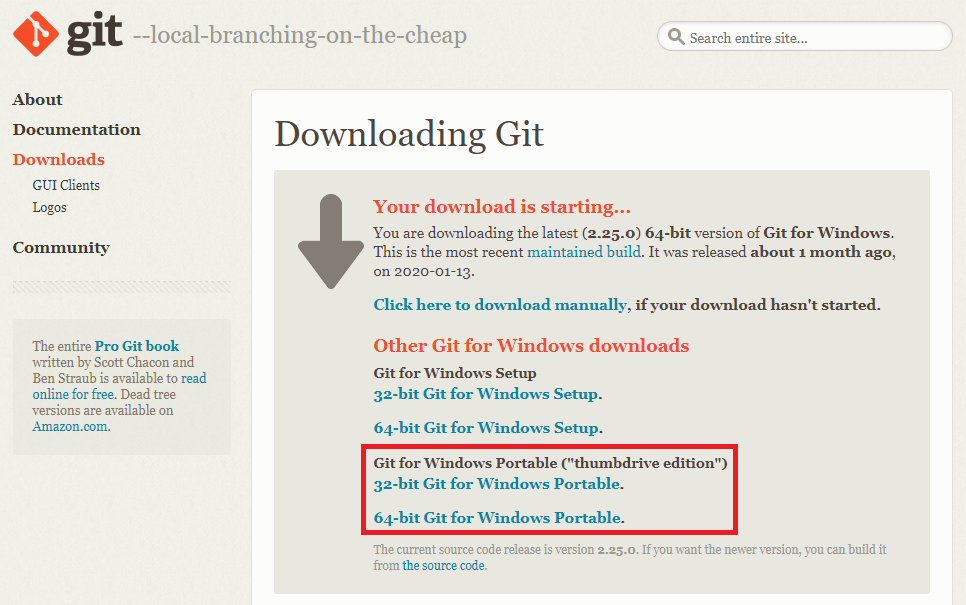

# Using VSCode with Gitlab <!-- omit in toc -->

## Table of Contents <!-- omit in toc -->

+ [1. Architecture of the Gitlab server](#1-architecture-of-the-gitlab-server)
+ [2. Git Client Installation](#2-git-client-installation)
    + [2.1 Default installation (Windows)](#21-default-installation-windows)
    + [2.2 Installation Using the Thumbdrive Edition](#22-installation-using-the-thumbdrive-edition)
    + [2.3 Installation on a Linux machine](#23-installation-on-a-linux-machine)
+ [3. VSCode IDE Installation](#3-vscode-ide-installation)
    + [3.1 Default Installation (Windows)](#31-default-installation-windows)
    + [3.2 Installation on a Linux machine](#32-installation-on-a-linux-machine)
+ [4. VSCode Configuration](#4-vscode-configuration)
    + [4.1 Extensions](#41-extensions)
        + [4.1.1 Through VS Code](#411-through-vs-code)
        + [4.1.2 Manual installation of extensions](#412-manual-installation-of-extensions)
    + [4.2 Settings](#42-settings)
+ [5. Using VSCode with Git](#5-using-vscode-with-git)
    + [5.1 Git Clone](#51-git-clone)
    + [5.2 Creating new branch](#52-creating-new-branch)
    + [5.3 Saving changes](#53-saving-changes)
    + [5.4 Reviewing changes](#54-reviewing-changes)
    + [5.5 Git commit](#55-git-commit)
    + [5.6 Git Push/Pull](#56-git-pushpull)
+ [6. Gitlab](#6-gitlab)
    + [6.1 Merge request](#61-merge-request)
    + [6.2 CI/CD - Pipeline setup](#62-cicd---pipeline-setup)
    + [6.3 CI/CD - Running a Pipeline](#63-cicd---running-a-pipeline)


## 1. Architecture of the Gitlab server


1. Perform the command git clone to the local repository
2. Add the folder to VSCode Workspace
3. Modificaton of source code through VSCode IDE
4. Commit the changes on local repository
5. Push the changes to remote repository, to the Gitlab server
6. Login into the Gitlab server through your web browser
7. Trigger deployment of the source code using Gitlab pipeline
8. New module gets deployed either on TEST environment or PRODUCTION environment

## 2. Git Client Installation

### 2.1 Default installation (Windows)

**a.** Open the Start Menu and search "cmd":


**b.** Open the command prompt and type the command `git`:


**c.** The two potential outputs you should have are:

- Git successfully installed:


- Git is not installed on your system:


If you have this last output, please do the following steps.

**d.** Go to the following URL: [**Git Downloads**](https://git-scm.com/downloads)


**e.** Depending on your operating, click on one of those buttons:


**f.** Let's say you are working on Windows. When you click on the button, git download start automatically. You also have another alternative: 



> **Note**: I recommend to use the installer downloaded by default. But if you have some access restrictions on your machine you may have to use the alternative, the thumbdrive edition, to be able to have git installed on your machine. The reason is you need system admin permissions to install git. Please refer to the section "**Installation Using the Thumbdrive Edition**" to have more information about this type of installation.*

**g.** Go to your **Downloads** folder and execute the git setup. The name of the file is similar to **Git-2.25.0-64-bit.exe**, depending on the version you install.

**h.** Follow the installation steps:

TODO Fill the installation steps, some of them with screenshots

**f.** Now git is successfully installed on your machine, we want to check that everything is working fine. Open the Start Menu, search "cmd" and execute the command `git` to see if you have the good output.


> **Note**: If you have further questions about git and its commands, please refer to the official documentation here [**Git Reference Manual**](https://git-scm.com/docs)

### 2.2 Installation Using the Thumbdrive Edition

Doing that kind of installation you have to setup environment variables, additionally.

TODO Fill this section

### 2.3 Installation on a Linux machine

TODO Fill this section

- Debian - Ubuntu

- Redhat - CentOS

## 3. VSCode IDE Installation

### 3.1 Default installation (Windows)

**a.** Go to the following URL: [**VSCode Downloads**](https://code.visualstudio.com/download)


**b.** Depending on your operating system, click on one of those buttons:


**c.** Let's say you are working on **Windows**. When you click on the button, VSCode download start automatically.

> **Note**: I recommend to use the installer downloaded by default. But if you have some access restrictions on your machine you may have to use the User Installer (just below the Windows button, choose either 64bit or 32bit depending on your environment). In that kind of situation, choose C:\\\\Users\\\\userid\\\\vscode as installation folder.

**d.** Follow the installation steps:

TODO Fill the installation steps, some of then with screenshots

**e.** After successful installation, you can now run **VSCode IDE**. Go to the installation folder and execute **Code.exe**, or seach "_vs code_" in the **Start Menu**.

TODO Add a screenshot for each situation

> **Note**: If you have further questions about VS Code and its features, please refer to the official documentation here [**VS Code Reference Manual**](https://code.visualstudio.com/docs)

### 3.2 Installation on a Linux machine

TODO Fill this scetion

- Debian - Ubuntu

- Redhat - CentOS

## 4. VSCode Configuration

### 4.1 Extensions

#### 4.1.1 Through VS Code

**a.** Go to the Extensions tab in VS Code and install the extensions you want:

TODO Do a screenshot with a clean VS Code

**b.** Here is a list of Extensions I recommend you to install:
    - COBOL
    - Date & Time
    - Git Extension Pack
    - Git Blame
    - Todo Tree

> **Note**: If you have some access restrictions on your machine that does not allowed to install extensions through VS Code, you may have to install them manually. Please follow the steps im the next section.

#### 4.1.2 Manual installation of extensions

**a.** To install these extensions manually, go the the extensions for VS Code webpage: [**Extensions**](https://marketplace.visualstudio.com/VSCode)
   


**b.** From here you can search for an extension and download the corresponding VSIX file:


**c.** To setup a VSIX extension in VS Code, go to the extensions tab, Open the menu and hit the button **Install form VSIX...**:

TODO Do the screenshot with a clean version of VS Code

**d.** Go to the folder where you downloaded the VSIX file and open it. The extension is now successfully installed!

TODO Add the corresponding screenshot

### 4.2 Settings

**a.** Open the menu File, go to **Preferences** and **Settings** (You can also just hit the shortcut **CTRL+,**):

TODO Do the screenshot with a clean version of VS Code

**b.** Search for settings.json and edit the file:

TODO Do the screenshot with a clean version of VS Code

**c.** Add the following lines to this file 
```json
{
    "files.encoding": "iso88591",
    "files.eol": "\n",
    "git.autofetch": true,
    "editor.tabSize": 4,
    "editor.insertSpaces": true,
    "editor.detectIndentation": false,
    "diffEditor.ignoreTrimWhitespace": false
}
```

**d.** After the change, save the file and restart VS Code.

## 5. Using VSCode with Git

### 5.1 Git Clone

**a.** Press F1 to toggle the command prompt:
   
TODO Do the screenshot with a clean version of VS Code

**b.** Type **Git Clone** and then press **Enter**:
 
TODO Do the screenshot with a clean version of VS Code
   
**c.** It will ask you the repository URL. Use the URL for the Gitlab project.
   
TODO Do the screenshot without customer reference

**d.** Select the folder where you want to clone the project (under _C:\\\\Users\\\\userid_, you can create a folder **gitrepo** for instance). This is going to be your **local repository**:

TODO Do the screenshot with a clean version of VS Code
   
**e.** Finally, you can add the folder to the Workspace. Right click on empty area in **Explorer** and do **Add Folder to Workspace...**. Select the previously cloned project you want to add:

TODO Do the screenshot with a clean version of VS Code

### 5.2 Creating new branch

**a.** Hit the button related to the branch in the bottom left corner:

TODO Do the screenshot with a clean version of VS Code

**b.** The command prompt appear in the top middle of the window. Create a new branch using your userid first, and then test for instance. Here are good examples of branch names:

- userid-test
- userid-new-cobol-feature
- userid-program_name-ehancement
- ...

TODO Do the screenshot with a clean version of VS Code

### 5.3 Saving changes

Whenever you make some modifications on a file, you have to save it:

- Situation before saving changes on a file:
  1. White circle next to the filename appears
  2. Number of files which have not been saved gets displayed

TODO Do the screenshot with a clean version of VS Code

- Situation after saving changes on a file:
  1. White circle changed to **X** (button to close the file in the Editor)
  2. Number of files which have not been committed to the git local repository gets displayed
  3. **M** which means **Modified** appears next to the filename in the Explorer

TODO Do the screenshot with a clean version of VS Code

### 5.4 Reviewing changes

**a.** To open the Working Tree, you have two options:
    - Click on the dedicated button in the top right corner
    - Double click on the modified file

TODO Add a screenshot for the two options

**b.** Here is what you can see: 

TODO Add screenshot where I can see addtion, deletion and modification of code

### 5.5 Git commit

**a.** On Source Control View, you can see the list of files which have been modified but not have been committed:

TODO Add screenshot where I can see one file modified, one file added, one file deleted and one file I do nothing with it

**b.** You have multiple options about the changes:
    - **Open** the file
    - **Discard Changes** with the **arrow**
    - **Add Changes** to Stages Changes with the **+**

**c.** Click on the +.

TODO Add screenshot 

**d.** Type the commit message just above:

TODO Add screenshot

**e.** Either Ctrl+Enter or the dedicated button, commit changes to the local repository:

TODO Add screenshot 

Now your local repository is up to date.

### 5.6 Git Push/Pull

**a.** Now we want to push our changes to the remote repository, the Gitlab server. As you can see on the screenshot below, there is a change that needs to be pushed:

TODO Add screenshot

**b.** After the commit, push to make the changes on remote repository to synchronize the code. Hit the **push/pull** button:

TODO Zoom of the previous screenshot

When the remote repository have changes (another developer added his own changes for instance), you need to pull from remote. Here are the four types of situations you can have:
    - Nothing to push / pull
    - 1 to push / nothing to pull
    - 1 to push / 1 to pull
    - Nothing to push / 1 to pull

TODO Add screenshots for each type of situation

## 6. Gitlab 

### 6.1 Merge request

**a.** Since you created your own branch and pushed the changes on it, the Admin Developer has to review your changes before adding them to the master branch of the project. To do that, you have to create a merge request:
    - Open your web browser
    - Go to your Gitlab server
    - Log in
    - Go to the merge request webpage

TODO Add a screenshot for the last step

**b.** Fill **Title**, **Description**, **Assignee**. Please look at the example below:

TODO Add screenshot

> **Note**: You can optionally choose to delete your branch after merging. Deleting unnecessary branches is HIGHLY RECOMMENDED for better maintenance

**c.** After creating a merge request, you can see that **Merge Request count** has been added:

TODO Add screenshot

**d.** As the Admin Developer, you have 3 different type of views if you click on the merge request item:
   - **Discussion**: can leave comments on this thread
   - **Commits**: see all commits for the merge request
   - **Changes**: see the content of the changes

TODO Add screeshots for each situation 

**e.** If everything is correct, approve the merge request by clicking the **Merge** button

TODO Add screenshot

**f.** After merging, leave a "_merge completion_" message and close the request:

TODO Add screeshot

### 6.2 CI/CD - Pipeline setup

**a.** Make sure you have a file called ".gitlab-ci.yml" in your project, this is a configuration file for the pipeline.

TODO Add screenshot

> **Note**: If you don't have that file in your project but the Gitlab server contains other projects that have tghat file, take it from there and modify the variables depending on your environment.*

**b.** Go to **Settings**, then **CI/CD**. Enable pipeline runners for your project:

TODO Add screenshot

**c.** In **ops** project, there is a **profile** folder which contain one folder for each project, named same as these projects:
   
TODO Add screenshot

**d.** There are 4 different variables in profile you may change:
    - `BUILD_SCRIPT`: build script being used during pipeline running	(build scripts are in the scripts folder in **ops** project)
    - `BUILD_INCLUDE`: you can include copybooks for the compilation
    - `BUILD_INSTALL`: installation destination for the target
    - `BUILD_OPTION`: additional options

TODO Add screenshots with several examples, specifically if you have multiple options you use a comma (:) to separate the options

### 6.3 CI/CD - Running a Pipeline

**a.** When you are in your project, click **CI/CD** and then **Pipelines**.
   
TODO Add screenshot   

**b.** Then click **Run Pipeline**.
   
**c.** You now have to set up pipeline variables:
    - Run for: choice of the branch of the project you want5 to use to run the pipeline
    - SERVER: either TEST or PROD, depending on which server you want to deploy the code
    - SOURCE: source code you want to compile and then deploy
    - PROFILE: must be predefined in ops project 

TODO Add screenshot

**d.** Then click **Run Pipeline** at the bottom of the list of the variables.

TODO Add screenshot

**e.** Check if the pipeline is successful or not:

TODO Add screenshot for success (and its log), another one for failed (and its log)


