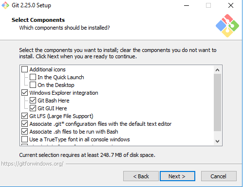
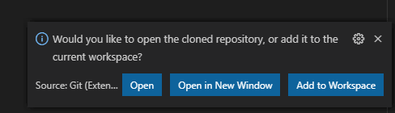
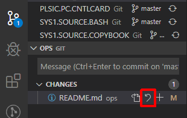

# Devops - Using VSCode with Gitlab <!-- omit in toc -->

## Table of Contents <!-- omit in toc -->

<!-- TODO Finalize the Table of Contents with the formatting and links -->

- [1. Architecture of the Gitlab server](#1-architecture-of-the-gitlab-server)
- [2. Git Client Installation](#2-git-client-installation)
  - [2.1 Default installation (Windows)](#21-default-installation-windows)
- [3. VSCode IDE Installation](#3-vscode-ide-installation)
  - [3.1 Windows](#31-windows)
- [4. VSCode Configuration](#4-vscode-configuration)
  - [4.1 Extensions](#41-extensions)
    - [4.1.1 Through VS Code](#411-through-vs-code)
    - [4.1.2 Manual installation of extensions](#412-manual-installation-of-extensions)
  - [4.2 Settings](#42-settings)
- [5. Using VSCode with Git](#5-using-vscode-with-git)
  - [5.1 Git Clone](#51-git-clone)
  - [5.2 Creating new branch](#52-creating-new-branch)
  - [5.3 Saving changes](#53-saving-changes)
  - [5.4 Reviewing changes](#54-reviewing-changes)
  - [5.5 Git commit](#55-git-commit)
  - [5.6 Git Push/Pull](#56-git-pushpull)
- [6. Gitlab](#6-gitlab)
  - [6.1 Merge request](#61-merge-request)
  - [6.2 CI/CD - Pipeline setup](#62-cicd---pipeline-setup)
  - [6.3 CI/CD - Running a Pipeline](#63-cicd---running-a-pipeline)

## 1. Architecture of the Gitlab server


1. Perform the command git clone to the local repository
1. Add the folder to VSCode Workspace
1. Modification of source code through VSCode IDE
1. Commit the changes on local repository
1. Push the changes to remote repository, to the Gitlab server
1. Login into the Gitlab server through your web browser
1. Trigger deployment of the source code using Gitlab pipeline
1. New module gets deployed either on TEST environment or PRODUCTION environment

## 2. Git Client Installation

### 2.1 Default installation (Windows)

__a.__ Open the Start Menu and search "cmd":


__b.__ Open the command prompt and type the command `git`:


__c.__ The two potential outputs you should have are:

- Git successfully installed:


- Git is not installed on your system:


If you have this last output, please do the following steps.

__d.__ Go to the following URL: [**Git Downloads**](https://git-scm.com/downloads)


__e.__ Depending on your operating, click on one of those buttons:


__f.__ Let's say you are working on Windows. When you click on the button, git download start automatically.

__g.__ Go to your __Downloads__ folder and execute the git setup.

__h.__ Follow the installation steps:





__f.__ Now git is successfully installed on your machine, we want to check that everything is working fine. Open the Start Menu, search "cmd" and execute the command `git` to see if you have the good output.


*Note: If you have further questions about git and its commands, please refer to the official documentation here [**Git Reference Manual**](https://git-scm.com/docs)*

## 3. VSCode IDE Installation

### 3.1 Windows

__a.__ Go to the following URL: [**VSCode Downloads**](https://code.visualstudio.com/download)


__b.__ Download User Installer and execute it to install.

__c.__ Follow the installation steps:


__d.__ After successful installation, you can now run __VSCode IDE__. Go to the installation folder and execute __Code.exe__.


*Note: If you have further questions about VS Code and its features, please refer to the official documentation here [**VS Code Reference Manual**](https://code.visualstudio.com/docs)*

## 4. VSCode Configuration

### 4.1 Extensions

#### 4.1.1 Through VS Code

__a.__ Go to the Extensions tab in VS Code and install the extensions you want:


__b.__ Go to the Extensions tab and check if the extension is enabled


__c.__ Recommended Extensions:
- COBOL  
- Date & Time  
- Git Extension Pack  
- Git Blame  
- Git Lens  
- Todo Tree  

#### 4.1.2 Manual installation of extensions

If you have some access restrictions on your machine that does not allowed to install extensions through VS Code, you may have to install them manually.

__a.__ Go the extensions on VS Code webpage: [**Extensions**](https://marketplace.visualstudio.com/VSCode)
   


__b.__ Search for an extension and download the corresponding VSIX file:


__c.__ Go to the extensions tab on VSCode and Open the menu by clicking "..." and hit the button __Install form VSIX...__:


__d.__ Go to the folder where you downloaded the VSIX file and open it. The extension is now successfully installed!


### 4.2 Settings

__a.__ Open the menu File, go to __Preferences__ and __Settings__ (You can also just hit the shortcut __CTRL+,__):


__b.__ Search for settings.json and edit the file:


__c.__ Add the following lines to this file 

```json
{
    "files.encoding": "iso88591",
    "files.eol": "\n",
    "git.autofetch": true,
    "editor.tabSize": 4,
    "editor.insertSpaces": true,
    "editor.detectIndentation": false,
    "diffEditor.ignoreTrimWhitespace": false
}
```

__d.__ After the change, save the file and restart VS Code.

## 5. Using VSCode with Git

### 5.1 Git Clone

__a.__ Press F1 to toggle the command prompt. Type __Git Clone__ and then press __Enter__:


__b.__ It will ask you the repository URL. Use the URL for the Gitlab project.


__c.__ Select the folder where you want to clone the project (under *C:\\\\Users\\\\userid*, you can create a folder __gitrepo__ for instance). This is going to be your __local repository__:


   
__d.__ Finally, you can add the folder to the Workspace. Right click on empty area in __Explorer__ and do __Add Folder to Workspace...__. Select the previously cloned project you want to add:



### 5.2 Creating new branch

__a.__ Hit the button related to the branch in the bottom left corner:

  

__b.__ The command prompt appear in the top middle of the window. Create a new branch using your userid first, and then test for instance. Here are good examples of branch names:

- userid-test
- userid-new-cobol-feature
- userid-program_name-ehancement
- ...

  
  
  

__c.__ Branch name in the bottom left corner gets changed.  

  

### 5.3 Saving changes

Whenever you make some modifications on a file, you have to save it:

- Situation before saving changes on a file:
  1. White circle next to the filename appears
  2. Number of files which have not been saved gets displayed

  

- Situation after saving changes on a file:
  1. White circle changed to __X__ (button to close the file in the Editor)
  2. Number of files which have not been committed to the git local repository gets displayed
  3. __M__ which means __Modified__ appears next to the filename in the Explorer

  

### 5.4 Reviewing changes

__a.__ To open the Working Tree:
    - Click on the dedicated button in the top right corner    

  

__b.__ Here is what you can see:  
    - Left: Local repository version  
    - Right: Current version  

  

### 5.5 Git commit

__a.__ On Source Control View, you can see the list of files which have been modified but not have been committed:

  

__b.__ By clicking the __arrow__, you can discard changes rollback to version on local repository

  

__c.__  By clikcing __+__, you can add changes and make them in staged state

  

__d.__ After staging the changes, type the commit message just above:

  

__e.__ Either Ctrl+Enter or the dedicated button, commit changes to the local repository:

  

Now your local repository is up to date.

### 5.6 Git Push/Pull

__a.__ To push/pull the changes to and from remote repository, click on synchronize icon:

  

When the remote repository have changes (another developer added his own changes for instance), you need to pull from remote. Here are some of situations you can have:
    - Nothing to push / pull  
      
    - 1 to push / nothing to pull  
      
    - 1 to push / 1 to pull  
      

## 6. Gitlab

### 6.1 Merge request

__a.__ Since you created your own branch and pushed the changes on it, the Admin Developer has to review your changes before adding them to the master branch of the project. To do that, you have to create a merge request:  
    - Open your web browser -> Go to your Gitlab server -> Log in -> Go to the merge request webpage

__b.__ Fill __Title__, __Description__, __Assignee__ and submit merge request:  

  

*Note: You can optionally choose to delete your branch after merging. Deleting unnecessary branches is HIGHLY RECOMMENDED for better maintenance*

__c.__ After creating a merge request, you can see that __Merge Request count__ has been added:

  

__d.__ As the Admin Developer, you have 3 different type of views if you click on the merge request item:
   - __Discussion__: can leave comments on this thread
   - __Commits__: see all commits for the merge request
   - __Changes__: see the content of the changes

  

__e.__ If everything is correct, approve the merge request by clicking the __Merge__ button

  

### 6.2 CI/CD - Pipeline setup

__a.__ Make sure you have a file called ".gitlab-ci.yml" in your project, this is a configuration file for the pipeline.

  

*Note: If you don't have that file in your project but the Gitlab server contains other projects that have tghat file, take it from there and modify the variables depending on your environment.*

__b.__ Go to __Settings__, then __CI/CD__. Enable pipeline runners for your project:

  

__c.__ In __ops__ project, there is a __profile__ folder which contain one folder for each project, named same as these projects. in each profile, there are 4 different variables in profile you may change:  
    - __BUILD_SCRIPT__: build script being used during pipeline run. build scripts are in the scripts folder in __ops__ project.  
    - __BUILD_INCLUDE__: Specify git project which contain includes or copybooks you want to use during the compilation. If you want to specify multiple, use a colon (:) between the names. You can also give branch name in front of the project name with '/' and default is master.  
    - __BUILD_INSTALL__: Installation destination which is a PDS name in Openframe volume. If you want to specify multiple, use a colon (:) between the names.  
    - __BUILD_OPTION__: additional options which gets passed to __BUILD_SCRIPT__.  

  

### 6.3 CI/CD - Running a Pipeline

__a.__ Goto project on gitlab and click __CI/CD__ -> __Pipelines__ -> __Run Pipeline__.

  

__b.__ Set up pipeline variables and click __Run Pipeline__ to trigger pipeline:  
    - Run for: choice of the branch of the project you want5 to use to run the pipeline  
    - SERVER: either TEST or PROD, depending on which server you want to deploy the code  
    - SOURCE: source code you want to compile and then deploy  
    - PROFILE: must be predefined in ops project   

  

__d.__ Check if the pipeline is successful or not:

  