# OpenFrame Installation Guide <!-- omit in toc -->

## Table of Contents <!-- omit in toc -->
+ [1. Overview](#1-overview)
+ [2. OpenFrame installation](#2-openframe-installation)
  + [2.1 Pre-installation](#21-pre-installation)
      + [2.1.1 Set Hostname](#211-set-hostname)
      + [2.1.2 Create groups and users](#212-create-groups-and-users)
      + [2.1.3 Update bash profiles](#213-update-bash-profiles)
      + [2.1.4 Create directory structure](#214-create-directory-structure)
      + [2.1.5 Download licenses](#215-download-licenses)
      + [2.1.6 Copy all the files](#216-copy-all-the-files)
      + [2.1.7 Update kernel parameters](#217-update-kernel-parameters)
      + [2.1.8 Network configuration](#218-network-configuration)
      + [2.1.9 Install required packages](#219-install-required-packages)
      + [2.1.10 Setup NTP](#2110-setup-ntp)
  + [2.2 Install Tibero for OpenFrame](#22-install-tibero-for-openframe)
      + [2.2.1 Scenario type](#221-scenario-type)
      + [2.2.2 Installation first steps](#222-installation-first-steps)
      + [2.2.3 Generate the TIP file](#223-generate-the-tip-file)
      + [2.2.4 Client configuration file](#224-client-configuration-file)
      + [2.2.5 Final installation and verification steps ](#225-final-installation-and-verification-steps)
  + [2.3 Creating an ODBC Environment](#23-creating-an-odbc-environment)
      + [2.3.1 Installation](#231-installation)
      + [2.3.2 Verification steps](#232-verification-steps)
  + [2.4 Install Base](#24-base)
      + [2.4.1 Installation](#241-installation)
      + [2.4.2 Verification steps](#242-verification-steps)
  + [2.5 Install Batch](#25-install-batch)
      + [2.5.1 Installation](#251-installation)
      + [2.5.2 Verification steps](#252-verification-steps)
      + [2.5.3 Script editing](#253-script-editing)
  + [2.6 Install TACF](#26-install-tacf)
      + [2.6.1 Installation](#261-installation)
      + [2.6.2 Verification steps](#262-verification-steps)
  + [2.7 Install ProSort](#27-install-prosort)
      + [2.7.1 Installation](#271-installation)
      + [2.7.2 Verification steps](#272-verification-steps)
  + [2.8 Install ProTrieve](#28-install-protrieve)
      + [2.8.1 Installation](#281-installation)
      + [2.8.2 Verification steps](#282-verification-steps)
  + [2.9 Install OFCOBOL](#29-install-ofcobol)
      + [2.9.1 Installation](#291-installation)
      + [2.9.2 Verification steps](#292-verification-steps)
  + [2.10 Install OFPLI](#210-install-ofpli)
      + [2.10.1 Installation](#2101-installation)
      + [2.10.2 Verification steps](#2102-verification-steps)
  + [2.11 Install OFASM](#211-install-ofasm)
      + [2.11.1 Installation](#2111-installation)
      + [2.11.2 Verification steps](#2112-verification-steps)
  + [2.12 Install OSC](#212-install-osc)
      + [2.12.1 Installation](#2121-installation)
      + [2.12.2 Verification steps](#2122-verification-steps)
  + [2.13 JEUS 7](#213-jeus-7)
      + [2.13.1 Ant-Apache](#2131-ant-apache)
      + [2.13.2 Installation](#2132-installation)
      + [2.13.3 Duplication through the JEUS 7 webadmin](#2133-duplication-through-the-jeus-7-webadmin)
      + [2.13.4 Duplication through the jeusadmin console](#2134-duplication-through-the-jeusadmin-console)
  + [2.14 Install OFGW](#214-install-ofgw)
      + [2.14.1 Installation WebTerminal & T3270 Terminal](#2141-installation-webterminal--t3270-terminal)
      + [2.14.2 Verification steps](#2142-verification-steps)
  + [2.15 Install OFManager](#215-install-ofmanager)
      + [2.15.1 Installation](#2151-installation)
      + [2.15.2 Verification steps](#2152-verification-steps)
  + [2.16 Install OFMiner](#216-install-ofminer)
      + [2.16.1 Installation](#2161-installation)
      + [2.16.2 Verification steps](#2162-verification-steps)
  + [2.17 Install HiDB (IMS DB)](#217-install-hidb-ims-db)
      + [2.17.1 Installation](#2171-installation)
      + [2.17.2 Verification steps](#2172-verification-steps)
  + [2.18 Install OSI Online (IMS DC)](#218-install-osi-online-ims-dc)
      + [2.18.1 Installation](#2181-installation)
      + [2.18.2 Verification steps](#2182-verification-steps)
  + [2.19 OFStudio](#219-ofstudio)
      + [2.19.1 Server Installation](#2191-server-installation)
      + [2.19.2 Verification steps](#2192-verification-steps)
      + [2.19.3 Client Installation](#2193-client-installation)
  + [2.20 ISPF](#220-ispf)
      + [2.20.1 General Information](#2201-general-information)
      + [2.20.2 JEUS 8](#2202-jeus-8)
      + [2.20.3 ProObject 7 Installation](#2203-proobject-7-installation)
      + [2.20.4 ISPF Installation](#2204-ispf-installation)
      + [2.20.5 Patching](#2205-patching)
      + [2.20.6 Migrate ISPF assets](#2206-migrate-ispf-assets)
      + [2.20.7 TOP IDE Installation](#2207-top-ide-installation)
      + [2.20.8 Project for panel assets in TOP IDE](#2208-project-for-panel-assets-in-top-ide)
      + [2.20.9 Deploy the ISPF application in JEUS 8](#2209-deploy-the-ispf-application-in-jeus-8)
  + [2.21 Running additional scripts](#221-running-additional-scripts)
+ [3. Boot/shutdown process](#3-bootshutdown-process)
  + [3.1 Boot everything](#31-boot-everything)
  + [3.2 Shutdown everything](#32-shutdown-everything)

# 1. Overview
This document is intended to go through the installation of Tibero and OpenFrame. For information listed below, please refer to the installation package document related to your situation:
- Version list (version of the software supposed to be installed)
- File list (list of binaries, TAR archives, scripts required for installation)
- Operating system characteristics (where OpenFrame is going to be installed)
- Hardware
- Software requirements
- Additional information if required

Each time you use this guide to install OpenFrame on an OS that is not already listed, please create a installation package guide for this specific OS. As a template you can take any installation package guide already available.

# 2. OpenFrame installation

If you have any question during the installation process, please refer to the installation FAQ document. If there is no answer to your problem in this document, ...

TODO Add what the user is supposed to do in this situation (raise an issue, create a ticket, send a email to the maintenance team...)

## 2.1 Pre-installation

#### 2.1.1 Set Hostname
__a.__ Login as root and check hostname. For the simplicity of the demo, change hostname to ofdemo (case sensitive, be careful it has to be __ofdemo__):
```bash
su -
# <enter root password>
hostname # Just to check the default hostname
hostnamectl set-hostname ofdemo
# If CentOS 6, the above command is not working. Just run:
hostname ofdemo

hostname # Double check, change takes effect immediately

```


__b.__ Retrieve the private IP of your machine with the following command under *eth0* (it could also be *wlp0s3* or *enp0s3* or *ens192* depending on your machine): `ifconfig -a`. 

An efficient text editor to modify the file in the following step and also for the whole installation is __vi__.

TODO Add the full path

[__Reference Documents: Vi Cheatsheet__](../../)

If your interface does not display an IP adress, you need to modify the file */etc/sysconfig/network-scripts/__name_of_the_network_interface_on_your_machine__* so that `ONBOOT=YES`

Reboot your VM. It should now have an IP adress every time you launch your VM.

Modify the file */etc/hosts* and add the following line to the end of the file (replace 0.0.0.0 with the IP of your machine):
```text
0.0.0.0 ofdemo ofdemo
```
The file has to look like the following screenshot:


*note: On cloud VMs, the private IP should be used.*

__c.__ Reboot your machine with the simple command `reboot`:
```bash
cat /etc/hostname
# After checking, please reboot
reboot
```

*note: If not set already, set root user password with the command "passwd root". As seen in the installation package, use preferably `tmax1234` as the password.*

#### 2.1.2 Create groups and users
### __The user ofjeus8 and all the following steps related to this user are required ONLY if you planned to use JEUS8, ProObject 7 and OpenFrame/ISPF.__ <!-- omit in toc -->

__a.__ Login as root and enter the following commands in the terminal window:
```bash
su -
# <enter root password>
groupadd mqm -g 10000
groupadd dba -g 10005

useradd -d /home/oframe -g mqm -s /bin/bash -m oframe -u 10001
useradd -d /home/oftibr -g dba -s /bin/bash -m oftibr -u 10002
useradd -d /home/ofjeus8 -g mqm -s /bin/bash -m ofjeus8 -u 10003
```

__b.__ Set passwords for the new users, choose “__tmax1234__” (without the quotes):
```bash
passwd oframe
passwd oftibr
passwd ofjeus8
```
*note: Type the passwords two times because it fails the dictionary check (too simple).*

#### 2.1.3 Update bash profiles
Create or modify the following bash profiles:

- __oframe user__
Login as oframe in the terminal (command `su - oframe`) and go to the *~/* directory to create or modify the file. You can use the bash_profile provided in your installation package, just copy/paste it and override the existing one. After creation, execute it with the command: `. ~/.bash_profile` or `source ~/.bash_profile`.

- __oftibr user__
Login as oftibr in the terminal (command `su - oftibr`) and go to the *~/* directory to create or modify the file. You can use the bash_profile provided in your installation package, just copy/paste it and override the existing one. After creation, execute it with the command: `. ~/.bash_profile` or `source ~/.bash_profile`.

- __ofjeus8 user__
Login as ofjeus8 in the terminal (command `su - ofjeus8`) and go to the *~/* directory to create or modify the file. You can use the bash_profile provided in your installation package, just copy/paste it and override the existing one. After creation, execute it with the command: `. ~/.bash_profile` or `source ~/.bash_profile`.

Every time you make any change to one of the bash profiles, log out/log in or execute it. If you use multiple terminals with oframe or oftibr user, make sure to execute the bash profile in each of them.

#### 2.1.4 Create directory structure
TmaxSoft suggests creating your directory structure in the following way. Create an opt directory in root directory (if this one does not exist already). Once you have the directory, create the tmaxapp, tmaxdb, tmaxsw, tmaxui directories:
```bash
su -
# <enter root password>
cd /
mkdir opt
cd opt
mkdir tmaxapp tmaxdb tmaxsw tmaxui
```

#### 2.1.5 Download licenses
All licenses for OpenFrame depend on the __hostname__ and the __number of cores__ (remember how many CPU cores you choose for your VM), and can last from 2 months to 6 months depending on the license.
To get the latest licenses specific to your machine, download them from TmaxSoft Technet website.

*note: If you don't remember the NCPU value, run the command `lscpu | grep 'CPU(s)'` and read the first output line.*

- Access Technet at <https://technet.tmaxsoft.com/>


- Login to your account, and click Demo License Request. If you don't have an account yet, you should create one. Please provide an email address that you regularly check, licenses will be sent to this address:
  


- Now, click on License Demo Request:
  


- Here is a list of al licenses you need for this installation:
  - Tmax
  - JEUS, 5fix#19later (used for both JEUS7 and JEUS8)
  - Tibero 6.0 Standard Edition
  - OpenFrame Engine with all modules selected (BASE, BATCH, TACF, OSC, OSI, HIDB)
  - OpenFrame Compiler OFCOBOL then OFPLI
  - OpenFrame Tool
    - Protrieve
    - ProSort 2.0
    - OpenStudio Web (ncpu=4) with Batch Manager (MVS), TACF Manager (TACF) and Online Manager (OSC)
    - OpenFrame GW with WebTerminal (ncpu=4, still related to the number of cpu you have for your machine)
    - OpenFrame Miner (ncpu=4)
    - OpenFrame Manager with Batch, TACF and Online (ncpu=4)

For "Host Name", put __ofdemo__ and for "Purpose of Use" put __demo__. Save all the required licenses on your host machine.

### __Please DO NOT rename license files.__ <!-- omit in toc -->

#### 2.1.6 Copy all the files

__a.__	Create the following folder structure for your licenses:

  - licenses/
    - openframe/
      - licbase.dat
      - lichidb.dat
      - licofpli.dat
      - licosc.dat
      - licosi.dat
      - lictacf.dat
      - lictjes.dat
    - prosort/
      - license.xml (the one for prosort)
    - tmax/
      - license.dat
    - license (for JEUS, both JEUS7 and JEUS8)
    - license.xml (for Tibero)
    - licofcob.dat
    - licprot.dat
    - OFGWLicense
    - OFManagerLicense
    - OFMinerLicense

__b.__ Create the following folder structure for the binaries for OpenFrame installation:

  - binaries/
    - patch/  
    - apache-ant-1.9.7-bin.tar.gz
    - base.properties
    - batch.properties
    - dbio_config.xml
    - domain_of1.xml
    - hidb.properties
    - ispf.properties
    - jdk-7u79-linux-x64.rpm
    - jeus704.tar.gz
    - jeus8_b162106.zip
    - OpenFrame_ASM4_525_Linux_x86_64.bin
    - OpenFrame_Base7_Fix3_Linux_x86_64.bin
    - OpenFrame_Batch7_Fix3_MVS_Linux_x86_64.bin
    - OpenFrame_COBOL4_472_Linux_x86_64.bin
    - OpenFrame_GW_7_0_1_Generic.bin
    - OpenFrame_HiDB7_1_Linux_x86_64.bin
    - OpenFrame_ISPF_7_x86_64.tar.gz
    - OpenFrame_Manager7_Generic.bin
    - OpenFrame_Miner_7_Fix1_Generic.bin
    - OpenFrame_OSC7_Fix3_Linux_x86_64.bin
    - OpenFrame_OSI7_1_Linux_x86_64.bin
    - OpenFrame_PLI3_427_Linux_x86_64.bin
    - OpenFrame_Studio7_Linux_X86_64.bin
    - OpenFrame_Tacf7_Fix3_Linux_x86_64.bin
    - osc.properties
    - osi.properties
    - prosort-bin-prosort_2sp3-linux64-2167-opt.tar.gz
    - ProTrieve2_1_Linux_x86_64.bin
    - tacf.properties
    - tibero6-bin-FS06_CS_1806-linux64-158667-opt-20180912120346-tested.tar.gz
    - TOP-fix_3.0.92_200102.zip
    - unixODBC-2.3.4.tar.gz

__c.__ Create also a folder for the scripts required by OpenFrame installation (no particular folder structure, depends on what has been provided to you and what you need).

__d.__ Copy the all those folders to the directory */opt/tmaxsw/*
```bash
su -
# <enter root password>
cp -R /media/sf_Share_VMs/binaries/* /opt/tmaxsw
cp -R /media/sf_Share_VMs/licenses/ /opt/tmaxsw
cp -R /media/sf_Share_VMs/scripts/ /opt/tmaxsw
# The following command allow scripts written in a Windows environment to be compatible with Linux environment
find /opt/tmaxsw/scripts/ -type f -print0 | xargs -0 dos2unix --
```

__e.__ oframe will take ownership of tmaxapp, tmaxsw, and tmaxui while oftibr will take ownership of tmaxdb (there are also some specific folders assigned to users):
```bash
chown -R oframe:mqm /opt/tmaxapp /opt/tmaxsw /opt/tmaxui
chown -R oftibr:dba /opt/tmaxdb /opt/tmaxsw/scripts/tibero
# There are also the below commands specifically for the ofjeus8 user
chown -R ofjeus8:mqm /opt/tmaxsw/{dbio_config.xml,domain_of1.xml,ispf.properties,jeus8_b162106.zip,OpenFrame_ISPF_7_x86_64.tar.gz,TOP-fix_3.0.92_200102.zip} /opt/tmaxsw/scripts/jeus/jeus8
chmod 771 -R /opt/tmaxui /opt/tmaxsw
```


#### 2.1.7 Update kernel parameters
__a.__ Modify the file */etc/sysctl.conf* as follow:
```text
# Shared Memory
kernel.shmmni = 4096
kernel.shmmax = 4294967295
kernel.shmall = 2097152
kernel.sem = 10000 32000 10000 10000

fs.file-max = 65536
net.ipv4.ip_local_port_range = 1024 65000

net.core.rmem_default=262144
net.core.wmem_default=262144
net.core.rmem_max=262144
net.core.wmem_max=262144
```

__b.__ Refresh the kernel parameters dynamically without a reboot: `sysctl -p`

__c.__ Edit the kernel limits in */etc/security/limits.conf*. This file allows setting resource limits for users logged in via PAM. This is a useful way of preventing, for example, fork-bombs from using up all system resources. Add the lines below to the end of the file:
```text
oframe           soft    nofile          65536
oframe           hard    nofile          65536
oframe           soft    nproc           unlimited
oframe           hard    nproc           unlimited
oframe           soft    core            unlimited
oframe           hard    core            unlimited

oftibr           soft    nofile          1024
oftibr           hard    nofile          65536
oftibr           soft    nproc           2047
oftibr           hard    nproc           16384
```

#### 2.1.8 Network configuration
__a.__ Edit the interface configuration file and make the IP address which you are provided with static.
Modify the file */etc/sysconfig/network-scripts/ifcfg-__name_of_the_network_interface_on_your_machine__* as follow:

```text
TYPE=Ethernet
PROXY_METHOD=none
BROWSER_ONLY=no
BOOTPROTO=static
DEFROUTE=yes
IPV4_FAILURE_FATAL=no
IPV6INIT=yes
IPV6_AUTOCONF=yes
IPV6_DEFROUTE=yes
IPV4_FAILURE_FATAL=no
IPV6_ADDR_GEN_MODE=stable-privacy
NAME="enp0s3"
DEVICE="enp0s3"
ONBOOT=yes
IPADDR=0.0.0.0
NETMASK=0.0.0.0
GATEWAY=0.0.0.0
DNS1=0.0.0.0
DNS2=0.0.0.0
PREFIX=24
```
- BOOTPROTO value "dhcp" to "static"
- Add the lines missing
- Modify IPADDR, NETMASK, GATEWAY, DNS1,  DNS2, with your values

*note: You can retrieve the gateway address with the command: `route -n` or `ip route` show or even with `netstat -rn`. You can retrieve DNS addresses with the commands: `cat /etc/resolv.conf` or `nmcli dev show | grep DNS`*

__b.__ Restart the network on the VM with the following command:
```bash
systemctl restart network
```

__c.__ Open the file */etc/resolv.conf* and add the following line:
```text
nameserver 9.9.9.9
```
This command setup Quad9 DNS on Linux. Quad9 is a DNS that brings together cyber threat intelligence about malicious domains from variety of public and private sources and blocks access to those malicious domains when your system attempts to contact them.

#### 2.1.9 Install required packages
__a.__ List the installed OpenJDK packages:
```bash
rpm -qa | grep openjdk
```
Then, remove all of them:
```bash
yum -y remove ...
```
Check again with the list command above that you remove all the packages.

__b.__ Install the appropriate JDK package, run the following commands:
```bash
rpm -ivh /opt/tmaxsw/jdk-7u79-linux-x64.rpm
```

```bash
yum -y install dos2unix glibc glibc.i686 glibc.x86_64 libaio gcc gcc-c++ strace ltrace gdb nano vim-enhanced git htop jansson jasson-devel
yum -y install compat-libtermcap # See specific installation below depending on your OS
# If CentOS 7, not necessary because chronyd already installed
yum -y install ntp

# If REDHAT Solaris try below
yum -y install glibc-2.17-78.el7.i686

# If Centos try below instead of compat-libtermcap (deprecated)
yum -y install ncurses*
ln -s /usr/lib64/libncurses.so.5.9 /usr/lib/libtermcap.so
ln -s /usr/lib64/libncurses.so.5.9 /usr/lib/libtermcap.so.2

#If SUSE (SLES) is used, try below instead of compat-libtermcap
ln -s /user/lib64/libncurses++.so.5.9 /user/lib/libtermcap.so
ln -s /user/lib64/libncurses++.so.5.9 /user/lib/libtermcap.so.2
```

If you did not installed the ntp package, skip the following section

#### 2.1.10 Setup NTP (Optionnal)
NTP (Network Time Protocol) is a protocol to keep servers time synchronized: one or several master servers provide time to client servers that can themselves provide time to other client servers (notion of stratus).

- Activate at boot and start the NTPD service:
```bash
systemctl enable ntpd
systemctl start ntpd
```

## 2.2 Install Tibero for OpenFrame

#### 2.2.1 Scenario type
If you want to install OpenFrame and Tibero on two different servers, you would need to install Tibero client/OpenFrame on one server, and Tibero client + server on the other server.

The two scenarios are depicted here:


Make sure the two Tibero binaries installed on the separate servers are identical. This would also mean that if you patch a Tibero on one server, you would also need to patch the other.

You have two collapsible sections, one for each scenario.

<details>
  <summary>Scenario A</summary>

  #### 2.2.2 Installation first steps
  __a.__ Unpack tibero6 from the tar.gz file using the following commands:
  ```bash
  # The following cp commands probably need root access because the owner of the
  # /opt/tmaxsw/ folder is not oftibr but oframe.
  # Moreover, copying does not change the owner of the file. Please change the
  # owner to oftibr instead of oframe with chown command
  su -
  # <enter root password>
  cd /opt/tmaxdb
  cp /opt/tmaxsw/tibero6-bin-FS06_CS_1806-linux64-158667-opt-20180912120346-tested.tar.gz .
  chown oftibr:dba tibero6-bin-FS06_CS_1806-linux64-158667-opt-20180912120346-tested.tar.gz
  exit
  # Make sure you are logged in as oftibr, if not run the following line first
  su - oftibr
  # <enter password>
  cd ${HOME_DIRECTORY}/tmaxdb
  tar -xzvf tibero6-bin-FS06_CS_1806-linux64-158667-opt-20180912120346-tested.tar.gz
  ```

  __b.__ You should now see a tibero6 directory in *${HOME_DIRECTORY}/tmaxdb*:

  

  __c.__ Copy the license downloaded before to the license directory:
  ```bash
  # Same issue as above, you probably need to use root access and change the owner
  # of the license file
  su - 
  # <enter root password>
  cp /opt/tmaxsw/licenses/license.xml /opt/tmaxdb/tibero6/license/license.xml
  chown oftibr:dba /opt/tmaxdb/tibero6/license/license.xml
  exit
  ```

  #### 2.2.3 Generate the TIP file
  The TIP file is the Tibero instance folder. It contains parameters used by the database server. Inside the *config* folder, there will be a *gen_tip.sh* script. Run the script using the below commands:
  ```bash
  cd ${TB_HOME}/config
  sh gen_tip.sh
  ```

  Then open the file *TVSAM.tip* and modify the __MAX_SESSION_COUNT__ to __120__ instead of __20__, the __TOTAL_SHM_SIZE__ to __1G__ instead of __2G__, and the __MEMORY_TARGET__ to __2G__ instead of __4G__ (these values are related to your OS and its configuration). You also need to add the below parameters:
  ```text
  WTHR_PROC_CNT=8
  _WTHR_PER_PROC=15
  _STMT_DD_CSR_MODE=N
  ```
  You should have the same file as the screenshot below:

  

  #### 2.2.4 Client configuration file
  Modify the Tibero client configuration file located at *$TB_HOME/client/config/tbdsn.tbr* as shown below (local install example). For local install, you might be using 127.0.0.1 or localhost but in remote install you need to specify the remote IP address or hostname. There are no modification to *tdbsn.tbr* in the scenario A.

  

  #### 2.2.5 Final installation and verification steps
  __a.__	Delete the existing default database instances:
  ```bash
  # Probably useless, the TVSAM folder doesn't exist for the first installation
  rm -rf ${TB_HOME}/TVSAM
  ```

  __b.__	Create a new database instance:
  ```bash
  cd ${TB_HOME}/bin
  sh tb_create_db.sh
  ```

  __c.__	Test shutdown/startup commands and verify that Tibero processes are running:
  ```bash
  tbdown
  tbboot
  # When Tibero is down, you can run the command "tbdown clean" to delete the info file

  # This first command shows information on the inter-process communication facilities
  # for which the calling process has read access. By default, it shows information
  # about all three resources: shared memory segments, message queues, and semaphore
  # arrays.
  ipcs -m | grep oftibr

  ps -ef | grep tbsvr
  ```
  Output for the last command:

  

  Now that we have a database created, both of our users have their updated bash profiles ready, we can create the tablespaces for the OpenFrame application. The script *dbclear.sh* contains the necessary drop and create statements.

  __d.__ Copy the script *dbclear.sh* and run it:
  ```bash
  # Same issue as in couple sections above, you probably need to use root access
  # and change the owner of the script file because you need to run it as oftibr
  su -
  # <enter root password>
  cp /opt/tmaxsw/scripts/tibero/dbclear.sh /opt/tmaxdb/tibero6/scripts
  chown oftibr:dba /opt/tmaxdb/tibero6/scripts/dbclear.sh
  exit
  cd ${TB_HOME}/scripts
  sh dbclear.sh
  ```

  __e.__ Try to log in the database with the command: `tbsql tibero/tmax` (or `tbsql sys/tibero` but this is the admin of the database). Then enter the same command as below on the screenshot (`ls TABLESPACE`) to see if you obtain the same output:

  

  ### __Please DO NOT shut down Tibero at the end of the installation. TIBERO SHOULD BE UP FOR THE FOLLOWING INSTALLATIONS TO CONTINUE. If you shutdown your virtual machine, make sure to boot Tibero after bringing the up the machine.__ <!-- omit in toc -->

</details>

<details>
  <summary>Scenario B</summary>

  #### 2.2.2 Installation first steps
  __a.__ Unpack tibero6 from the tar.gz file using the following commands:
  ```bash
  # The following cp commands probably need root access because the owner of the
  # /opt/tmaxsw/ folder is not oftibr but oframe.
  # Moreover, copying does not change the owner of the file. Please change the
  # owner to oftibr instead of oframe with chown command
  su -
  # <enter root password>
  cd /opt/tmaxdb
  cp /opt/tmaxsw/tibero6-bin-FS06_CS_1806-linux64-158667-opt-20180912120346-tested.tar.gz .
  chown oftibr:dba tibero6-bin-FS06_CS_1806-linux64-158667-opt-20180912120346-tested.tar.gz
  exit
  # Make sure you are logged in as oftibr, if not run the following line first
  su - oftibr
  # <enter password>
  cd ${HOME_DIRECTORY}/tmaxdb
  tar -xzvf tibero6-bin-FS06_CS_1806-linux64-158667-opt-20180912120346-tested.tar.gz
  ```

  __b.__ You should now see a tibero6 directory in *${HOME_DIRECTORY}/tmaxdb*:

  

  __c.__ Copy the license downloaded before to the license directory:
  ```bash
  # Same issue as above, you probably need to use root access and change the owner
  # of the license file
  su - 
  # <enter root password>
  cp /opt/tmaxsw/licenses/license.xml /opt/tmaxdb/tibero6/license/license.xml
  chown oftibr:dba /opt/tmaxdb/tibero6/license/license.xml
  exit
  ```

  #### 2.2.3 Generate the TIP file
  In scenario B, configuration changes need to be applied on OF + Tibero client server.

  The TIP file is the Tibero instance folder. It contains parameters used by the database server. Inside the *config* folder, there will be a *gen_tip.sh* script. Run the script using the below commands:
  ```bash
  cd ${TB_HOME}/config
  sh gen_tip.sh
  ```

  Then open the file *TVSAM.tip* and modify the __MAX_SESSION_COUNT__ to __120__ instead of __20__, the __TOTAL_SHM_SIZE__ to __1G__ instead of __2G__, and the __MEMORY_TARGET__ to __2G__ instead of __4G__ (these values are related to your OS and its configuration). You also need to add the below parameters:
  ```text
  WTHR_PROC_CNT=8
  _WTHR_PER_PROC=15
  _STMT_DD_CSR_MODE=N
  ```
  You should have the same file as the screenshot below:

  

  #### 2.2.4 Client configuration file
  Modify the Tibero client configuration file located at *$TB_HOME/client/config/tbdsn.tbr* as shown below (local install example). For local install, you might be using 127.0.0.1 or localhost but in remote install you need to specify the remote IP address or hostname. There are no modification to *tdbsn.tbr* in the scenario A.

  

  #### 2.2.5 Final installation and verification steps
  TODO Section NOT tested, should be tested to check if everything is OK

  __a.__	Copy the script *dbclear.sh*:
  ```bash
  # Make sure you are still logged in as oftibr, if not run the following line first
  su - oftibr
  # <enter password>
  # Same issue as in couple sections above, you probably need to use root access
  # and change the owner of the script file
  cp /opt/tmaxsw/scripts/tibero/dbclear.sh /opt/tmaxapp/scripts/
  ```

  __b.__	Run the script using the following command:
  ```bash
  cd ${HOME_DIRECTORY}/tmaxapp/scripts
  sh dbclear.sh TVSAM
  ```

  __c.__ Verify the script, by logging into the TVSAM database:
  ```bash
  tbsql tibero/tmax # Or tbsql sys/tibero@TVSAM but this is the admin of the database
  ```

  And then in the database:
  ```sql
  SQL> ls TABLESPACE
  ```
  Expected output:

  

  ### __Please DO NOT shut down Tibero at the end of the installation. TIBERO SHOULD BE UP FOR THE FOLLOWING INSTALLATIONS TO CONTINUE. If you shutdown your virtual machine, make sure to boot Tibero after bringing the up the machine.__ <!-- omit in toc -->

</details>

## 2.3 Creating an ODBC Environment

#### 2.3.1 Installation
OpenFrame 7 – Base needs ODBC environment to be setup for communicating with Tibero database.

__a.__ Verify if unixODBC-2.3.* is present in the software folder, if not download from <http://www.unicdxodbc.org> (version available on the website on 11/21/2019 is unixODBC-2.3.7, NOT TESTED). Then you can untar the archive:
```bash
# Make sure you are logged in as oframe, if not run the following line first
su - oframe
# <enter password>
cd ${HOME_DIRECTORY}/tmaxsw
tar -zxvf unixODBC-2.3.4.tar.gz
cd unixODBC-2.3.4
./configure --prefix=/opt/tmaxapp/unixODBC/ --sysconfdir=/opt/tmaxapp/unixODBC/etc
make
make install
```

__b.__ Verify if a folder is created in *${HOME_DIRECTORY}/tmaxapp*. There should be a *unixODBC* folder:
```bash
cd ${HOME_DIRECTORY}/tmaxapp
ls
```


__c.__ Create symbolic link for *libodbc.so.1* and *libodbcinst.so.1*:
```bash
cd ${ODBC_HOME}/lib/
ln -s libodbc.so.2.0.0 libodbc.so.1
ln -s libodbcinst.so.2.0.0 libodbcinst.so.1
```

__d.__ Configure ODBC configuration files (odbc.ini and odbcinst.ini). These two files are normally empty.

- odbc.ini (*${ODBC_HOME}/etc/odbc.ini*) records ODBC driver connection information. Make below changes to odbc.ini:

```text
[ODBC Data Sources]
tibero6 = Tibero6 ODBC driver
[TVSAM]
Driver = /opt/tmaxdb/tibero6/client/lib/libtbodbc.so
Description = Tibero ODBC driver for Tibero6
DSN = TVSAM
SID = TVSAM
User = tibero
Password = tmax
```
For ODBC connection setting, below is the sample that would work for __remote__ Tibero connection. Replace the server address *10.0.2.15* by the remote IP of Tibero server (it is better to use the hostname):

```text
[ODBC Data Sources]
tibero6 = Tibero6 ODBC driver
[TVSAM]
Driver = /opt/tmaxapp/unixODBC/lib/libtbodbc.so
Description = Tibero ODBC driver for Tibero6
SERVER = 10.0.2.15
PORT = 8629
DSN = TVSAM
SID = TVSAM
User = tibero
Password = tmax
DATABASE = TVSAM
```

- odbcinst.ini (*${ODBC_HOME}/etc/odbcinst.ini*).

```text
[Tibero]
Description = Tibero ODBC driver for Tibero6
Driver = /opt/tmaxdb/tibero6/client/lib/libtbodbc.so
Setup =
FileUsage =
CPTimeout =
CPReuse =
Driver Logging = 7
[ODBC]
Trace = NO
TraceFile = /home/oframe/odbc.log
ForceTrace = Yes
Pooling = No
DEBUG = 1
```

#### 2.3.2 Verification steps

__a.__ Verify if ODBC connection is working fine. Check the unixODBC version and configuration files. Execute `odbcinst -j` to check the unixODBC version as well as the *odbc.ini* and *odbcinst.ini* locations in DRIVERS and SYSTEM DATA SOURCES respectively. You probably need to copy *odbc.ini* and  *odbcinst.ini* to the folder *${ODBC_HOME}* to comply with these parameters.

```shell
oframe@ofdemo ~:/opt/tmaxapp/unixODBC/etc /> odbcinst -j
unixODBC 2.3.4
DRIVERS............: /opt/tmaxapp/unixODBC/odbcinst.ini
SYSTEM DATA SOURCES: /opt/tmaxapp/unixODBC/odbc.ini
FILE DATA SOURCES..: /opt/tmaxapp/unixODBC/ODBCDataSources
USER DATA SOURCES..: /opt/tmaxapp/unixODBC/etc/odbc.ini
SQLULEN Size.......: 8
SQLLEN Size........: 8
SQLSETPOSIROW Size.: 8
```

For the copy, these are the commands:
```bash
# Override if the file alredy exists, that is probably an empty one
cp ${ODBC_HOME}/etc/odbcinst.ini ${ODBC_HOME}
cp ${ODBC_HOME}/etc/odbc.ini ${ODBC_HOME}
```

Double check the content of each file to see if there is actually something in it.

__b.__ Test an isql connection, logged in as oframe user. Type the command as follows (Make sure that Tibero is running before, if not run `tbboot` in another terminal window with oftibr user):
```bash
isql -v TVSAM tibero tmax
```

You should see the following output:
```sql
+---------------------------------------+
| Connected!                            |
|                                       |
| sql-statement                         |
| help [tablename]                      |
| quit                                  |
|                                       |
+---------------------------------------+
SQL>
```
Execute `quit` to leave the menu with SQL commands.

*note: If you have the error “invalid socket file descriptor” message, check if Tibero is up.*

## 2.4 Install Base

#### 2.4.1 Installation
__a.__ Check and edit the following parameters in base.properties (*${HOME_DIRECTORY}/tmaxsw/base.properties*) file:
```text     
OPENFRAME_HOME=/opt/tmaxapp/OpenFrame

TP_HOST_NAME=ofdemo
TP_HOST_IP=ofdemo
TP_SHMKEY=63481
TP_TPORTNO=6623
TP_UNBLOCK_PORT=6291
TP_NODE_NAME=NODE1
TP_NODE_LIST=NODE1

MASCAT_NAME=SYS1.MASTER.ICFCAT
MASCAT_CREATE=YES
DEFAULT_VOLSER=DEFVOL
VOLADD_DEFINE=YES

ODBC_USERNAME=tibero
ODBC_PASSWORD=tmax
ODBC_DATABASE=TVSAM

TSAM_USERNAME=tibero
TSAM_PASSWORD=tmax
TSAM_DATABASE=TVSAM
TSAM_DBTYPE=TIBERO
DATASET_SHMKEY=62211
SYSTEM_TABLESPACE=OFM_REPOSITORY

DSLOCK_DATA=SYS1.DSLOCK.DATA
DSLOCK_LOG=SYS1.DSLOCK.LOG
DSLOCK_SEQ=dslock_seq.dat
DSLOCK_CREATE=YES

OPENFRAME_LICENSE_PATH=/opt/tmaxsw/licenses/openframe
TMAX_LICENSE_PATH=/opt/tmaxsw/licenses/tmax
```

__b.__ Execute the installer using the properties file and then the bash profile:
```bash
# Make sure you are still logged in as oframe, if not run the following line first
su - oframe
# <enter password>
cd ${HOME_DIRECTORY}/tmaxsw
./OpenFrame_Base7_Fix3_Linux_x86_64.bin -f base.properties
. ~/.bash_profile
```

__c.__ Copy and paste the TMAX license into the core folder (it should already be in the folder but just in case double check):
```bash
ls ${OPENFRAME_HOME}/core/license | grep license.dat
# If necessary
ln -s ${HOME_DIRECTORY}/tmaxsw/licenses/tmax/license.dat ${OPENFRAME_HOME}/core/license/license.dat
```

__d.__ Verify if the license *licbase.dat* is in the folder *${OPENFRAME_HOME}/license*. If not, copy or link the license:
```bash
ls ${OPENFRAME_HOME}/license | grep licbase.dat
# If necessary
ln –s ${HOME_DIRECTORY}/tmaxsw/licenses/openframe/licbase.dat ${OPENFRAME_HOME}/license/licbase.dat
```

#### 2.4.2 Verification steps
__a.__ Check the *install_base.log* and the *OpenFrame_Base7_Fix3_InstallLog.log* files:
```bash
cd ${OPENFRAME_HOME}/UninstallerData/log
vi install_base.log
vi OpenFrame_Base7_Fix3_InstallLog.log
```
If you have been provided with logs, check that they are similar to yours.

__b.__ Boot up Base with the command: `tmboot`

Output:
```text
TMBOOT for node(NODE1) is starting:
Welcome to Tmax demo system: it will expire 2019/12/3
Today: 2019/10/15
	TMBOOT: TMM is starting: Tue Oct 15 13:26:36 2019
	TMBOOT: CLL is starting: Tue Oct 15 13:26:36 2019
	TMBOOT: CLH is starting: Tue Oct 15 13:26:36 2019
	TMBOOT: TLM(tlm) is starting: Tue Oct 15 13:26:36 2019
	TMBOOT: SVR(ofrsasvr) is starting: Tue Oct 15 13:26:36 2019
	TMBOOT: SVR(ofrlhsvr) is starting: Tue Oct 15 13:26:36 2019
	TMBOOT: SVR(ofrdmsvr) is starting: Tue Oct 15 13:26:36 2019
	TMBOOT: SVR(ofrdsedt) is starting: Tue Oct 15 13:26:36 2019
	TMBOOT: SVR(ofrcmsvr) is starting: Tue Oct 15 13:26:36 2019
	TMBOOT: SVR(ofruisvr) is starting: Tue Oct 15 13:26:36 2019
	TMBOOT: SVR(ofruisvr) is starting: Tue Oct 15 13:26:36 2019
	TMBOOT: SVR(ofrsmlog) is starting: Tue Oct 15 13:26:36 2019
	TMBOOT: SVR(vtammgr) is starting: Tue Oct 15 13:26:36 2019
```

__c.__ Verify process ready status using `tmadmin`. Then use the command `si`, all the processes should have RDY status.
```text
--- Welcome to Tmax Admin (Type "quit" to leave) ---
$1 NODE1 (tmadm): si
------------------------------------------------------------------------
  clh   svrname    (svri)   status     count   qcount   qpcount  emcount
------------------------------------------------------------------------
    0   ofrsasvr   (   4)      RDY         0        0         0        0
    0   ofrlhsvr   (   5)      RDY         0        0         0        0
    0   ofrdmsvr   (   6)      RDY         0        0         0        0
    0   ofrdsedt   (   7)      RDY         0        0         0        0
    0   ofrcmsvr   (   8)      RDY         0        0         0        0
    0   ofruisvr   (   9)      RDY         0        0         0        0
    0   ofrsmlog   (  10)      RDY         0        0         0        0
    0   vtammgr    (  11)      RDY         0        0         0        0

$2 NODE1 (tmadm): quit
ADM quit for node (NODE1)
```

If you don't have all processes in __RDY__ state, stop the installation and check that Tibero is up (if you don't know how, go back to the section of Tibero installation). If Tibero is up, you can also review the logs. You can find the logs for each process in the folder *${OPENFRAME_HOME}/log/tmax/ulog*. Then run the following command to easily find the logs related to the process that has an issue:
```bash
ls | grep process-name
vi process-name.date.err
```

__d.__ Shutdown Base with : `tmdown` or better with `tmdown -y`

Output:
```text
Do you really want to down whole Tmax? (y : n): y

TMDOWN for node(NODE1) is starting:
	TMDOWN: SERVER(ofrdmsvr:38) downed: Mon Oct 14 14:34:02 2019
	TMDOWN: SERVER(ofrdsedt:39) downed: Mon Oct 14 14:34:02 2019
	TMDOWN: SERVER(ofrsasvr:36) downed: Mon Oct 14 14:34:02 2019
	TMDOWN: SERVER(ofruisvr:42) downed: Mon Oct 14 14:34:02 2019
	TMDOWN: SERVER(ofruisvr:41) downed: Mon Oct 14 14:34:02 2019
	TMDOWN: SERVER(ofrcmsvr:40) downed: Mon Oct 14 14:34:02 2019
	TMDOWN: SERVER(vtammgr:47) downed: Mon Oct 14 14:34:02 2019
	TMDOWN: SERVER(ofrlhsvr:37) downed: Mon Oct 14 14:34:02 2019
	TMDOWN: SERVER(ofrsmlog:46) downed: Mon Oct 14 14:34:02 2019
	TMDOWN: CLH downed: Mon Oct 14 14:34:02 2019
	TMDOWN: CLL downed: Mon Oct 14 14:34:02 2019
	TMDOWN: TLM downed: Mon Oct 14 14:34:02 2019
	TMDOWN: TMM downed: Mon Oct 14 14:34:02 2019
	TMDOWN: TMAX is down
```

## 2.5 Install Batch

#### 2.5.1 Installation
__a.__ Check and edit the following parameters in batch.properties (*${HOME_DIRECTORY}/tmaxsw/batch.properties*) file:
```text     
OPENFRAME_HOME=/opt/tmaxapp/OpenFrame

SYSTEM_TABLESPACE=OFM_REPOSITORY
DEFAULT_VOLSER=DEFVOL
BATCH_TABLE_CREATE=YES

TP_NODE_NAME=NODE1
TP_NODE_LIST=NODE1

RESOURCE_SHMKEY=66991
DEFAULT_JCLLIB_CREATE=YES
DEFAULT_PROCLIB_CREATE=YES
DEFAULT_USERLIB_CREATE=YES
DEFAULT_TEMPLIB_CREATE=YES

TJES_USERNAME=tibero
TJES_PASSWORD=tmax
TJES_DATABASE=TVSAM
```

__b.__ Take a backup of core configuration file:
```bash
# Make sure you are still logged in as oframe, if not run the following line first
su - oframe
# <enter password>
cd ${OPENFRAME_HOME}/core/config
cp oframe.m oframe_base.m
```

__c.__ Execute the installer using the properties file and then the bash profile:
```bash
cd ${HOME_DIRECTORY}/tmaxsw
./OpenFrame_Batch7_Fix3_MVS_Linux_x86_64.bin -f batch.properties
. ~/.bash_profile
```

__d.__ Verify if the license *lictjes.dat* is in the folder *${OPENFRAME_HOME}/license*. If not, copy or link the license:
```bash
ls ${OPENFRAME_HOME}/license | grep lictjes.dat
# If necessary
ln –s ${HOME_DIRECTORY}/tmaxsw/licenses/openframe/lictjes.dat ${OPENFRAME_HOME}/license/lictjes.dat
```

#### 2.5.2 Verification steps
__a.__ Check the *install_batch.log* and the *OpenFrame_Batch7_Fix3_MVS_InstallLog.log* files:
```bash
cd ${OPENFRAME_HOME}/UninstallerData/log
vi install_batch.log
vi OpenFrame_Batch7_Fix3_MVS_InstallLog.log
```
If you have been provided with logs, check that they are similar to yours.

__b.__ Boot up Batch: `tmboot`

Output:
```text
TMBOOT for node(NODE1) is starting:
Welcome to Tmax demo system: it will expire 2019/12/3
Today: 2019/10/15
	TMBOOT: TMM is starting: Tue Oct 15 13:40:35 2019
	TMBOOT: CLL is starting: Tue Oct 15 13:40:35 2019
	TMBOOT: CLH is starting: Tue Oct 15 13:40:35 2019
	TMBOOT: TLM(tlm) is starting: Tue Oct 15 13:40:35 2019
	TMBOOT: SVR(ofrsasvr) is starting: Tue Oct 15 13:40:35 2019
	TMBOOT: SVR(ofrlhsvr) is starting: Tue Oct 15 13:40:35 2019
	TMBOOT: SVR(ofrdmsvr) is starting: Tue Oct 15 13:40:35 2019
	TMBOOT: SVR(ofrdsedt) is starting: Tue Oct 15 13:40:35 2019
	TMBOOT: SVR(ofrcmsvr) is starting: Tue Oct 15 13:40:35 2019
	TMBOOT: SVR(ofruisvr) is starting: Tue Oct 15 13:40:35 2019
	TMBOOT: SVR(ofruisvr) is starting: Tue Oct 15 13:40:35 2019
	TMBOOT: SVR(ofrsmlog) is starting: Tue Oct 15 13:40:35 2019
	TMBOOT: SVR(vtammgr) is starting: Tue Oct 15 13:40:35 2019
	TMBOOT: SVR(obmjmsvr) is starting: Tue Oct 15 13:40:35 2019  <--------
	TMBOOT: SVR(obmjschd) is starting: Tue Oct 15 13:40:35 2019  <--------
	TMBOOT: SVR(obmjinit) is starting: Tue Oct 15 13:40:35 2019  <--------
	TMBOOT: SVR(obmjhist) is starting: Tue Oct 15 13:40:35 2019  <--------
	TMBOOT: SVR(obmjspbk) is starting: Tue Oct 15 13:40:35 2019  <--------
	TMBOOT: SVR(ofrpmsvr) is starting: Tue Oct 15 13:40:35 2019  <--------
	TMBOOT: SVR(obmtsmgr) is starting: Tue Oct 15 13:40:35 2019  <--------
	TMBOOT: SVR(obmjtimr) is starting: Tue Oct 15 13:40:35 2019  <--------
```

__c.__ Verify process ready status using `tmadmin`. Then use the command `si`, all the processes should have RDY status:
```text
--- Welcome to Tmax Admin (Type "quit" to leave) ---

   $1 NODE1 (tmadm): si

   ------------------------------------------------------------------------
   clh   svrname    (svri)   status     count   qcount   qpcount  emcount
   ------------------------------------------------------------------------
    0   ofrsasvr   (   4)      RDY         0        0         0        0
    0   ofrlhsvr   (   5)      RDY         0        0         0        0
    0   ofrdmsvr   (   6)      RDY         0        0         0        0
    0   ofrdsedt   (   7)      RDY         0        0         0        0
    0   ofrcmsvr   (   8)      RDY         0        0         0        0
    0   ofruisvr   (   9)      RDY         0        0         0        0
    0   ofrsmlog   (  10)      RDY         0        0         0        0
    0   vtammgr    (  11)      RDY         0        0         0        0
    0   obmjmsvr   (  12)      RDY         0        0         0        0
    0   obmjschd   (  13)      RDY         1        0         0        0
    0   obmjinit   (  14)      RDY         2        0         0        0
    0   obmjhist   (  15)      RDY         0        0         0        0
    0   obmjspbk   (  16)      RDY         0        0         0        0
    0   ofrpmsvr   (  17)      RDY         0        0         0        0
    0   obmtsmgr   (  18)      RDY         0        0         0        0
    0   obmjtimr   (  19)      RDY         0        0         0        0

   $2 NODE1 (tmadm): quit
   ADM quit for node (NODE1)
```

__e.__ Shutdown Batch: `tmdown` or better `tmdown -y`

Output:
```text
Do you really want to down whole Tmax? (y : n): y

TMDOWN for node(NODE1) is starting:
	TMDOWN: SERVER(ofrcmsvr:40) downed: Tue Oct 15 13:46:18 2019
	TMDOWN: SERVER(ofrlhsvr:37) downed: Tue Oct 15 13:46:18 2019
	TMDOWN: SERVER(obmjmsvr:48) downed: Tue Oct 15 13:46:18 2019
	TMDOWN: SERVER(obmjhist:51) downed: Tue Oct 15 13:46:18 2019
	TMDOWN: SERVER(ofrdsedt:39) downed: Tue Oct 15 13:46:18 2019
	TMDOWN: SERVER(obmjspbk:52) downed: Tue Oct 15 13:46:18 2019
	TMDOWN: SERVER(ofrsasvr:36) downed: Tue Oct 15 13:46:18 2019
	TMDOWN: SERVER(ofrdmsvr:38) downed: Tue Oct 15 13:46:18 2019
	TMDOWN: SERVER(ofruisvr:41) downed: Tue Oct 15 13:46:18 2019
	TMDOWN: SERVER(ofruisvr:42) downed: Tue Oct 15 13:46:18 2019
	TMDOWN: SERVER(obmjschd:49) downed: Tue Oct 15 13:46:18 2019
	TMDOWN: SERVER(ofrpmsvr:53) downed: Tue Oct 15 13:46:18 2019
	TMDOWN: SERVER(obmjinit:50) downed: Tue Oct 15 13:46:18 2019
	TMDOWN: SERVER(vtammgr:47) downed: Tue Oct 15 13:46:18 2019
	TMDOWN: SERVER(obmjtimr:55) downed: Tue Oct 15 13:46:18 2019
	TMDOWN: SERVER(obmtsmgr:54) downed: Tue Oct 15 13:46:18 2019
	TMDOWN: SERVER(ofrsmlog:46) downed: Tue Oct 15 13:46:18 2019
	TMDOWN: CLL downed: Tue Oct 15 13:46:18 2019
	TMDOWN: CLH downed: Tue Oct 15 13:46:18 2019
	TMDOWN: TLM downed: Tue Oct 15 13:46:18 2019
	TMDOWN: TMM downed: Tue Oct 15 13:46:18 2019
	TMDOWN: TMAX is down
```

#### 2.5.3 Script editing
Edit the OpenFrame configuration file *tjclrun.conf*:
```bash
vi ${OPENFRAME_HOME}/config/tjclrun.conf
```    
Then, add the __OBCD_HOME__ lib in *LIB_PATH*:
```bash
LIB_PATH=${OPENFRAME_HOME}/lib:${OPENFRAME_HOME}/core/lib:${TB_HOME}/client/lib:${COBDIR}/lib:/usr/lib:/lib:/lib/i686:/usr/local/lib:${PROSORT_HOME}/lib:/opt/FSUNbsort/lib:${ODBC_HOME}/lib
```

## 2.6 Install TACF

#### 2.6.1 Installation
__a.__ Check and edit the following parameters in tacf.properties (*${HOME_DIRECTORY}/tmaxsw/tacf.properties*) file:
```text     
OPENFRAME_HOME=/opt/tmaxapp/OpenFrame

USE_OS_AUTH=NO
TACF_TABLESPACE=TACF00
TACF_TABLE_CREATE=YES

TACF_USERNAME=tibero
TACF_PASSWORD=tmax
TACF_DATABASE=TVSAM
```

__b.__ Take a backup of core configuration file:
```bash
# Make sure you are still logged in as oframe, if not run the following line first
su - oframe
# <enter password>
cd ${OPENFRAME_HOME}/core/config
cp oframe.m oframe_base_batch.m
```

__c.__ Execute the installer using the properties file and then the bash profile:
```bash
cd ${HOME_DIRECTORY}/tmaxsw
./OpenFrame_Tacf7_Fix3_Linux_x86_64.bin -f tacf.properties
. ~/.bash_profile
```

__d.__ Verify if the license *lictacf.dat* is in the folder *${OPENFRAME_HOME}/license*. If not, copy or link the license:
```bash
ls ${OPENFRAME_HOME}/license | grep lictacf.dat
# If necessary
ln –s ${HOME_DIRECTORY}/tmaxsw/licenses/openframe/lictacf.dat ${OPENFRAME_HOME}/license/lictacf.dat
```

__e.__ Copy the file *.tacfpass* to */home/oframe*:
```bash
cp ${HOME_DIRECTORY}/tmaxsw/scripts/tacf/.tacfpass /home/oframe
```

#### 2.6.2 Verification steps
__a.__ Check the *install_tacf.log* and the *OpenFrame_Tacf7_Fix3_InstallLog.log* files:
```bash
cd ${OPENFRAME_HOME}/UninstallerData/log
vi install_tacf.log
vi OpenFrame_Tacf7_Fix3_InstallLog.log
```
If you have been provided with logs, check that they are similar to yours.

__b.__ Boot up TACF: `tmboot`

Output:
```text
TMBOOT for node(NODE1) is starting:
Welcome to Tmax demo system: it will expire 2019/12/3
Today: 2019/10/17
	TMBOOT: TMM is starting: Thu Oct 17 10:05:01 2019
	TMBOOT: CLL is starting: Thu Oct 17 10:05:01 2019
	TMBOOT: CLH is starting: Thu Oct 17 10:05:01 2019
	TMBOOT: TLM(tlm) is starting: Thu Oct 17 10:05:01 2019
	TMBOOT: SVR(ofrsasvr) is starting: Thu Oct 17 10:05:01 2019
	TMBOOT: SVR(ofrlhsvr) is starting: Thu Oct 17 10:05:01 2019
	TMBOOT: SVR(ofrdmsvr) is starting: Thu Oct 17 10:05:01 2019
	TMBOOT: SVR(ofrdsedt) is starting: Thu Oct 17 10:05:01 2019
	TMBOOT: SVR(ofrcmsvr) is starting: Thu Oct 17 10:05:01 2019
	TMBOOT: SVR(ofruisvr) is starting: Thu Oct 17 10:05:01 2019
	TMBOOT: SVR(ofruisvr) is starting: Thu Oct 17 10:05:01 2019
	TMBOOT: SVR(ofrsmlog) is starting: Thu Oct 17 10:05:01 2019
	TMBOOT: SVR(vtammgr) is starting: Thu Oct 17 10:05:01 2019
	TMBOOT: SVR(obmjmsvr) is starting: Thu Oct 17 10:05:01 2019
	TMBOOT: SVR(obmjschd) is starting: Thu Oct 17 10:05:01 2019
	TMBOOT: SVR(obmjinit) is starting: Thu Oct 17 10:05:01 2019
	TMBOOT: SVR(obmjhist) is starting: Thu Oct 17 10:05:01 2019
	TMBOOT: SVR(obmjspbk) is starting: Thu Oct 17 10:05:01 2019
	TMBOOT: SVR(ofrpmsvr) is starting: Thu Oct 17 10:05:01 2019
	TMBOOT: SVR(obmtsmgr) is starting: Thu Oct 17 10:05:01 2019
	TMBOOT: SVR(obmjtimr) is starting: Thu Oct 17 10:05:01 2019
	TMBOOT: SVR(tmsvr) is starting: Thu Oct 17 10:05:01 2019      <--------
```

__c.__ Verify process ready status using `tmadmin`. Then use the command `si`, all the processes should have RDY status:
```text
--- Welcome to Tmax Admin (Type "quit" to leave) ---

$1 NODE1 (tmadm): si
------------------------------------------------------------------------
clh   svrname    (svri)   status     count   qcount   qpcount  emcount
------------------------------------------------------------------------
0   ofrsasvr   (   4)      RDY         0        0         0        0
0   ofrlhsvr   (   5)      RDY         0        0         0        0
0   ofrdmsvr   (   6)      RDY         0        0         0        0
0   ofrdsedt   (   7)      RDY         0        0         0        0
0   ofrcmsvr   (   8)      RDY         0        0         0        0
0   ofruisvr   (   9)      RDY         0        0         0        0
0   ofrsmlog   (  10)      RDY         0        0         0        0
0   vtammgr    (  11)      RDY         0        0         0        0
0   obmjmsvr   (  12)      RDY         0        0         0        0
0   obmjschd   (  13)      RDY         1        0         0        0
0   obmjinit   (  14)      RDY         2        0         0        0
0   obmjhist   (  15)      RDY         0        0         0        0
0   obmjspbk   (  16)      RDY         0        0         0        0
0   ofrpmsvr   (  17)      RDY         0        0         0        0
0   obmtsmgr   (  18)      RDY         0        0         0        0
0   tmsvr      (  19)      RDY         0        0         0        0

$2 NODE1 (tmadm): quit
ADM quit for node (NODE1)
```

__d.__ Shutdown TACF: `tmdown` or better `tmdown -y`

Output:
```text
Do you really want to down whole Tmax? (y : n): y

TMDOWN for node(NODE1) is starting:
	TMDOWN: SERVER(ofrdsedt:39) downed: Thu Oct 17 10:09:35 2019
	TMDOWN: SERVER(ofrcmsvr:40) downed: Thu Oct 17 10:09:35 2019
	TMDOWN: SERVER(ofrdmsvr:38) downed: Thu Oct 17 10:09:35 2019
	TMDOWN: SERVER(obmjhist:51) downed: Thu Oct 17 10:09:35 2019
	TMDOWN: SERVER(vtammgr:47) downed: Thu Oct 17 10:09:35 2019
	TMDOWN: SERVER(tmsvr:56) downed: Thu Oct 17 10:09:35 2019
	TMDOWN: SERVER(ofrsasvr:36) downed: Thu Oct 17 10:09:35 2019
	TMDOWN: SERVER(obmjtimr:55) downed: Thu Oct 17 10:09:35 2019
	TMDOWN: SERVER(ofrlhsvr:37) downed: Thu Oct 17 10:09:35 2019
	TMDOWN: SERVER(ofruisvr:42) downed: Thu Oct 17 10:09:35 2019
	TMDOWN: SERVER(ofruisvr:41) downed: Thu Oct 17 10:09:35 2019
	TMDOWN: SERVER(obmjinit:50) downed: Thu Oct 17 10:09:35 2019
	TMDOWN: SERVER(obmjmsvr:48) downed: Thu Oct 17 10:09:35 2019
	TMDOWN: SERVER(obmtsmgr:54) downed: Thu Oct 17 10:09:35 2019
	TMDOWN: SERVER(ofrsmlog:46) downed: Thu Oct 17 10:09:36 2019
	TMDOWN: CLH downed: Thu Oct 17 10:09:36 2019
	TMDOWN: CLL downed: Thu Oct 17 10:09:36 2019
	TMDOWN: TLM downed: Thu Oct 17 10:09:36 2019
	TMDOWN: TMM downed: Thu Oct 17 10:09:36 2019
	TMDOWN: TMAX is down
```

__e.__ Take a backup of core configuration file:
```bash
cd ${OPENFRAME_HOME}/core/config
cp oframe.m oframe_base_batch_tacf.m
```

## 2.7 Install ProSort

#### 2.7.1 Installation
__a.__ 	Untar the prosort archive:
```bash
# Make sure you are still logged in as oframe, if not run the following line first
su - oframe
# <enter password>
cd ${HOME_DIRECTORY}/tmaxsw
tar -zxvf prosort-bin-prosort_2sp3-linux64-2167-opt.tar.gz
```

__b.__ Verify if a folder *prosort/* is created in *${HOME_DIRECTORY}/tmaxsw*: `ls`. Move this folder to *\${HOME_DIRECTORY}/tmaxapp*:
```bash
mv prosort ${HOME_DIRECTORY}/tmaxapp
```
The *tmaxapp/* folder should looks like:


__c.__	Set up license file:
```bash
mkdir ${PROSORT_HOME}/license
# create a symbolic link
ln -s ${HOME_DIRECTORY}/tmaxsw/licenses/prosort/license.xml ${PROSORT_HOME}/license/license.xml
```

__d.__ Create the configuration file:
```bash   
cd ${PROSORT_HOME}/config
./gen_tip.sh
```
Expected output:
```text
Using PROSORT_SID "gbg"
/opt/tmaxapp/prosort/config/gbg.tip generated
```

__e.__ Create the symbolic link for *SORT*:
```bash
cd ${OPENFRAME_HOME}/util/
ln -s DFSORT SORT
```

#### 2.7.2 Verification steps
__a.__ Verify PROSORT installation: `prosort -h`

Expected output:
```text
Usage: prosort [options] [sort script files]

options
-------
 -h             Display this information
 -v             Display version information
 -s             Display state information
 -j             Display profile information
 -x             Use SyncSort compatible mode
```

## 2.8 Install ProTrieve

#### 2.8.1 Installation
__a.__ Execute the installer:
```bash
# Make sure you are still logged in as oframe, if not run the following line first
su - oframe
# <enter password>
cd ${HOME_DIRECTORY}/tmaxsw
./ProTrieve2_1_Linux_x86_64.bin
```

__b.__ Change the path to */opt/tmaxapp/protrieve* as below (if the folder does not exist, the installation program will automatically create it). The value you need to modify is like \**value*\*:
```markdown
Choose Install Folder
---------------------

Where would you like to install?

	Default Install Folder: /home/oframe/protrieve

ENTER AN ABSOLUTE PATH, OR PRESS <ENTER> TO ACCEPT THE DEFAULT
  : */opt/tmaxapp/protrieve*
```

__c.__ Verify if the bash profile is updated with Protrieve variables and execute it:
```bash
cd ~
vi .bash_profile
. .bash_profile
```

__d.__ Setup the license file:
```bash
# Create a symbolic link
ln -s ${HOME_DIRECTORY}/tmaxsw/licenses/licprot.dat ${PROTRIEVE_HOME}/license/licprot.dat
```

__e.__ Create a backup of the OpenFrame configuration file *${OPENFRAME_HOME}/config/tjclrun.conf*:
```bash
cd ${OPENFRAME_HOME}/config/
cp tjclrun.conf tjclrun.conf.bck1
```
Then, add the __PROTRIEVE_HOME__ lib (two times, in *BIN_PATH* first and *LIB_PATH* then):
```bash
[SYSLIB]
BIN_PATH=${OPENFRAME_HOME}/bin:${OPENFRAME_HOME}/util:${COBDIR}/bin:/usr/local/bin:/bin:${OPENFRAME_HOME}/volume_default/SYS1.LOADLIB/bin:${PROTRIEVE_HOME}/bin
LIB_PATH=${OPENFRAME_HOME}/lib:${OPENFRAME_HOME}/core/lib:${TB_HOME}/client/lib:${COBDIR}/lib:/usr/lib:/lib:/lib/i686:/usr/local/lib:${PROSORT_HOME}/lib:/opt/FSUNbsort/lib:${ODBC_HOME}/lib:${PROTRIEVE_HOME}/lib
```

#### 2.8.2 Verification steps
__a.__ Review *ProTrieve_InstallLog.log* and verify that there are no errors:
```bash
cat ${PROTRIEVE_HOME}/UninstallerData/log/ProTrieve_InstallLog.log
```
If you have been provided with logs, check that they are similar to yours.

__b.__ Review the version number: `protp –v`

Expected output:
```text
ProTrieve 2.1
Copyright (C) 2018 TMAXSOFT RESERVED
```

__c.__ Perform OpenFrame reboot: `tmboot` then `tmdown -y`

## 2.9 Install OFCOBOL

#### 2.9.1 Installation
__a.__ First execute the installer:
```bash
# Make sure you are still logged in as oframe, if not run the following line first
su - oframe
# <enter password>
cd ${HOME_DIRECTORY}/tmaxsw
./OpenFrame_COBOL4_472_Linux_x86_64.bin
```

Change the path to */opt/tmaxapp/ofcobol* as below (folder automatically created during the installation process). The value you need to modify is like \**value*\*:
```markdown
Choose Install Folder
---------------------

Where would you like to install?

		Default Install Folder: /home/oframe/OFCOBOL

ENTER AN ABSOLUTE PATH, OR PRESS <ENTER> TO ACCEPT THE DEFAULT
    : */opt/tmaxapp/ofcobol*
```

__c.__ Verify if the bash profile is updated with __OFCOBOL__ variables and execute it:
```bash
vi ~/.bash_profile
. ~/.bash_profile
```

__d.__ Setup the license file:
```bash
# Create a symbolic link
ln -s ${HOME_DIRECTORY}/tmaxsw/licenses/licofcob.dat ${OFCOB_HOME}/license/licofcob.dat
```

__e.__ Create a backup of the OpenFrame configuration file *${OPENFRAME_HOME}/config/tjclrun.conf*:
```bash
cd ${OPENFRAME_HOME}/config/
cp tjclrun.conf tjclrun.conf.bck2
```
Then, add the __OFCOB_HOME__ lib to *LIB_PATH*:
```bash
LIB_PATH=${OPENFRAME_HOME}/lib:${OPENFRAME_HOME}/core/lib:${TB_HOME}/client/lib:${COBDIR}/lib:/usr/lib:/lib:/lib/i686:/usr/local/lib:${PROSORT_HOME}/lib:/opt/FSUNbsort/lib:${ODBC_HOME}/lib:${PROTRIEVE_HOME}/lib:${OFCOB_HOME}/lib
```

#### 2.9.2 Verification steps
__a.__ Review *OpenFrame_COBOL_InstallLog.log* and verify there are no errors:
```bash
vi ${OFCOB_HOME}/UninstallerData/log/OpenFrame_COBOL_InstallLog.log
```
If you have been provided with logs, check that they are similar to yours.

__b.__ Review the version number: `ofcob –-version`

Expected output:
```text
OpenFrame COBOL Compiler 4
Revision : 472
CommitID : c20ee10
```

__c.__ Try to create a small COBOL program after installation completed:
```bash
vi HELLO.cob
```
Add the following lines to the file:
```cobol
000100 IDENTIFICATION DIVISION.
000200 PROGRAM-ID.     HELLO.
000300 ENVIRONMENT DIVISION.
000400 DATA DIVISION.
000500 WORKING-STORAGE SECTION.
000600 PROCEDURE DIVISION.
000600     DISPLAY "Hello world!"
```
Then you can compile it:
```bash
ofcob -o HELLO.so HELLO.cob
```

__d.__ Perform OpenFrame reboot: `tmboot` then `tmdown -y`

## 2.10 Install OFPLI

#### 2.10.1 Installation
__a.__ Execute the installer:
```bash
# Make sure you are still logged in as oframe, if not run the following line first
su - oframe
# <enter password>
cd ${HOME_DIRECTORY}/tmaxsw
./OpenFrame_PLI3_427_Linux_x86_64.bin
```

Change the path to */opt/tmaxapp/ofpli* as below (folder automatically created during the installation process). . The value you need to modify is like \**value*\*:
```markdown
Choose Install Folder
---------------------

Where would you like to install?

	Default Install Folder: /home/oframe/OFPLI

ENTER AN ABSOLUTE PATH, OR PRESS <ENTER> TO ACCEPT THE DEFAULT
  : */opt/tmaxapp/ofpli*
```

__b.__ Verify if the bash profile is updated with OFPLI variables and execute it:
```bash
vi ~/.bash_profile
. ~/.bash_profile
```

__c.__ Setup the license file:
```bash
ln -s ${HOME_DIRECTORY}/tmaxsw/licenses/licofpli.dat ${OFPLI_HOME}/license/licofpli.dat
```

__d.__ Create a backup of the OpenFrame configuration file *${OPENFRAME_HOME}/config/tjclrun.conf*:
```bash
cd ${OPENFRAME_HOME}/config/
cp tjclrun.conf tjclrun.conf.bck3
```
Then, add the __OFPLI_HOME__ lib to *LIB_PATH*:
```bash
LIB_PATH=${OPENFRAME_HOME}/lib:${OPENFRAME_HOME}/core/lib:${TB_HOME}/client/lib:${COBDIR}/lib:/usr/lib:/lib:/lib/i686:/usr/local/lib:${PROSORT_HOME}/lib:/opt/FSUNbsort/lib:${ODBC_HOME}/lib:${PROTRIEVE_HOME}/lib:${OFCOB_HOME}/lib:${OFPLI_HOME}/lib
```

#### 2.10.2 Verification steps
__a.__ Review *OpenFrame_PLI_InstallLog.log* and verify there are no errors:
```bash
vi ${OFPLI_HOME}/UninstallerData/log/OpenFrame_PLI_InstallLog.log
```
If you have been provided with logs, check that they are similar to yours.

__b.__ Review the version number: `ofpli –-version`

Expected output:
```text
OpenFrame PL/I Compiler 3
Revision: 427
CommitID: 6ca0580
```

__c.__ Review the license: `ofpli -–license`

Expected output:
```text

	###############################################
	  License Information
	###############################################

product name: OFPLI
License issue date: 2019/10/3
License type: DEMO
Expiration date: 2020/1/3
Edition: Base
License check by hostname: ofdemo
Unlimited license
```

__d.__ Perform OpenFrame reboot: `tmboot` then `tmdown -y`

## 2.11 Install OFASM

#### 2.11.1 Installation
__a.__ Execute the installer:
```bash
# Make sure you are still logged in as oframe, if not run the following line first
su - oframe
# <enter password>
cd ${HOME_DIRECTORY}/tmaxsw
./OpenFrame_ASM4_525_Linux_x86_64.bin
```

__b.__ Change the path to */opt/tmaxapp/ofasm* as below. The value you need to modify is like \**value*\*:
```markdown
Choose Install Folder
---------------------

Where would you like to install?

	Default Install Folder: /home/oframe/OFASM

ENTER AN ABSOLUTE PATH, OR PRESS <ENTER> TO ACCEPT THE DEFAULT
  : */opt/tmaxapp/ofasm*
```

__c.__ Verify if the bash profile is updated with OFASM variables and execute it:
```bash
vi ~/.bash_profile
. ~/.bash_profile
```

__d.__ Create a backup of the OpenFrame configuration file *${OPENFRAME_HOME}/config/tjclrun.conf*:
```bash
cd ${OPENFRAME_HOME}/config/
cp tjclrun.conf tjclrun.conf.bck4
```
Then, add the __OFASM_HOME__ lib to *LIB_PATH*:
```bash
[SYSLIB]
LIB_PATH=${OPENFRAME_HOME}/lib:${OPENFRAME_HOME}/core/lib:${TB_HOME}/client/lib:${COBDIR}/lib:/usr/lib:/lib:/lib/i686:/usr/local/lib:${PROSORT_HOME}/lib:/opt/FSUNbsort/lib:${ODBC_HOME}/lib:${PROTRIEVE_HOME}/lib:${OFCOB_HOME}/lib:${OFPLI_HOME}/lib:${OFASM_HOME}/lib
```

#### 2.11.2 Verification steps
__a.__ Review *OpenFrame_ASM_InstallLog.log* and verify there are no errors:
```bash
vi ${OFASM_HOME}/UninstallerData/log/OpenFrame_ASM_InstallLog.log
```
If you have been provided with logs, check that they are similar to yours.

__b.__ Review the version number: `ofasm -–version`

Expected output:
```text
OpenFrame Assembler 4
Revision: 525
CommitID: 87ee037
```

__c.__ Perform OpenFrame reboot: `tmboot` then `tmdown -y`

## 2.12 Install OSC

#### 2.12.1 Installation
__a.__ Check and edit the following parameters in osc.properties (*${HOME_DIRECTORY}/tmaxsw/osc.properties*) file:
```text
OPENFRAME_HOME=/opt/tmaxapp/OpenFrame

COBOL=OFCOBOL
PLI=OFPLI

TP_NODE_NAME=NODE1

DEFAULT_VOLSER=DEFVOL
TSAM_USERNAME=tibero
TSAM_PASSWORD=tmax
TSAM_DATABASE=TVSAM

OSC_APP_SYS_SHMKEY=65111
OSC_APP_USR_SHMKEY=66111
OSC_APP_TSQ_SHMKEY=67111
TCACHE_SHMKEY=63111
CORE_TDL_SHMKEY=64111

OSC_APP_CPM_REGION_CCSID=437
OSC_APP_CPM_3270_CCSID=37

OSC_TL_OSCTLSVR_PORT=8654

VTAM_PORT=5556
```

__b.__ Verify that you have the license file in the folder *${OPENFRAME_HOME}/license*:
```bash
# Make sure you are still logged in as oframe, if not run the following line first
su - oframe
# <enter password>
ls ${OPENFRAME_HOME}/license | grep licosc.dat
```

__c.__ Create a symbolic link for *libodbc.so* in the folder *${OPENFRAME_HOME}/lib*:
```bash
ln -s ${ODBC_HOME}/lib/libodbc.so.2.0.0 ${OPENFRAME_HOME}/lib/libodbc.so
```

__d.__ Execute the installer using the properties file:
```bash
cd ${HOME_DIRECTORY}/tmaxsw
./OpenFrame_OSC7_Fix3_Linux_x86_64.bin -f osc.properties
```

__e.__ Verify if the bash profile is updated with OSC variables and execute it:
```bash
vi ~/.bash_profile
. ~/.bash_profile
```

__f.__ Edit the configuration file *${OPENFRAME_HOME}/config/ofsys.seq*

Uncomment the following lines:
```text
#BASE
ofrsasvr
ofrlhsvr
ofrdmsvr
ofrdsedt
ofrcmsvr
ofruisvr
ofrsmlog
vtammgr
TPFMAGENT

#BATCH
obmtsmgr
ofrpmsvr
obmjmsvr
obmjschd
obmjinit
obmjhist
obmjspbk
# Add the following one
obmjtimr

#TACF
tmsvr
```

#### 2.12.2 Verification steps
__a.__ Review *install_OSC.log* and *OpenFrame_OSC7_0_Fix3_InstallLog.log* files:
```bash
cat ${OPENFRAME_HOME}/UninstallerData/log/install_OSC.log
cat ${OPENFRAME_HOME}/UninstallerData/log/OpenFrame_OSC7_Fix3_InstallLog.log
```
If you have been provided with logs, check that they are similar to yours.

__b.__ OSC Start up: `oscboot`

Output:
```text
OSCBOOT : pre-processing                                              [ OK ]

TMBOOT for node(NODE1) is starting:
Welcome to Tmax demo system: it will expire 2019/12/3
Today: 2019/11/13
	TMBOOT: TMM is starting: Wed Nov 13 13:26:52 2019
	TMBOOT: CLL is starting: Wed Nov 13 13:26:52 2019
	TMBOOT: CLH is starting: Wed Nov 13 13:26:52 2019
	TMBOOT: TLM(tlm) is starting: Wed Nov 13 13:26:52 2019
OSCBOOT : system server(ofrsasvr)                                     [ OK ]
OSCBOOT : system server(ofrlhsvr)                                     [ OK ]
OSCBOOT : system server(ofrdmsvr)                                     [ OK ]
OSCBOOT : system server(ofrdsedt)                                     [ OK ]
OSCBOOT : system server(ofrcmsvr)                                     [ OK ]
OSCBOOT : system server(ofruisvr)                                     [ OK ]
OSCBOOT : system server(ofrsmlog)                                     [ OK ]
OSCBOOT : system server(vtammgr)                                      [ OK ]
OSCBOOT : system server(TPFMAGENT)                                    [ OK ]
OSCBOOT : system server(obmtsmgr)                                     [ OK ]
OSCBOOT : system server(ofrpmsvr)                                     [ OK ]
OSCBOOT : system server(obmjmsvr)                                     [ OK ]
OSCBOOT : system server(obmjschd)                                     [ OK ]
OSCBOOT : system server(obmjinit)                                     [ OK ]
OSCBOOT : system server(obmjhist)                                     [ OK ]
OSCBOOT : system server(obmjspbk)                                     [ OK ]
OSCBOOT : system server(obmjtimr)                                     [ OK ]
OSCBOOT : system server(tmsvr)                                        [ OK ]
OSCBOOT : OSC server(oscmgr)                                          [ OK ]
OSCBOOT : OSC server(oscmcsvr)                                        [ OK ]
OSCBOOT : OSC server(oscmnsvr)                                        [ OK ]
OSCBOOT : OSC server(oscdfsvr)                                        [ OK ]
OSCBOOT : OSC server(oscncsvr)                                        [ OK ]
OSCBOOT : OSC server(oscolsvr)                                        [ OK ]
OSCBOOT : OSC server(oscscsvr)                                        [ OK ]
OSCBOOT : OSC server(oscjcsvr)                                        [ OK ]
OSCBOOT : OSC RTSD loading(OSCOIVP1)                                  [ OK ]
OSCBOOT : OSC region server(OSCOIVP1TL)                               [ OK ]
OSCBOOT : OSC region server(OSCOIVP1OMC)                              [ OK ]
OSCBOOT : OSC region server(OSCOIVP1C)                                [ OK ]
OSCBOOT : OSC region server(OSCOIVP1)                                 [ OK ]
OSCBOOT : OSC trancalss server(OSCOIVP1_TCL1)                         [ OK ]
OSCBOOT : OSC PLTPI loading(OSCOIVP1)                                 [ OK ]
OSCBOOT : OSC Region(OSCOIVP1)                                        [ OK ]
OSCBOOT : post-processing                                             [ OK ]
```

- Verify process ready status using `tmadmin`. Then use the command `si`, all the processes should have RDY status:
```text
--- Welcome to Tmax Admin (Type "quit" to leave) ---

$1 NODE1 (tmadm): si
------------------------------------------------------------------------
  clh   svrname    (svri)   status     count   qcount   qpcount  emcount
------------------------------------------------------------------------
    0   ofrsasvr   (   4)      RDY         0        0         0        0
    0   ofrlhsvr   (   5)      RDY        11        0         0        0
    0   ofrdmsvr   (   6)      RDY         0        0         0        0
    0   ofrdsedt   (   7)      RDY         0        0         0        0
    0   ofrcmsvr   (   8)      RDY         0        0         0        0
    0   ofruisvr   (   9)      RDY         0        0         0        0
    0   ofrsmlog   (  10)      RDY         0        0         0        0
    0   vtammgr    (  11)      RDY         0        0         0        0
    0   obmjmsvr   (  12)      RDY         0        0         0        0
    0   obmjschd   (  13)      RDY         1        0         0        0
    0   obmjinit   (  14)      RDY         2        0         0        0
    0   obmjhist   (  15)      RDY         0        0         0        0
    0   obmjspbk   (  16)      RDY         0        0         0        0
    0   ofrpmsvr   (  17)      RDY         0        0         0        0
    0   obmtsmgr   (  18)      RDY         0        0         0        0
    0   obmjtimr   (  19)      RDY         0        0         0        0
    0   tmsvr      (  20)      RDY         0        0         0        0
    0   oscmgr     (  21)      RDY         2        0         0        0
    0   oscmcsvr   (  22)      RDY         0        0         0        0
    0   oscmnsvr   (  23)      RDY         0        0         0        0
    0   oscncsvr   (  24)      RDY         0        0         0        0
    0   oscolsvr   (  25)      RDY         0        0         0        0
    0   oscscsvr   (  26)      RDY         2        0         0        0
    0   oscdfsvr   (  27)      RDY         0        0         0        0
    0   oscjcsvr   (  28)      RDY         0        0         0        0
    0   OSCOIVP1   (  29)      RDY         1        0         0        0
    0   OSCOIVP1C  (  30)      RDY         0        0         0        0
    0   OSCOIVP1OMC (  31)      RDY         0        0         0        0
    0   OSCOIVP1TL (  32)      RDY         2        0         0        0
    0   OSCOIVP1_TCL1 (  33)      RDY         0        0         0        0
    0   TPFMAGENT  (  34)      RDY         1        0         0        0

$2 NODE1 (tmadm): quit
ADM quit for node (NODE1)
```

The region automatically boot with the installation. But if you need to boot OSC in the future, you wwill have to use these two commands:
```bash
osctdlinit OSCOIVP1
oscboot
```
__c.__ OSC Shutdown: `oscdown`

Output:
```text
OSCDOWN : pre-processing                                              [ OK ]
OSCDOWN : OSC PLTPI closing(OSCOIVP1)                                 [ OK ]
OSCDOWN : OSC tranclass server(OSCOIVP1_TCL1)                         [ OK ]
OSCDOWN : OSC region server(OSCOIVP1)                                 [ OK ]
OSCDOWN : OSC region server(OSCOIVP1C)                                [ OK ]
OSCDOWN : OSC region server(OSCOIVP1OMC)                              [ OK ]
OSCDOWN : OSC region server(OSCOIVP1TL)                               [ OK ]
OSCDOWN : OSC RTSD closing(OSCOIVP1)                                  [ OK ]
OSCDOWN : OSC Region(OSCOIVP1)                                        [ OK ]
OSCDOWN : OSC server(oscscsvr)                                        [ OK ]
OSCDOWN : OSC server(oscolsvr)                                        [ OK ]
OSCDOWN : OSC server(oscncsvr)                                        [ OK ]
OSCDOWN : OSC server(oscjcsvr)                                        [ OK ]
OSCDOWN : OSC server(oscdfsvr)                                        [ OK ]
OSCDOWN : OSC server(oscmnsvr)                                        [ OK ]
OSCDOWN : OSC server(oscmcsvr)                                        [ OK ]
OSCDOWN : OSC server(oscmgr)                                          [ OK ]
OSCDOWN : system server(tmsvr)                                        [ OK ]
OSCDOWN : system server(obmjtimr)                                     [ OK ]
OSCDOWN : system server(obmjspbk)                                     [ OK ]
OSCDOWN : system server(obmjhist)                                     [ OK ]
OSCDOWN : system server(obmjinit)                                     [ OK ]
OSCDOWN : system server(obmjschd)                                     [ OK ]
OSCDOWN : system server(obmjmsvr)                                     [ OK ]
OSCDOWN : system server(ofrpmsvr)                                     [ OK ]
OSCDOWN : system server(obmtsmgr)                                     [ OK ]
OSCDOWN : system server(TPFMAGENT)                                    [ OK ]
OSCDOWN : system server(vtammgr)                                      [ OK ]
OSCDOWN : system server(ofrsmlog)                                     [ OK ]
OSCDOWN : system server(ofruisvr)                                     [ OK ]
OSCDOWN : system server(ofrcmsvr)                                     [ OK ]
OSCDOWN : system server(ofrdsedt)                                     [ OK ]
OSCDOWN : system server(ofrdmsvr)                                     [ OK ]
OSCDOWN : system server(ofrlhsvr)                                     [ OK ]
OSCDOWN : system server(ofrsasvr)                                     [ OK ]

TMDOWN for node(NODE1) is starting: 
	TMDOWN: CLL downed: Thu Jan  2 10:29:24 2020
	TMDOWN: CLH downed: Thu Jan  2 10:29:24 2020
	TMDOWN: TLM downed: Thu Jan  2 10:29:24 2020
	TMDOWN: TMM downed: Thu Jan  2 10:29:24 2020
	TMDOWN: TMAX is down 

OSCDOWN : Tmax system                                                 [ OK ]
OSCDOWN : post-processing                                             [ OK ]
```


## 2.13 JEUS 7

#### 2.13.1 Ant-Apache
Ant is an automation build tool such as make, or Maven. This tool is required to build JEUS.

__a.__ Install ant-apache:
```bash
# Make sure you are still logged in as oframe, if not run the following line first
su - oframe
# <enter password>
cd ${HOME_DIRECTORY}/tmaxsw
tar -xzvf apache-ant-1.9.7-bin.tar.gz
mv apache-ant-1.9.7 ${HOME_DIRECTORY}/tmaxui/
```

__b.__	Create a symbolic link for efficiency:
```bash
ln -s ${HOME_DIRECTORY}/tmaxui/apache-ant-1.9.7 ${HOME_DIRECTORY}/tmaxui/ant
```

#### 2.13.2 Installation
__a.__ Untar the JEUS 7 folder and move it to *${HOME_DIRECTORY}/tmaxui/*:
```bash
cd ${HOME_DIRECTORY}/tmaxsw
tar -xzvf jeus704.tar.gz
mv jeus7 ${HOME_DIRECTORY}/tmaxui/
```

__b.__ Take a backup of *${JEUS_HOME}/setup/domain-config-template.properties* (for this just run a cp command like this `cp <file> <file>.bck`) and then modify the file for your own environment:
```text
jeus.password=tmax1234
jeus.username=administrator
nodename=ofdemo
```
- jeus.password means password for connecting jeus server.
- jeus.username means username for connecting jeus server.
- nodename means hostname on your computer. Please fill out the nodename field after checking, using `hostname` command.

Here is a screenshot of this file after modification:


__c.__ Run the __ant__ commands to build the server being in *${JEUS_HOME}/setup/*:
```bash
ant clean-all
ant install
```
Output for the first command:


Output for the second command:


__d.__ Replace the existing license file in the folder *${JEUS_HOME}/license*:
```bash
cd ${JEUS_HOME}/license
ls
# If there is a license, this is probably the default trial license. Check with the following command:
jeusadmin -licenseinfo
# If yes, remove it and put your demo license instead
rm license
ln -s ${HOME_DIRECTORY}/tmaxsw/licenses/license ${JEUS_HOME}/license/license
```

__e.__ The __DomainAdminServer__ can now be started by issuing the command:
```bash
cd ${JEUS_HOME}/bin
startDomainAdminServer -domain jeus_domain -u administrator -p tmax1234
# Since you have the folder jeus7/bin/ in the PATH in the bash_profile, this command is supposed to work from everywhere
```

__f.__ Connect to the JEUS admin by using your web browser. The URL is: <http://IP-address-JEUS-Server:9736/webadmin/login>. To find the IP address of the JEUS Server, just run `ifconfig`. This is the same address as your machine. The credentials are the same as these above to start the domain admin server.


__g.__ Stop the firewall rules using below command with root access (BE CAREFUL ONLY DO THIS IF YOU ARE SURE):
```bash
# Log in as root
su -
systemctl stop firewalld
systemctl disable firewalld
exit

# If CentOS 6, run
service iptables save
service iptables stop
chkconfig iptables off
service ip6tables save
service ip6tables stop
Fchkconfig ip6tables off
```
*note: This step presents a security concern, perhaps it is only a matter of opening the appropriate ports to ensure that JEUS applications work properly.*

__h.__ Change setup for server1 to bring up:


As you can see, you have to change the hostname to `ofdemo` and apply the changes. Follow the step order.


__i.__ Run the boot command: `startManagedServer -domain jeus_domain -server server1 -u administrator -p tmax1234`


#### 2.13.3 Duplication through the JEUS 7 webadmin
As you saw, JEUS installs __server1__ by default. It is recommended that you install JEUS applications (OFGW, OFMiner, OFManager) on separate servers.
For this installation, we will install 3 additional managed servers: __ofgw_svr__, __ofmgr_svr__ and __ofminer_svr__. Then, we will delete the __server1__.

__a.__ Turn on Edit mode by clicking of "Lock & Edit" button:


__b.__ Duplicate server1 by clicking "DUP" button:


__c.__ Put node name (ex: ofdemo), name(ex: ofgw_svr) and listen port (ex: 9746), then click "OK" button:


__d.__ Now, server (ofgw_svr) is created. In order to avoid the conflict of port usage, change the port number as follows. In server view, double click target server (ofgw_svr):


__e.__ Double click __BASE__ and change port number. Repeat changing __HTTP__ and __JMS__ ports (port numbers must be unique for each server, please find all ports numbers in the table below). Apply changes and turn off edit mode by clicking "Apply Changes" button at the end:


__f.__ In total, you have to create 3 managed servers for OpenFrame. You just need to repeat the duplication process. Their name and parameters are defined below:

| OpenFrame web-solution | Server name | BASE Port | HTTP Port | JMS Internal Port |
|:----------------------:|:-----------:|:---------:|:---------:|:-----------------:|
|   DomainAdmin Server   | adminServer |    9736   |    8808   |        9941       |
|        OFGateway       |   ofgw_svr  |    9746   |    8818   |        9951       |
|        OFManager       |  ofmgr_svr  |    9756   |    8828   |        9961       |
|         OFMiner        | ofminer_svr |    9766   |    8838   |        9971       |


*note: There is also the parameters of the __DomainAdminServer__ to have one tab with all parameters.*

__g.__ Servers can be started by command: `startManagedServer -domain jeus_domain -server <server-name> -u administrator -p tmax1234`

__h.__ Servers can be also be stoped by command: `stopServer -host ofdemo:<port_number> -u administrator -p tmax1234`

__i.__ You can now delete the server called __server1__ (the server has to be shutdown first). Open edit mode with `Lock & Edit`, and hit `delete` for __server1__. Then save changes.

__j.__ Starting here, you should open a new terminal window dedicated to run `htop` to monitor the resources on your machine and check that you do not reach the limit. It is also possible to check the RAM memory usage with the command `cat /proc/meminfo`.

#### 2.13.4 Duplication through the jeusadmin console
TODO Section NOT tested

__a.__ Access the JEUS console and list the servers:
```bash
jeusadmin -u administrator -p tmax1234 -port 9736
# Or just
jeusadmin -u administrator -p tmax1234
# Then
list-servers
```

__b.__ Add managed server (replace 'server-name' and 'baseport' by the appropriate values): `add-server 'server_name'  -addr 10.0.2.15 -baseport 'baseport' -node ofdemo -jvm "-Xmx512m -XX:MaxPermSize=128m"`

*note: For the node, use same as other servers, check with list-servers.*

__c.__ Add listener (replace 'server-name' and 'http_port' by the appropriate values): `add-listener -server 'server_name' -name http-server2 -port 'http_port'`

*note: See which port is recommended with the table in the above section.*

__d.__ Add HTTP listener (replace 'server-name' by the appropriate value): `add-web-listener -name http2  -server 'server_name' -slref http-server2 -tmin 10`

__e.__ Quit jeusadmin: `quit`	then boot server (replace 'server-name' by the appropriate value): `startManagedServer -domain jeus_domain -server 'server_name' -u administrator -p tmax1234`

TODO What about the jvm port?

*note: In the lines above, change 'http-server2' by 'http-server3' and then 'http-server4'. It has to be unique for each server (check also other values with those numbers, '2' replaced by '3' and then '4').*

## 2.14 Install OFGW

#### 2.14.1 Installation WebTerminal & T3270 Terminal
WebTerminal is the TmaxSoft web product to replace traditional 3270.

__a.__ Confirm the status of __JEUS__ and __OFGW__ servers, they must be up for automatic deployment. First run the command `jeusadmin -u administrator -p tmax1234` and inside *jeusadmin* you can run the command `si` or `serverinfo`.

__b.__ Execute the installer:
```bash
# Make sure you are still logged in as oframe, if not run the following line first
su - oframe
# <enter password>
cd ${HOME_DIRECTORY}/tmaxsw
./OpenFrame_GW_7_0_1_Generic.bin
```

Output (the value you need to modify is like \*value\*):
```markdown
   Choose JEUS Folder
   ------------------
   Please Enter JEUS HOME

     Default Install Folder: /home/oframe/jeus7

   ENTER AN ABSOLUTE PATH, OR PRESS <ENTER> TO ACCEPT THE DEFAULT
         : */opt/tmaxui/jeus7*

   INSTALL FOLDER IS: /opt/tmaxui/jeus7
      IS THIS CORRECT? (Y/N): *Y*

   Get Jeus Information
   --------------------
   Please Enter the Domain Name and the Server name
   (Installation Server Folder)

   Jeus Domain Name (DEFAULT: jeus_domain):
   Jeus Server Name (DEFAULT: server1): *ofgw_svr*
   Jeus Administrator Password (DEFAULT: ): *tmax1234*
   Jeus DAS IP (DEFAULT: 10.0.2.15):
   Jeus DAS Base Port (DEFAULT: 9736):

   Get DataBase Information
   ------------------------
   Choose vendor Name of JDBC driver
     ->1- tibero
       2- oracle
       3- mssql
       4- other

   ENTER THE NUMBER FOR YOUR CHOICE, OR PRESS <ENTER> TO ACCEPT THE DEFAULT:
      : *1*

   Get DataBase Information
   ------------------------
   Please Enter Database Information

   DataBase Server Name (DEFAULT: 10.0.2.15):
   DataBase Port (DEFAULT: ): *8629*
   DataBase Name (DEFAULT: TVSAM):
   DataBase User ID (DEFAULT: ): *tibero*
   DataBase User PW (DEFAULT: ): *tmax*

   Get Gateway Information
   -----------------------
   Enter requested information

   Gateway Name (DEFAULT: ofgw):
   Gateway PORT (DEFAULT: 5556):  (Check osc.properties from OSC installation, should be the same as the VTAM_PORT)
   Datasource ID (DEFAULT: ofgw):
   Application Name (DEFAULT: webterminal):

   Get Tmax Information
   --------------------
   Enter requested information
   ($OPENFRAME_HOME/core/config/oframe.m)

   Tmax NODE Name (DEFAULT: NODE1):
   Tmax NODE IP (DEFAULT: 192.168.220.99): *ofdemo* (Use hostname instead of IP address)
   Tmax NODE PORT (DEFAULT: 6623):                  (echo $TMAX_HOST_PORT using oframe user to be sure)


   Get OFGW license Path
   ---------------------
   Enter requested information
   ex) /home/user/license/OFGWLicense

   OFGW License Path (DEFAULT: ): */opt/tmaxsw/licenses/OFGWLicense*

   Restart Server
   --------------
   Do you want to restart the server(server1)?
   (To apply the changes, restart the server.)
    -->1- Yes
       2- No

   ENTER THE NUMBER OF THE DESIRED CHOICE, OR PRESS <ENTER> TO ACCEPT THE
      DEFAULT: *1*

   [...]

   Installation Complete
   ---------------------

   Congratulations! OpenFrame_GW_7_Fix1 has been successfully installed to:

   /opt/tmaxui/jeus7/domains/jeus_domain/servers/ofgw_svr/lib/application

   Press Done to quit the installer.

   PRESS <ENTER> TO EXIT THE INSTALLER:
```

__c.__ Execute the bash profile and check if the license file is setup correctly:
```bash
. ~/.bash_profile

ls ${OFGW_HOME}/ofgwconf/license
# If there is nothing, run the following command:
ln -s ${HOME_DIRECTORY}/tmaxsw/licenses/OFGWLicense ${OFGW_HOME}/ofgwconf/license/OFGWLicense
```

__d.__ Tibero 6’s jdbc driver is initially provided. If another version of Tibero or other database is used, copy the corresponding jdbc driver under *${JEUS_HOME}/lib/datasource*. To have an idea where to find the driver for replacement, the Tibero 6 driver is under *\${TB_HOME}/client/lib/jar/tibero6-jdbc.jar*.

#### 2.14.2 Verification steps
__a.__ Review *install_script.log* and *OpenFrame_GW_7_Fix1_InstallLog.log* files:
```bash
cat ${OFGW_HOME}/UninstallerData/log/install_script.log
cat ${OFGW_HOME}/UninstallerData/log/OpenFrame_GW_7_Fix1_InstallLog.log
```
If you have been provided with logs, check that they are similar to yours.

__b.__ Even if they are supposed to be already up, check the status of the two servers __domainAdmin__ and __ofgw_svr__:
```bash
jps
# If none of them is running, you can use the following commands (respect the boot order)
startDomainAdminServer -domain jeus_domain -u administrator -p tmax1234
startManagedServer -domain jeus_domain -server ofgw_svr -u administrator -p tmax1234
```

__c.__ Verify if the URL for __OFGW__ is working. Open your browser and type the URL in the address bar in the following format (replace 10.0.2.15 by your IP address): <http://10.0.2.15:8818/webterminal/>


__d.__ Click CONNECT button on top. __LU__ name is automatically assigned. Enter region name: `OSCOIVP1`:


*note: You can check the name of the different regions in ${OPENFRAME_HOME}/osc/region*

TODO It seems there is a glitch or something don't know why

__e.__ Enter transaction: __OIVP__:


__f.__ Enter code: __BROS__:


TODO Is it normal I have the message "DATA DOES NOT EXIST" on my screen?

## 2.15 Install OFManager

#### 2.15.1 Installation
__a.__ Confirm the status of __JEUS__ and __OFManager__ servers, they must be up for automatic deployment. First run the command `jeusadmin -u administrator -p tmax1234` and inside *jeusadmin* you can run the command `si` or `serverinfo`.

__b.__ Execute the installer:
```bash
# Make sure you are still logged in as oframe, if not run the following line first
su - oframe
# <enter password>
cd ${HOME_DIRECTORY}/tmaxsw
./OpenFrame_Manager7_Generic.bin
```

Output (the value you need to modify is like \*value\*):
```markdown
Choose JEUS Folder
------------------
Note
1. OpenFrame Manager7 is available in the JEUS7 Fix4 environment.
2. In order to install OpenFrame Manager7 successfully, Jeus's domainServer and
DataBase must be running.
3. The tablespace to be used by the OpenFrameManager must be created before
install.

Please Enter JEUS HOME

  Default Install Folder: /home/oframe/jeus7

ENTER AN ABSOLUTE PATH, OR PRESS <ENTER> TO ACCEPT THE DEFAULT
      : */opt/tmaxui/jeus7*

INSTALL FOLDER IS: /opt/tmaxui/jeus7
   IS THIS CORRECT? (Y/N): *Y*

Get Jeus Information
--------------------
Plase Enter the DomainAdminServer Name and the ManagedServer name
(Installation Server Folder)

JEUS DomainAdminServer Name (DEFAULT: jeus_domain):

JEUS ManagedServer Name (DEFAULT: server1): *ofmgr_svr*

JEUS DomainAdminServer Password (DEFAULT: ): *tmax1234*

JEUS DomainAdminServer IP (DEFAULT: 10.0.2.15): *ofdemo*

JEUS DomainAdminServer Base Port (DEFAULT: 9736):


Get DataBase Information
------------------------
Choose vendor Name of JDBC driver

  ->1- Tibero
    2- Oracle
    3- MS-SQL
    4- others

ENTER THE NUMBER FOR YOUR CHOICE, OR PRESS <ENTER> TO ACCEPT THE DEFAULT:
   : *1*

Get DataBase Information
------------------------
Please Enter Database Information

DataBase Server Name (DEFAULT: 10.0.2.15): *ofdemo*

DataBase Port (DEFAULT: ): *8629*

DataBase Name (DEFAULT: TVSAM):

DataBase User ID (DEFAULT: ): *tibero*

DataBase User PW (DEFAULT: ): *tmax*


Get OpenFrameManager Information
--------------------------------
Enter requested information

Datasource ID (DEFAULT: ds_ofm1):

Application Name (DEFAULT: ofmanager):

TABLESPACE Name (DEFAULT: OFMGR01): *DEFVOL*


Check the module to use.
------------------------
Check all the modules you want to use in the OpenFrameManager.
(Common modules are set by default.)

  ->1- Batch Manager (BM)
  ->2- TACF Manager (TM)
  ->3- Online Manager (OM)

ENTER A COMMA-SEPARATED LIST OF NUMBERS REPRESENTING THE DESIRED CHOICES, OR
   PRESS <ENTER> TO ACCEPT THE DEFAULT: *1,2,3*


Get OnlineManager Information
-----------------------------
Enter requested information

Webterminal IP (DEFAULT: ofdemo):

Webtermianl Application Name (DEFAULT: webterminal):

OFGW LU PORT (DEFAULT: 5556):

OFGW Name (DEFAULT: ofgw):


Get Tmax Information
--------------------
Enter requested information
($OPENFRAME_HOME/core/config/oframe.m)

Tmax NODE IP (DEFAULT: 10.0.2.15): *ofdemo*

Tmax NODE PORT (DEFAULT: 6623):


Get OFManager license Path
--------------------------
Enter requested information
ex) /home/user/license/OFManagerLicense

OFManager License Path (DEFAULT: ): */opt/tmaxsw/licenses/OFManagerLicense*


Restart ManagedServer
---------------------
Do you want to restart the server(ofmgr_svr)?
(To apply the changes, restart the server.)

  ->1- Yes
    2- No

ENTER THE NUMBER OF THE DESIRED CHOICE, OR PRESS <ENTER> TO ACCEPT THE
   DEFAULT: *1*

[...]

Disk Space Information (for Installation Target):
    Required:  60,097,348 bytes
    Available: 41,000,345,600 bytes

[...]

Installation Complete
---------------------
Congratulations! OpenFrame_Manager7 has been successfully installed to:

     /opt/tmaxui/jeus7/domains/jeus_domain/servers/ofmgr_svr/lib/application/of
manager

Press Done to quit the installer.

PRESS <ENTER> TO EXIT THE INSTALLER:
```

__c.__ Execute the bash profile and check the if license file is setup correctly:
```bash
. ~/.bash_profile

ls ${OFMANAGER_HOME}/license
# If there is nothing, run the following command:
ln -s ${HOME_DIRECTORY}/tmaxsw/licenses/OFManagerLicense ${OFMANAGER_HOME}/license/OFManagerLicense
```

#### 2.15.2 Verification steps
__a.__ Review *install_script.log* and *OpenFrame_Manager7_InstallLog.log* files:
```bash
cat ${OFMANAGER_HOME}/UninstallerData/log/install_script.log
cat ${OFMANAGER_HOME}/UninstallerData/log/OpenFrame_Manager7_InstallLog.log
```
If you have been provided with logs, check that they are similar to yours.

__b.__ Even if they are supposed to be already up, check the status of the two servers __domainAdmin__ and __ofmgr_svr__:
```bash
jps
# If none of them is running, you can use the following commands (respect the boot order)
startDomainAdminServer -domain jeus_domain -u administrator -p tmax1234
startManagedServer -domain jeus_domain -server ofmgr_svr -u administrator -p tmax1234
```

__c.__ Verify if the URL for OFManager is working. Open your browser and type the URL in the address bar in the following format (replace 10.0.2.15 by your IP address): <http://10.0.2.15:8828/ofmanager/>. The credentials for the login page are `ROOT` and `SYS1`.

## 2.16 Install OFMiner

#### 2.16.1 Installation
__a.__ Confirm the status of __JEUS__ and __OFMiner__ servers, they must be up for automatic deployment. First run the command `jeusadmin -u administrator -p tmax1234` and inside *jeusadmin* you can run the command `si` or `serverinfo`.

__b.__ Execute the installer:
```bash
# Make sure you are still logged in as oframe, if not run the following line first
su - oframe

cd ${HOME_DIRECTORY}/tmaxsw
./OpenFrame_Miner_7_Fix1_Generic.bin
```

Output (the value you need to modify is like \*value\*):
```markdown   
   Choose Install Folder
   ---------------------
   Where would you like to install?

   Default Install Folder: /home/oframe/OFMiner

   ENTER AN ABSOLUTE PATH, OR PRESS <ENTER> TO ACCEPT THE DEFAULT
         : */opt/tmaxui/ofminer*

   INSTALL FOLDER IS: /opt/tmaxui/ofminer
      IS THIS CORRECT? (Y/N): *Y*

   Get Jeus Infomation
   -------------------
   Please Enter the Domain Name and the Server name
   (Installation Server Folder)

   Jeus Server Name (DEFAULT: server1): *ofminer_svr*
   Jeus Administrator PW (DEFAULT: ): *tmax1234*
   Jeus PORT (DEFAULT: ): *9736*

   Get DataBase Infomation
   -----------------------
   Enter requested information

   DataBase IP (DEFAULT: 10.0.2.15):
   DataBase PORT (DEFAULT: 8629):
   DataBase NAME (DEFAULT: TVSAM):
   DataBase User ID (DEFAULT: tibero):
   DataBase User PW (DEFAULT: tmax):

   Choose OS
   ---------
   Enter requested information
   ex) mvs,xsp

   OFMiner OS (DEFAULT: mvs):


   Get OFMiner license Path
   ------------------------
   Enter requested information
   ex) /home/user1/license/OFMinerLicense

   OFMiner License Path (DEFAULT: ): */opt/tmaxsw/licenses/OFMinerLicense*

   [...]

   Installation Complete
   ---------------------
   Congratulations! OpenFrame_Miner_7_Fix1 has been successfully installed to:

   /opt/tmaxui/ofminer

   Press Done to quit the installer.

   PRESS <ENTER> TO EXIT THE INSTALLER:
```

__c.__ Execute the bash profile and check if the license file is setup correctly:
```bash
. ~/.bash_profile

ls ${OFMINER_HOME}/license
# If there is nothing, run the following command:
ln -s ${HOME_DIRECTORY}/tmaxsw/licenses/OFMinerLicense ${OFMINER_HOME}/license/OFMinerLicense
```

#### 2.16.2 Verification steps
__a.__ Review *install_script.log* and *OpenFrame_Miner_7_Fix1_InstallLog.log* files:
```bash
cat ${OFMINER_HOME}/UninstallerData/log/install_script.log
cat ${OFMINER_HOME}/UninstallerData/log/OpenFrame_Miner_7_Fix1_InstallLog.log
```
If you have been provided with logs, check that they are similar to yours.

__b.__ Even if they are supposed to be already up, check the status of the two servers __domainAdmin__ and __ofminer_svr__:
```bash
jps
# If none of them is running, you can use the following commands (respect the boot order)
startDomainAdminServer -domain jeus_domain -u administrator -p tmax1234
startManagedServer -domain jeus_domain -server ofminer_svr -u administrator -p tmax1234
```

__c.__ Verify if the URL for OFMiner is working. Open your browser and type the URL in the address bar in the following format (replace 10.0.2.15 by your IP address): <http://10.0.2.15:8838/ofminer/> The credentials for the login page are `ROOT` and `SYS1`.

## 2.17 Install HiDB (IMS DB)

#### 2.17.1 Installation
__a.__ Make sure OSC is down with the command `oscdown` and Tibero is up with the command `ps -ef | grep tbsvr`. If not, run as oftibr user the command `tbboot` first.

__b.__ Check and edit the following parameters in hidb.properties (*${HOME_DIRECTORY}/tmaxsw/hidb.properties*) file:
```text
OPENFRAME_HOME=/opt/tmaxapp/OpenFrame

DEFAULT_VOLSER=DEFVOL
HIDB_TABLESPACE=DEFVOL
DATABASE=TVSAM
USERNAME=tibero
PASSWORD=tmax
HIDB_OBJECT_DIR=/opt/tmaxapp/OpenFrame/hidb/hidb_sch
HIDB_IMPORT_DIR=/opt/tmaxapp/OpenFrame/hidb/hidb_import
COPYBOOK_DIR=/opt/tmaxapp/OpenFrame/hidb/hidb_cpy

IMS_DBDLIB=IMS.DBDLIB
IMS_PSBLIB=IMS.PSBLIB
IMS_RESLIB=IMS.RESLIB
IMS_ACBLIB=IMS.ACBLIB
LIB_CREATE=YES

OPENFRAME_LICENSE_PATH=/opt/tmaxsw/licenses/openframe
```

__c.__ Execute the installer using the properties file and then the bash profile:
```bash
# Make sure you are still logged in as oframe, if not run the following line first
su - oframe
# <enter password>
cd /tmaxsw
./OpenFrame_HiDB7_1_Linux_x86_64.bin -f hidb.properties
```

__d.__ Check if the license file is setup correctly:
```bash
ls ${OPENFRAME_HOME}/license | grep lichidb.dat
# If the lichidb.dat is missing, run the following command:
ln -s ${HOME_DIRECTORY}/tmaxsw/licenses/openframe/lichidb.dat ${OPENFRAME_HOME}/license/lichidb.dat
```

#### 2.17.2 Verification steps
__a.__ Check the *install_hidb.log* and the *OpenFrame_HiDB7_1_InstallLog.log* files:
```bash
cd $OPENFRAME_HOME/UninstallerData/log
vi install_hidb.log
vi OpenFrame_HiDB7_1_InstallLog.log
```
If you have been provided with logs, check that they are similar to yours.

__b.__ You should have a folder *hidb_proc* under OpenFrame:
```bash
ls ${OPENFRAME_HOME} | grep hidb_proc
```

## 2.18 Install OSI Online (IMS DC)

#### 2.18.1 Installation

__a.__ Make sure OSC is down with the command `oscdown` and Tibero is up with the command `ps -ef | grep tbsvr`. If not, run as oftibr user `tbboot` first.

__b.__ Check and edit the following parameters in osi.properties (*${HOME_DIRECTORY}/tmaxsw/osi.properties*) file:
```text
OPENFRAME_HOME=/opt/tmaxapp/OpenFrame

DEFAULT_VOLSER=DEFVOL
DEFAULT_VOLPATH=/opt/tmaxapp/OpenFrame/volume_default
TSAM_USERNAME=tibero
TSAM_PASSWORD=tmax
TSAM_DATABASE=TVSAM

VTAM_SHMKEY=85222
VTAM_DSNAME=OSI.IMSA.VTAMLST
VTAM_GW_PORT=5556

IMSA_SHMKEY=86222
IMSA_MODBLKS=OSI.IMSA.DEFLIB
IMSA_IMSACB=IMS.ACBLIB
IMSA_DFSRELB=IMS.RESLIB
IMSA_MATRIX=OSI.IMSA.SECLIB
IMSA_FORMAT=OSI.IMSA.MFSLIB
IMSA_STEPLIB=OSI.IMSA.STEPLIB
IMSA_MQLIB=OSI.IMSA.MQLIB
IMSA_JCLLIB=SYS1.JCLLIB

COMPILER_TYPE=OFCOBOL

OSI_LICENSE_PATH=/opt/tmaxsw/licenses/openframe
```

__c.__ Execute the installer using the properties file and then the bash profile:
```bash
# Make sure you are still logged in as oframe, if not run the following line first
su - oframe
# <enter password>
cd ${HOME_DIRECTORY}/tmaxsw
./OpenFrame_OSI7_1_Linux_x86_64.bin -f osi.properties
```

__d.__ Check if the license file is setup correctly:
```bash
ls ${OPENFRAME_HOME}/license | grep licosi.dat
# If the licosi.dat is missing, run the following command:
ln -s ${HOME_DIRECTORY}/tmaxsw/licenses/openframe/licosi.dat ${OPENFRAME_HOME}/license/licosi.dat
```

__e.__ Edit the configuration file *${OPENFRAME_HOME}/config/osi.ofsys.seq*

Uncomment the following lines:
```text
#BASE
ofrsasvr
ofrlhsvr
ofrdmsvr
ofrdsedt
ofrcmsvr
ofruisvr
ofrsmlog
vtammgr
TPFMAGENT

#BATCH
ofrpmsvr
obmjmsvr
obmjschd
obmjinit
obmjhist
obmjspbk
obmtsmgr
# Add the following one
obmjtimr

#TACF
tmsvr

#OSI
OSIGW001
```


#### 2.18.2 Verification steps
__a.__ Check the *install_OSI.log* and the *OpenFrame_OSI7_1_InstallLog.log* files:
```bash
cd $OPENFRAME_HOME/UninstallerData/log
vi install_OSI.log
vi OpenFrame_OSI7_1_InstallLog.log
```
If you have been provided with logs, check that they are similar to yours.

__b.__ Boot up OSI:
```bash
osiboot
tjesmgr boot
tjesmgr r IMSACTL
imscmd /NRE
```

Output:
```text
TMBOOT for node(NODE1) is starting: 
Welcome to Tmax demo system: it will expire 2020/2/18 
Today: 2020/2/4 
	TMBOOT: TMM is starting: Tue Feb  4 15:44:18 2020 
	TMBOOT: CLL is starting: Tue Feb  4 15:44:18 2020 
	TMBOOT: CLH is starting: Tue Feb  4 15:44:18 2020 
	TMBOOT: TLM(tlm) is starting: Tue Feb  4 15:44:18 2020 
20200204:154418 I OSI7061I [20:     OSIBOOT: 0:  6476:   79] System server(ofrsasvr) booting ok
20200204:154418 I OSI7061I [20:     OSIBOOT: 0:  6476:   79] System server(ofrlhsvr) booting ok
20200204:154418 I OSI7061I [20:     OSIBOOT: 0:  6476:   79] System server(ofrdmsvr) booting ok
20200204:154418 I OSI7061I [20:     OSIBOOT: 0:  6476:   79] System server(ofrdsedt) booting ok
20200204:154418 I OSI7061I [20:     OSIBOOT: 0:  6476:   79] System server(ofrcmsvr) booting ok
20200204:154418 I OSI7061I [20:     OSIBOOT: 0:  6476:   79] System server(ofruisvr) booting ok
20200204:154418 I OSI7061I [20:     OSIBOOT: 0:  6476:   79] System server(ofrsmlog) booting ok
20200204:154418 I OSI7061I [20:     OSIBOOT: 0:  6476:   79] System server(vtammgr) booting ok
20200204:154418 I OSI7061I [20:     OSIBOOT: 0:  6476:   79] System server(TPFMAGENT) booting ok
20200204:154418 I OSI7061I [20:     OSIBOOT: 0:  6476:   79] System server(ofrpmsvr) booting ok
20200204:154418 I OSI7061I [20:     OSIBOOT: 0:  6476:   79] System server(obmjmsvr) booting ok
20200204:154418 I OSI7061I [20:     OSIBOOT: 0:  6476:   79] System server(obmjschd) booting ok
20200204:154418 I OSI7061I [20:     OSIBOOT: 0:  6476:   79] System server(obmjinit) booting ok
20200204:154418 I OSI7061I [20:     OSIBOOT: 0:  6476:   79] System server(obmjhist) booting ok
20200204:154418 I OSI7061I [20:     OSIBOOT: 0:  6476:   79] System server(obmjspbk) booting ok
20200204:154418 I OSI7061I [20:     OSIBOOT: 0:  6476:   79] System server(obmtsmgr) booting ok
20200204:154418 I OSI7061I [20:     OSIBOOT: 0:  6476:   79] System server(obmjtimr) booting ok
20200204:154418 I OSI7061I [20:     OSIBOOT: 0:  6476:   79] System server(tmsvr) booting ok
20200204:154418 I OSI7061I [20:     OSIBOOT: 0:  6476:   79] System server(OSIGW001) booting ok
20200204:154418 I OSI7061I [20:     OSIBOOT: 0:  6476:   79] System server(ofstudio) booting ok
20200204:154418 I OSI7061I [20:     OSIBOOT: 0:  6476:   79] System server(jgw) booting ok
20200204:154418 I OSI7061I [20:     OSIBOOT: 0:  6476:   79] System server(obmtscmd) booting ok
20200204:154418 I OSI7061I [20:     OSIBOOT: 0:  6476:   79] System server(ISPFTACF) booting ok
20200204:154418 I OSI7061I [20:     OSIBOOT: 0:  6476:   79] System server(ISPF) booting ok
20200204:154418 I OSI7051I [20:     OSIBOOT: 0:  6476:  281] Booting process complete.

================================================================================================

Input USERNAME  : ROOT
>
Command : [boot]
Node name :  A L L
NODE1 is booted.

================================================================================================

Input USERNAME  : ROOT
>
Command : [r IMSACTL]
Node name :  A N Y
(JOB00001) /opt/tmaxapp/OpenFrame/volume_default/SYS1.JCLLIB/IMSACTL is submitted as IMSACTL(JOB000
01).

================================================================================================

IMS control region : [IMSA]
Requested command  : [NRE]
----------------------------------------
NRESTART COMMAND IN PROGRESS
*20035/160251*
----------------------------------------
Command '/NRE' execution done
```

__c.__ Verify process ready status using `tmadmin`. Then use the command `si`, all the processes should have RDY status:

Output:
```text
--- Welcome to Tmax Admin (Type "quit" to leave) --- 

$1 NODE1 (tmadm): si
------------------------------------------------------------------------
  clh   svrname    (svri)   status     count   qcount   qpcount  emcount
------------------------------------------------------------------------
    0   jgw        (   0)      RDY         0        0         0        0
    0   ofrsasvr   (   4)      RDY         9        0         0        0
    0   ofrlhsvr   (   5)      RDY        12        0         0        0
    0   ofrdmsvr   (   6)      RDY         0        0         0        0
    0   ofrdsedt   (   7)      RDY         0        0         0        0
    0   ofrcmsvr   (   8)      RDY         0        0         0        0
    0   ofruisvr   (   9)      RDY         0        0         0        0
    0   ofrsmlog   (  10)      RDY         0        0         0        0
    0   vtammgr    (  11)      RDY         0        0         0        0
    0   obmjmsvr   (  12)      RDY         1        0         0        0
    0   obmjschd   (  13)      RDY         6        0         0        0
    0   obmjinit   (  14)      RDY         7        0         0        0
    0   obmjhist   (  15)      RDY         3        0         0        0
    0   obmjspbk   (  16)      RDY         0        0         0        0
    0   ofrpmsvr   (  17)      RDY         0        0         0        0
    0   obmtsmgr   (  18)      RDY         0        0         0        0
    0   obmjtimr   (  19)      RDY         0        0         0        0
    0   tmsvr      (  20)      RDY         0        0         0        0
    0   oscmgr     (  21)      NRDY        0        0         0        0
    0   oscmcsvr   (  22)      NRDY        0        0         0        0
    0   oscmnsvr   (  23)      NRDY        0        0         0        0
    0   oscncsvr   (  24)      NRDY        0        0         0        0
    0   oscolsvr   (  25)      NRDY        0        0         0        0
    0   oscscsvr   (  26)      NRDY        0        0         0        0
    0   oscdfsvr   (  27)      NRDY        0        0         0        0
    0   oscjcsvr   (  28)      NRDY        0        0         0        0
    0   OSCOIVP1   (  29)      NRDY        0        0         0        0
    0   OSCOIVP1C  (  30)      NRDY        0        0         0        0
    0   OSCOIVP1OMC (  31)      NRDY        0        0         0        0
    0   OSCOIVP1TL (  32)      NRDY        0        0         0        0
    0   OSCOIVP1_TCL1 (  33)      NRDY        0        0         0        0
    0   TPFMAGENT  (  34)      RDY         0        0         0        0
    0   OSIGW001   (  35)      RDY         0        0         0        0
    0   OSIMPPSVR  (  36)      NRDY        0        0         0        0
    0   osibmpsv   (  37)      NRDY        0        0         0        0
    0   IMSASCHD   (  38)      RDY         2        0         0        0
    0   IMSACMMD   (  39)      RDY         2        0         0        0
    0   ofstudio   (  40)      RDY         0        0         0        0
    0   obmtscmd   (  41)      RDY         0        0         0        0
    0   ISPFTACF   (  42)      RDY         0        0         0        0
    0   ISPF       (  43)      RDY         0        0         0        0

$2 NODE1 (tmadm): quit
ADM quit for node (NODE1)
```

__d.__ Shutdown with :
```bash
imscmd IMSA /CHE FREEZE
tjesmgr shutdown
osidown
```

Output:
```text
IMS control region : [IMSA]
Requested command  : [CHE FREEZE]
----------------------------------------
CHECKPOINT COMMAND IN PROGRESS
*20035/160538*
----------------------------------------
Command '/CHE FREEZE' execution done

================================================================================================

Input USERNAME  : ROOT
>
Command : [shutdown]
Node name :  A L L
NODE1 is downed.

================================================================================================

20200204:160627 I OSI7141I [20:     OSIDOWN: 0:  9669:   67] System server(ISPF) shutdown ok
20200204:160627 I OSI7141I [20:     OSIDOWN: 0:  9669:   67] System server(ISPFTACF) shutdown ok
20200204:160627 I OSI7141I [20:     OSIDOWN: 0:  9669:   67] System server(obmtscmd) shutdown ok
20200204:160627 I OSI7141I [20:     OSIDOWN: 0:  9669:   67] System server(jgw) shutdown ok
20200204:160627 I OSI7141I [20:     OSIDOWN: 0:  9669:   67] System server(ofstudio) shutdown ok
20200204:160627 I OSI7141I [20:     OSIDOWN: 0:  9669:   67] System server(OSIGW001) shutdown ok
20200204:160627 I OSI7141I [20:     OSIDOWN: 0:  9669:   67] System server(tmsvr) shutdown ok
20200204:160627 I OSI7141I [20:     OSIDOWN: 0:  9669:   67] System server(obmjtimr) shutdown ok
20200204:160627 I OSI7141I [20:     OSIDOWN: 0:  9669:   67] System server(obmtsmgr) shutdown ok
20200204:160627 I OSI7141I [20:     OSIDOWN: 0:  9669:   67] System server(obmjspbk) shutdown ok
20200204:160627 I OSI7141I [20:     OSIDOWN: 0:  9669:   67] System server(obmjhist) shutdown ok
20200204:160627 I OSI7141I [20:     OSIDOWN: 0:  9669:   67] System server(obmjinit) shutdown ok
20200204:160627 I OSI7141I [20:     OSIDOWN: 0:  9669:   67] System server(obmjschd) shutdown ok
20200204:160627 I OSI7141I [20:     OSIDOWN: 0:  9669:   67] System server(obmjmsvr) shutdown ok
20200204:160627 I OSI7141I [20:     OSIDOWN: 0:  9669:   67] System server(ofrpmsvr) shutdown ok
20200204:160627 I OSI7141I [20:     OSIDOWN: 0:  9669:   67] System server(TPFMAGENT) shutdown ok
20200204:160627 I OSI7141I [20:     OSIDOWN: 0:  9669:   67] System server(vtammgr) shutdown ok
20200204:160627 I OSI7141I [20:     OSIDOWN: 0:  9669:   67] System server(ofrsmlog) shutdown ok
20200204:160627 I OSI7141I [20:     OSIDOWN: 0:  9669:   67] System server(ofruisvr) shutdown ok
20200204:160627 I OSI7141I [20:     OSIDOWN: 0:  9669:   67] System server(ofrcmsvr) shutdown ok
20200204:160627 I OSI7141I [20:     OSIDOWN: 0:  9669:   67] System server(ofrdsedt) shutdown ok
20200204:160627 I OSI7141I [20:     OSIDOWN: 0:  9669:   67] System server(ofrdmsvr) shutdown ok
20200204:160627 I OSI7141I [20:     OSIDOWN: 0:  9669:   67] System server(ofrlhsvr) shutdown ok
20200204:160627 I OSI7141I [20:     OSIDOWN: 0:  9669:   67] System server(ofrsasvr) shutdown ok
Do you really want to down whole Tmax? (y : n): 
TMDOWN for node(NODE1) is starting: 
	TMDOWN: TLM downed: Tue Feb  4 16:06:27 2020
	TMDOWN: CLH downed: Tue Feb  4 16:06:27 2020
	TMDOWN: CLL downed: Tue Feb  4 16:06:27 2020
	TMDOWN: TMM downed: Tue Feb  4 16:06:27 2020
	TMDOWN: TMAX is down
```

## 2.19 OFStudio

#### 2.19.1 Server Installation
__a.__ For this installation TMAX has to be down. Execute the installer:
```bash
# Make sure you are still logged in as oframe, if not run the following line first
su - oframe
# <enter password>
cd ${HOME_DIRECTORY}/tmaxsw
./OpenFrame_Studio7_Linux_X86_64.bin
```

Output (the value you need to modify is like \*value\*):
```markdown
Get OpenFrame PATH
------------------
Please enter the OpenFrame Home information to install OpenFrame Studio7 Server binary.
($OPENFRAME_HOME)
OpenFrame Home Path (DEFAULT: /opt/tmaxapp/OpenFrame):

Get TMAX Info
-------------
Please enter the name of the Tmax Info to configure the OpenFrame Studio7 Server.
TMAX Node name (DEFAULT: NODE1):
TMAX ConfigFile name (DEFAULT: oframe.m):

OFGDB installation path
-----------------------
Please enter the path to install OFGDB ($OFGDB_HOME)
OFGDB installation path (DEFAULT: /home/oframe/OFGDB): */opt/tmaxapp/ofgdb*

[...]

Disk Space Information (for Installation Target):
    Required:  91,793,850 bytes
    Available: 40,164,904,960 bytes

[...]

Installation Complete
---------------------
Congratulations. OpenFrame_Studio7_Server has been successfully installed

PRESS <ENTER> TO EXIT THE INSTALLER:
```

__b.__ Verify if the bash profile is updated with OFStudio variables and execute it:
```bash
vi ~/.bash_profile
. ~/.bash_profile
```

__c.__ Create a symbolic link for the license file:
```bash
ln -s ${HOME_DIRECTORY}/tmaxsw/licenses/OpenStudioLicense ${HOME_DIRECTORY}/tmaxapp/ofgdb/license/OpenStudioLicense
```

__d.__ If you want to boot OFStudio with OSI, edit the configuration file *${OPENFRAME_HOME}/config/osi.ofsys.seq* and add the following lines:
```text
#OFStudio
ofstudio
```

#### 2.19.2 Verification steps
__a.__ Check the *OpenFrame_Studio7_Server_InstallLog.log* file:
```bash
cd $OPENFRAME_HOME/UninstallerData/log
vi OpenFrame_Studio7_Server_InstallLog.log
```
If you have been provided with logs, check that they are similar to yours.

__b.__ The installation of OFStudio several files/directories than you can check. For instance:
```bash
ls ${OPENFRAME_HOME}/core/appbin | grep ofstudio
ls ${HOME_DIRECTORY}/tmaxapp | grep OFGDB
```

__c.__ Boot up OpenFrame: `osctdlinit OSCOIVP1` and then `oscboot`
If OpenFrame is up, you can also boot the ofstudio server only: `tmboot -s ofstudio`

Output:
```text
TODO Add these outputs
```

__d.__ Verify process ready status using `tmadmin`. Then use the command `si`, all the processes should have RDY status.

Output:
```text
```

__e.__ Shutdown with : `oscdown`

Output:
```text
```

__f.__ By default, the server __ofstudio__ automatically boot with OSC (booting sequence in *${OPENFRAME_HOME}/config/ofsys.seq*). But if you want to boot this server also when you do `osiboot`, you need to add the following lines to the file *\${OPENFRAME_HOME}/config/osi.ofsys.seq*:
```text
#OFStudio
ofstudio
```


#### 2.19.3 Client Installation
TODO Fill this section - add the guide for plugins installation

## 2.20 ISPF

#### 2.20.1 General information
__a. Background__

OpenFrame ISPF is a bundle of several products including JEUS8, ProObject7, TOP IDE, Anylink7, TIbero6. To provide a full feature of ISPF, these 5 different kinds of products communicate with each other and serve 'dialogs' service same as mainframe. So, we need to install these software products to set OpenFrame ISPF.

__b. Architecture__

- OpenFrame ISPF product:
  - Code parser & generator ($ISPF_HOME): to migrate ISPF assets, this binary parses original assets and generate new source codes which can be understood by OpenFrame ISPF product.  
  - ISPF service/business object ($PROOBJECT_HOME): these objects are created using ProObject7 web application framework and act as a CLIST interpreter, ISPEXEC API, skeleton interpreter.

- JEUS8: web application server: JEUS8 will serve panel screens that are created by TOP IDE, and run thanks to ProObject runtime (dedicated managed server).
 
- ProObject7 runtime: this binary executes applications(ISPF service/business objects) using web socket. And this one is served by JEUS8 managed server.

- Anylink7 Gateway: this product will be used when some communication is needed between ProObject7 and OpenFrame engine.

- TOP IDE,  IDE tool for web UI: it supports web application building using parsed source codes, generated from the original source codes.

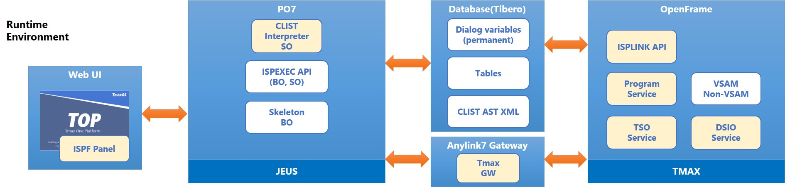

__c. Version information__

- JEUS8: JEUS 8 fix1 b162106
- ProObject 7 runtime version: runtime-7.0.0.1.218
- TOP IDE: Tmax One Platform IDE v.fix_3.0.92_200102


#### 2.20.2 JEUS 8
__a.__ Unzip the JEUS 8 folder and move it to *${HOME_DIRECTORY}/tmaxui/*:
```bash
# Make sure you are logged in as ofjeus8, if not run the following line first
su - ofjeus8
# <enter password>
cd ${HOME_DIRECTORY}/tmaxsw
mkdir jeus8
unzip jeus8_b162106.zip -d jeus8
mv ${HOME_DIRECTORY}/tmaxsw/jeus8 ${HOME_DIRECTORY}/tmaxui/
```

__b.__ Take a backup of *${JEUS_HOME}/setup/domain-config-template.properties* (for this just run a cp command like this `cp <file> <file>.bck`) and then modify the file for your own environment:
```text
domain=jeus8_domain
productionmode=false
domain.admin.server.name=adminServer
domain.admin.server.jvm.config=-Xmx256m -XX:MaxPermSize=128m
domain.admin.server.jeus.port=19736
domain.admin.server.http.port=18088
usevirtualmulticast=true

jeus.password=tmax1234
jeus.username=admin_jeus8
nodename=ofdemo
jeus.lang=ko
jvm.vendor=Sun

```

- __domain__: You can specify name of domain used at JEUS8
- __productionmode__: Choose if we use production mode at JEUS8.
- __domain.admin.server.<span>name</span>__: Specify name of domain administration server name.
- __domain.admin.server.jeus.port__: Specify base port number of domain server. I recommend setting this port number after adding 10000 to base port number of legacy JEUS base port number of domain server (9736 + 10000 = 19736).
- __domain.admin.server.http.port:__ Specify http-listener port number of domain server. I recommend setting this port number after adding 10000 to HTTP port number of legacy JEUS base port number of domain server (8088 + 10000 = 18088).
- __usevirtualmulticast__: JEUS use IP multicast network by default. But, this multicast method is not preferred by network engineer when this environment goes to production mode. Instead of using this multicast method, I recommend to use a virtual multicast method which identifies other jeus processes using physical ip address and port.

- __jeus.password__: Specify the password for jeusadmin account.
- __jeus.username__: Specify jeusadmin account ID.
- __nodename__: Specify name of node which will be used as node at JEUS domain (We recommend set this variable using hostname).
- __jeus.lang__: Now, JEUS 8 fix1 version is not supported in English. Our GPS team asked R&D to support English version. In the meantime we need to use ‘ko’ for a moment.
- __jvm.vendor__: Specify a name of vendor who provide JDK.

*note: The port numbers above should not be listened to other services in your machine.*

Here is a screenshot of this file after modification:

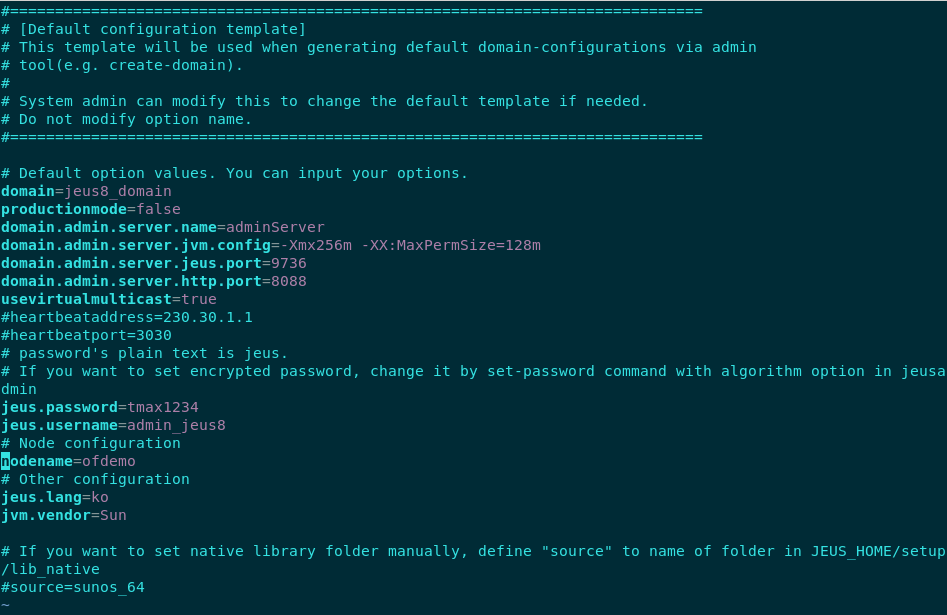

__c.__ Replace the existing license file in the folder *${JEUS_HOME}/license*:
```bash
ls ${JEUS_HOME}/license
# If there is a license, this is probably the default trial license. Check with the following command:
jeusadmin -licenseinfo
# If yes, remove it and put your demo license instead
rm ${JEUS_HOME}/license/license
ln -s ${HOME_DIRECTORY}/tmaxsw/licenses/license ${JEUS_HOME}/license/license
```

__d.__ Change permissions for ant binary folder: `chmod 751 ${JEUS_HOME}/lib/etc/ant/bin/*`

__e.__ Run the __ant__ commands to build the server being in *${JEUS_HOME}/setup/*:
```bash
ant clean-all
ant install
```
Output for the first command:

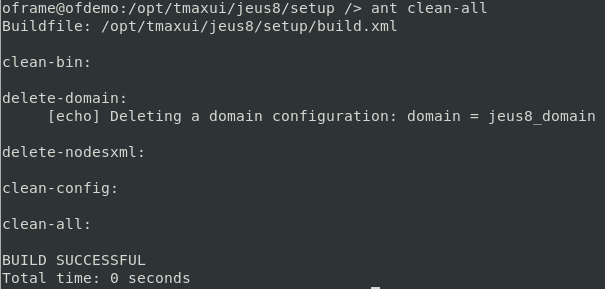

Output for the second command:

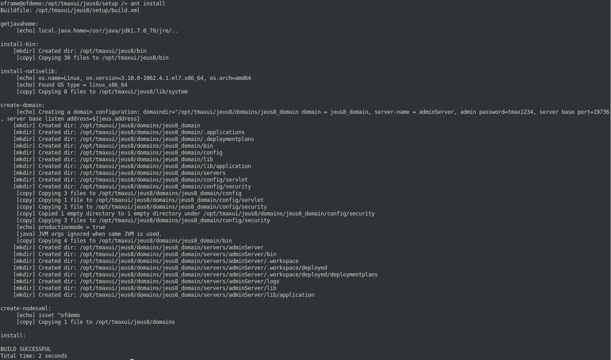

__f.__ Change the port of the Node Manager from __7730__ to __17730__ in the file *${JEUS_HOME}/domains/nodes.xml* and also in the file *\${JEUS_HOME}/nodemanager/jeusnm.xml* change the same port and the host from __0.0.0.0__ to __localhost__.

Here are screenshots of the files after modification:

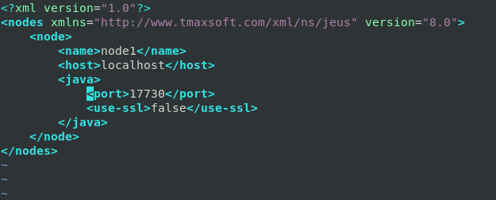
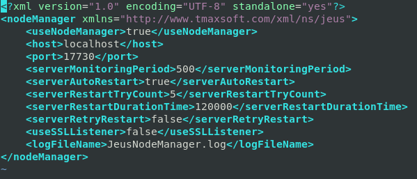

__g.__ Create the log file for the node manager:
```bash
mkdir ${JEUS_HOME}/nodemanager/logs
touch ${JEUS_HOME}/nodemanager/logs/JeusNodeManager.log
chmod 771 ${JEUS_HOME}/nodemanager/logs/JeusNodeManager.log
```

 ### __At this time do not boot the server and the node manager, it is necessary to do the ProObject7 runtime configuration first.__ <!-- omit in toc -->

#### 2.20.3 ProObject 7 Installation
 __a.__ Create a backup of the JEUS 8 domain configuration file *${JEUS_HOME}/domains/jeus8_domain/config/domain.xml*:
```bash
# Make sure you are logged in as ofjeus8, if not run the following line first
su - ofjeus8
# <enter password>
cd ${JEUS_HOME}/domains/jeus8_domain/config/
cp domain.xml domain.xml.bck
```
Then, copy the XML file *domain_of1.xml* and modify it:
```bash
cp ${HOME_DIRECTORY}/tmaxsw/domain_of1.xml ${JEUS_HOME}/domains/jeus8_domain/config/domain.xml
```

__b.__ Open the *domain.xml* file and modify the following parameters according to your environment:
```text
<servers>
    <server>
       <name>adminServer</name>
       <node-name>ofdemo</node-name>                            #ADAPT TO YOUR ENVIRONMENT
       <listeners>
          <base>base</base>
          <listener>
             <name>base</name>
             <listen-address>10.0.2.15</listen-address>         #ADAPT TO YOUR ENVIRONMENT
             <listen-port>19736</listen-port>                   #ADAPT TO YOUR ENVIRONMENT
             <selectors>1</selectors>
             <use-dual-selector>false</use-dual-selector>
             <backlog>128</backlog>
             <read-timeout>30000</read-timeout>
             <reserved-thread-num>0</reserved-thread-num>
          </listener>
          <listener>
             <name>http-server</name>                           #ADAPT TO YOUR ENVIRONMENT
             <listen-address>10.0.2.15</listen-address>         #ADAPT TO YOUR ENVIRONMENT
             <listen-port>18808</listen-port>                   #ADAPT TO YOUR ENVIRONMENT
             <selectors>1</selectors>
             <use-dual-selector>false</use-dual-selector>
             <backlog>128</backlog>
             <keep-alive-timeout>600000</keep-alive-timeout>
             <read-timeout>30000</read-timeout>
             <reserved-thread-num>0</reserved-thread-num>
          </listener>
       </listeners>

[...]

<session-config>
   <timeout>60</timeout>
   <max-session-count>-1</max-session-count>
   <shared>false</shared>
   <reload-persistent>false</reload-persistent>
   <tracking-mode>
      <cookie>true</cookie>
      <url>false</url>
      <ssl>false</ssl>
   </tracking-mode>
   <session-cookie>
      <cookie-name>JSESSIONID1</cookie-name>                    #ADAPT TO YOUR ENVIRONMENT
      <version>0</version>
      <max-age>-1</max-age>
      <secure>false</secure>
      <http-only>true</http-only>
      <same-site>None</same-site>
   </session-cookie>
</session-config>

[...]

    <server>
        <name>po7_svr</name>                                    #ADAPT TO YOUR ENVIRONMENT
        <node-name>ofdemo</node-name>                           #ADAPT TO YOUR ENVIRONMENT
        <listeners>
          <base>BASE</base>
          <listener>
              <name>BASE</name>
              <listen-address>10.0.2.15</listen-address>        #ADAPT TO YOUR ENVIRONMENT
              <listen-port>19746</listen-port>                  #ADAPT TO YOUR ENVIRONMENT
              <selectors>1</selectors>
              <use-dual-selector>false</use-dual-selector>
              <backlog>128</backlog>
              <read-timeout>30000</read-timeout>
              <reserved-thread-num>0</reserved-thread-num>
          </listener>
          <listener>
              <name>http-po7</name>                             #ADAPT TO YOUR ENVIRONMENT
              <listen-address>10.0.2.15</listen-address>        #ADAPT TO YOUR ENVIRONMENT
              <listen-port>18818</listen-port>                  #ADAPT TO YOUR ENVIRONMENT
              <selectors>1</selectors>
              <use-dual-selector>false</use-dual-selector>
              <backlog>128</backlog>
              <read-timeout>30000</read-timeout>
              <reserved-thread-num>0</reserved-thread-num>
          </listener>
        </listeners>
        <jvm-config>
          <jvm-option>-DPROOBJECT_HOME=/opt/tmaxui/proobject7   #ADAPT TO YOUR ENVIRONMENT
        </jvm-config>

[...]

<session-config>
   <timeout>60</timeout>
   <max-session-count>-1</max-session-count>
   <shared>false</shared>
   <reload-persistent>false</reload-persistent>
   <tracking-mode>
      <cookie>true</cookie>
      <url>false</url>
      <ssl>false</ssl>
   </tracking-mode>
   <session-cookie>
      <cookie-name>JSESSIONID1</cookie-name>                    #ADAPT TO YOUR ENVIRONMENT
      <version>0</version>
      <max-age>-1</max-age>
      <secure>false</secure>
      <http-only>true</http-only>
      <same-site>None</same-site>
   </session-cookie>
</session-config>

[...]

<deployed-applications>
   <deployed-application>
      <id>proobject-runtime.war</id>
      <path>/opt/tmaxui/proobject7/_for_jeus/proobject-runtime-war-7.0.0.1.228.war</path> #ADAPT TO YOUR ENVIRONMENT
      <type>WAR</type>
      <target-server>
         <name>po7_svr</name>                                   #ADAPT TO YOUR ENVIRONMENT
      </target-server>
      <classloading>ISOLATED</classloading>
      <use-fast-deploy>false</use-fast-deploy>
      <keep-generated>false</keep-generated>
      <shared>false</shared>
      <node-java-context>true</node-java-context>
   </deployed-application>
</deployed-applications>

[...]

<resources>
   <data-source>
      <database>
         <data-source-id>tibero6</data-source-id>
         <export-name>tibero6</export-name>
         <data-source-class-name>com.tmax.tibero.jdbc.ext.TbConnectionPoolDataSource</data-source-class-name>
         <data-source-type>ConnectionPoolDataSource</data-source-type>
         <vendor>tibero</vendor>
         <server-name>10.0.2.15</server-name>                   #ADAPT TO YOUR ENVIRONMENT
         <port-number>8629</port-number>                        #ADAPT TO YOUR ENVIRONMENT
         <database-name>TVSAM</database-name>                   #ADAPT TO YOUR ENVIRONMENT
         <user>tibero</user>                                    #ADAPT TO YOUR ENVIRONMENT
         <password>tmax</password>                              #ADAPT TO YOUR ENVIRONMENT
         <login-timeout>0</login-timeout>
         <auto-commit>DRIVER</auto-commit>
         <stmt-query-timeout>0</stmt-query-timeout>
         <pool-destroy-timeout>10000</pool-destroy-timeout>

[...]
```

- __node-name__: Specify the name of node, same as the one you specified in *domain-config-template.properties*.
- __listen-address__: Physical IP address of your server.
- __listen-port__: Specify actual BASE and HTTP ports number for JEUS 8 adminServer and ProObject7 server. These port numbers should not be listened to other services in your machine.
- __cookie-name__: Specify a different cookie-name to avoid a problem which can occurs when trying to logon to webadmin (between JEUS 7 and 8, same jsession ID can affect logon session). 
- __jvm-option__: Correct location of PROOBJECT_HOME.
- __path__: Correct location of PROOBJECT_HOME.

- __server-name__: Physical IP address of the Tibero database server.
- __port-number__: Tibero listen port number.
- __database-name__: Tibero SID used by OpenFrame (run `echo $TB_SID` to be sure).
- __user__: Tibero username. Use the same user as the one used for OpenFrame installation.
- __password__: password for the Tibero user.

__c.__ Copy Tibero's JDBC Driver to *${JEUS_HOME}/lib/system*:
```bash
# The following cp commands probably need root access because the owner of the 
# folder is not ofjeus8 but oftibr.
# Moreover, copying does not change the owner of the file. Please change the
# owner to ofjeus8 instead of oftibr with chown command
su -
# <enter root password>
cp /opt/tmaxdb/tibero6/client/lib/jar/tibero6-jdbc.jar /opt/tmaxui/jeus8/lib/system
chown ofjeus8:mqm /opt/tmaxui/jeus8/lib/system/tibero6-jdbc.jar
chmod 754 /opt/tmaxui/jeus8/lib/system/tibero6-jdbc.jar
exit
```

__d.__ Unpack OpenFrame_ISPF_7_x86_64 from the tar.gz file using the following commands:
  ```bash
  cd ${HOME_DIRECTORY}/tmaxsw
  tar -xzvf OpenFrame_ISPF_7_x86_64.tar.gz
  ```
Verify if a folder *OpenFrame_ISPF_7_x86_64/* is created in *${HOME_DIRECTORY}/tmaxsw*: `ls`. 

__e.__ Check and edit the following parameters in ispf.properties (*${HOME_DIRECTORY}/tmaxsw/OpenFrame_ISPF_7_x86_64/ispf.properties*) file. One *ispf.properties* file is provided with the correct parameters (under *\${HOME_DIRECTORY}/tmaxsw*), you can also just double check this properties file an override the other:
```text
USERID=tibero
PASSWD=tmax
DBPORT=8629
DBNAME=TVSAM

DOMAINNAME=jeus8_domain
ADMINPORT=19736
POSERVER=po7_svr

POPORT=8777
POFILEPORT=6445

TMAXINPORT=8282
TMAXOUTPORT=6555
```

*note: POPORT, POFILEPORT, TMAXINPORT, TMAXOUTPORT. These ports are the channel for communication between ProObject7 and Anylink, they should be unoccupied port!*

 __f.__ Execute *install.sh* located in the folder *${HOME_DIRECTORY}/tmaxsw/OpenFrame_ISPF_7_x86_64*:
 ```bash
 cd ${HOME_DIRECTORY}/tmaxsw/OpenFrame_ISPF_7_x86_64
 sh install.sh
 ```
Output:
```text
************************************************************
      Start the installation of OpenFrame_ISPF_7            
************************************************************
[1/19] setting the ispf_migration/parser/gen/skeleton/build.properties file
[2/19] setting the ispf_migration/parser/gen/skeleton/build.properties file
[3/19] setting the proobject7/application/of8/config/dbio_config.xml file
[4/19] setting the proobject7/application/of8/config/dbio_config.xml file
[5/19] setting the proobject7/application/of8/config/dbio_config.xml file
[6/19] setting the proobject7/application/of8/config/dbio_config.xml file
[7/19] setting the proobject7/system/config/dbio_config.xml file
[8/19] setting the proobject7/system/config/dbio_config.xml file
[9/19] setting the proobject7/system/config/dbio_config.xml file
[10/19] setting the proobject7/system/config/dbio_config.xml file
[11/19] setting the proobject7/config/proobject.xml file
[12/19] setting the proobject7/config/proobject.xml file
[13/19] setting the proobject7/config/proobject.xml file
[14/19] setting the proobject7/config/proobject.xml file
[15/19] setting the proobject7/_for_jeus/setting.js file
[16/19] setting the anylinkGW/protocol/TMAX/tmaxgw/config/gateway.json file
[17/19] setting the anylinkGW/protocol/TMAX/tmaxgw/config/gateway.json file
[18/19] setting the anylinkGW/protocol/TMAX/tmaxgw/endpoint/tmaxInboundEp.ep file
[19/19] setting the anylinkGW/protocol/TMAX/tmaxgw/endpoint/tmaxOutboundEp.ep file
Installation is complete. Please run ProylObject and AnylinkGW servers.....
```
TODO If the installation is successful like that, please update the script install.sh inside the TAR archive

Verify if the folders *anylinkGW*, *ispf_migration*, *proobject7* are created in *${HOME_DIRECTORY}/tmaxui*: `ls`.

__g.__ Create a backup of the ProObject7 configuration file *${PROOBJECT_HOME}/config/proobject.xml*:
```bash
cd /home/ofjeus8/proobject7/config/
cp proobject.xml proobject.xml.bck
```
Then, edit the XML file with the following parameters:
```text
<?xml version="1.0" encoding="UTF-8" standalone="yes"?>
<!DOCTYPE xml>
<ProObjectConfig>
    <!--single-application>true</single-application-->         #ADAPT TO YOUR ENVIRONMENTi
    <file-port>6445</file-port>                                #ADAPT TO YOUR ENVIRONMENT
    <proobject-port>8777</proobject-port>                      #ADAPT TO YOUR ENVIRONMENT
    <server-name>po7_svr</server-name>                         #ADAPT TO YOUR ENVIRONMENT
    <!--application-path>/opt/tmaxui/proobject7/application</application-path-->
    <engine-config>                                            #ADAPT TO YOUR ENVIRONMENT
        <listener-name>http-po7</listener-name>                #ADAPT TO YOUR ENVIRONMENT
        <host-name>ofdemo</host-name>                          #ADAPT TO YOUR ENVIRONMENT
        <proObject-datasource>tibero6</proObject-datasource>
        <initial-context-factory>jeus.jndi.JEUSContextFactory</initial-context-factory>
        <provider-url>10.0.2.15:19736</provider-url>           #ADAPT TO YOUR ENVIRONMENT
    </engine-config>

[...]

</ProObjectConfig>
```
- __file-port, proobject-port__: Check if these port numbers are bound to other services on your machine. These ports have to be the same as the ones set up in *ispf.properties* before.
- __server-name__: Server name, it has to be the same as the one setup in JEUS8 config.
- __listener-name__: Specify the same name as the one for HTTP port number of ProObject7 managed server.
- __host-name__: Double check if the hostname is correct with the one of your your machine.
- __provider-url__: Specify URL information about JEUS8 Domain Administration Server.

__h.__ Create a backup of the dbio configuration file *${PROOBJECT_HOME}/application/of8/config/dbio_config.xml*:
```bash
cd ${PROOBJECT_HOME}/application/of8/config/
cp dbio_config.xml dbio_config.xml.bck
```
Then, edit the following parameters in this file. One *dbio_config.xml* file is provided with the correct parameters (under *${HOME_DIRECTORY}/tmaxsw*), you can also just double check this XML file an override the other::
```text
<async-jdbc conn_name="tibero6" dbname="TVSAM" userid="tibero" passwd="tmax" ip="10.0.2.15" port="8629" />
<studio-jdbc conn_name="tibero6" username="tibero" passwd="tmax" driver="com.tmax.tibero.jdbc.TbDriver" pool_size="" url="jdbc:tibero:thin:@10.0.2.15:8629:TVSAM" /> 
```
- __dbname__: TB_SID, SID for the Tibero database.
- __userid / username__: Tibero user ID.
- __passwd (2 times)__: Tibero user password.
- __ip__: physical IP address of your machine.
- __port__: port number for Tibero database.


__i.__ Please check that Tibero is ON and then boot the __DomainAdminServer__ and the managed server __ProObject__ with the commands:
```bash
cd ${JEUS_HOME}/bin
startDomainAdminServer -domain jeus8_domain -u admin_jeus8 -p tmax1234
startManagedServer -domain jeus8_domain -server po7_svr -u admin_jeus8 -p tmax1234
# Since you have the folder jeus8/bin/ in the PATH variable in the bash_profile, this commands are supposed to work from everywhere
```

#### 2.20.4 ISPF Installation
__a.__ Check if *$JAVA_HOME* is set:
```bash
# Make sure you are still logged in as ofjeus8, if not run the following line first
su - ofjeus8
# <enter password>
echo $JAVA_HOME 
```
Output: 
```text
/usr/java/jdk1.7.0_79
```
__b.__ For the creation of the ISPF server in JEUS, please follow the list of steps below:
   -  Open your web browser and go to the JEUS8 admin console (10.0.2.15:19736/webadmin).
   -  Login with JEUS8 credentials (admin_jeus8 and tmax1234).
   -  Go to the page servers
   -  Click on "Lock & Edit"
  
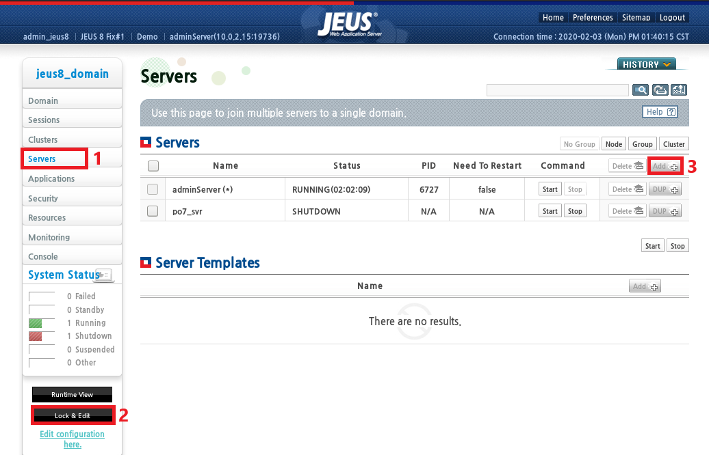

   -  Click on "Add" in the server list and fill the parameters:
      -  Name=ispf_svr
      -  Node Name=ofdemo
      -  Jvm Option=-DPROOBJECT_HOME=/opt/tmaxui/proobject7
      -  Data Source=tibero6

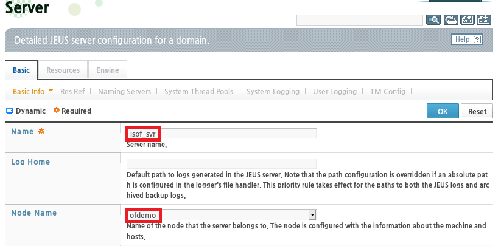
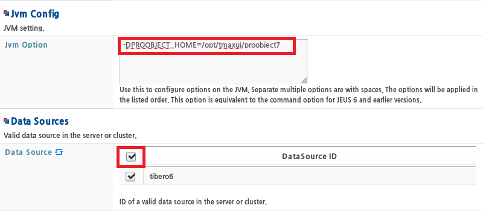

   -  Click on "OK" and then "Apply Changes". This first apply changes is required to create the server.
   -  Click on "Lock & Edit" again. We are going to configure the server now.
   -  Go to the tab "Resources".

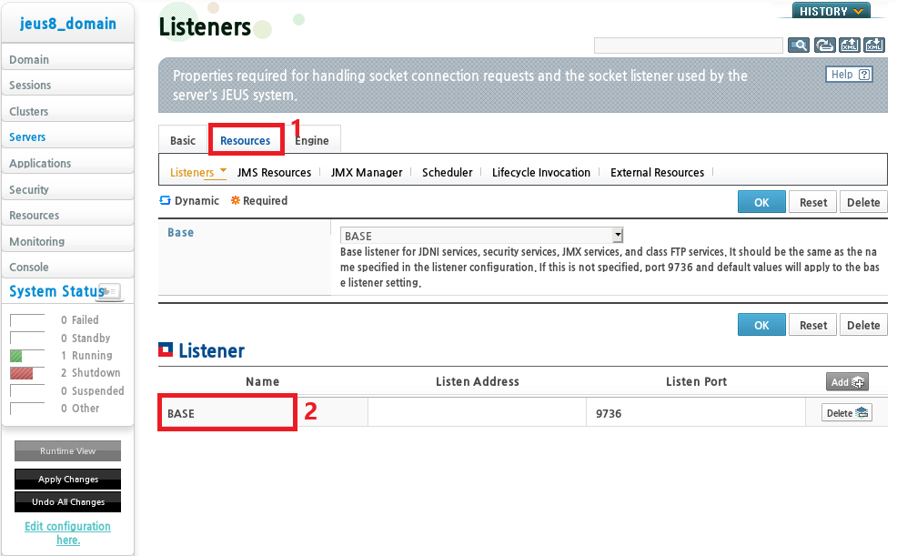

   -  Modify the first listener. The parameters are: 
      -  Name=BASE
      -  Listen Address=10.0.2.15
      -  Listen Port=19756

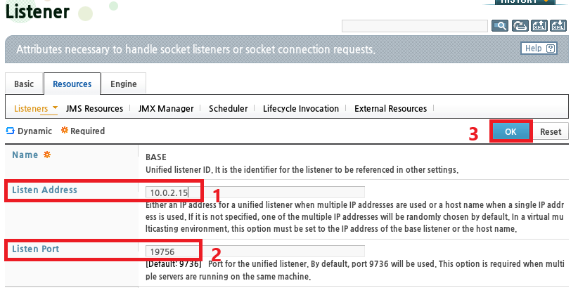

   - Click on "OK".
   -  Add a second listener:
      -  Name=http-ispf
      -  Listen Address=10.0.2.15
      -  Listen Port=18828

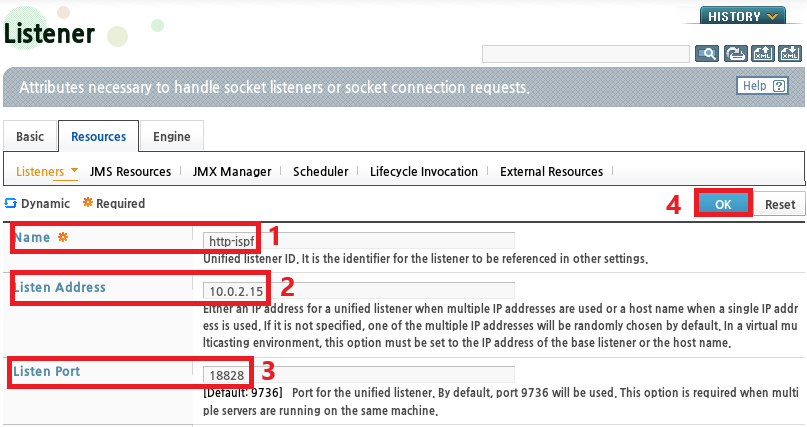

   - Click on "OK".
   -  Go to the tab "Engine" and "Web Connections".

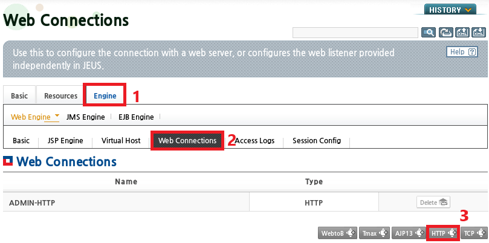

   -  Click on "HTTP +". Parameters are: 
      -  Name=http-conn-ispf
      -  Server Listener Ref=http-ispf (Need to be the same as the HTTP Listener for ISPF)
      -  Min=10
      -  Max=20

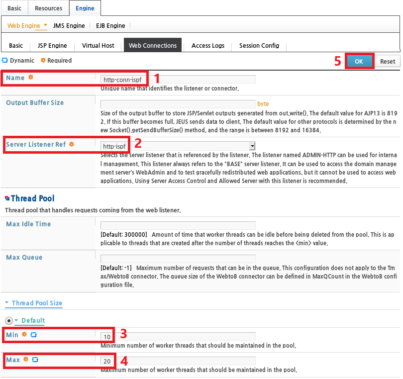

   - Click on "OK".
   - Finally, click on "Apply Changes".

__c.__ In total, you have the adminServer and 2 managed servers for JEUS 8:

| OpenFrame web-solution | Server name | BASE Port | HTTP Port |
|:----------------------:|:-----------:|:---------:|:---------:|
|   DomainAdmin Server   | adminServer |   19736   |   18808   |
|       ProObject7       |   po7_svr   |   19746   |   18818   |
|          ISPF          |  ispf_svr   |   19756   |   18828   |


__d.__ Check and edit the __JCL_PATH__ in ispf.properties (*${PROOBJECT_HOME}/application/of8/servicegroup/ispf/config/ispf.properties*) file. The default value for this parameter is:
```bash
JCL_PATH=${OPENFRAME_HOME}/volume_default/SYS1.JCLLIB
```

#### 2.20.5 Patching
__a.__ For all patchs applied in this section, make sure that OpenFrame is down. Go to the folder *${HOME_DIRECTORY}/tmaxsw/patch/batch*. Change the name of the patch folder by adding the date when you apply the patch. Please respect the following format, in the example the date for the patch is January 25th 2020:
```bash
# Make sure you are still logged in as ofjeus8, if not run the following line first
su - ofjeus8
# <enter password>
mv 193307_ 193307_20200125
```
Whenever you apply a patch to an OpenFrame product, you have to put all patch files under *${HOME_DIRECTORY}/tmaxsw/patch/__OpenFrame_product_concerned_by the_patch__/* and in a folder which name respect the format __'IMSTicketNumber_datePatchApplied'__

__b.__ For the batch module patch, the first step is copying the server binary __obmtscmd__ under *${OPENFRAME_HOME}/core/appbin*:
```bash
cd ${HOME_DIRECTORY}/tmaxsw/patch/batch/193307_20200125
tar -zxvf IMS193307_BATCH_20190626_linux_x86_64.tar.gz
cp ${HOME_DIRECTORY}/tmaxsw/patch/batch/193307_20200125/server/obmtscmd ${OPENFRAME_HOME}/core/appbin
```

__c.__ Copy the following libraries to the folder *${OPENFRAME_HOME}/lib* and create one symbolic link:
```bash
cp ${HOME_DIRECTORY}/tmaxsw/patch/batch/193307_20200125/lib/{libclistpar.so.64.7_0_3_0,libtsopar.so.64.7_0_3_4,libtso.so.64.7_0_3_55} ${OPENFRAME_HOME}/lib/
cd ${OPENFRAME_HOME}/lib/
ln -s libclistpar.so.64.7_0_3_0 libclistpar.so
ln -s libtsopar.so.64.7_0_3_4 libtsopar.so
rm libtso.so; ln -s libtso.so.64.7_0_3_55 libtso.so
```

__d.__ Replace the following files:
```bash
cp ${HOME_DIRECTORY}/tmaxsw/patch/batch/193307_20200125/bin/tjesinit ${OPENFRAME_HOME}/bin/
cp ${HOME_DIRECTORY}/tmaxsw/patch/batch/193307_20200125/util/IKJEFT01 ${OPENFRAME_HOME}/util/
```

__e.__ For the next patch, the first step is copying the server binary __ISPF__ under *${OPENFRAME_HOME}/core/appbin*:
```bash
cd ${HOME_DIRECTORY}/tmaxsw/patch/ispf
mv 197528_ 197528_20200125
cd 197528_20200125
tar -xvf IMS197528_20190703.tar
cp ${HOME_DIRECTORY}/tmaxsw/patch/ispf/197528_20200125/ISPF ${OPENFRAME_HOME}/core/appbin
```

__f.__ And then copy the library __libisplink.so__ to *${OPENFRAME_HOME}/lib*
```bash
cp ${HOME_DIRECTORY}/tmaxsw/patch/ispf/197528_20200125/libisplink.so ${OPENFRAME_HOME}/lib
```

__g.__ For the last patch, copy the server binary __ISPFTACF__ under *${OPENFRAME_HOME}/core/appbin*:
```bash
cd ${HOME_DIRECTORY}/tmaxsw/patch/ispf
mv 197101_ 197101_20200125
cd 197101_20200125
tar -xvf IMS197101_ISPFTACF-2019-07-03.tar
cp ${HOME_DIRECTORY}/tmaxsw/patch/ispf/197101_20200125/ISPFTACF-2019-07-03/appbin/ISPFTACF ${OPENFRAME_HOME}/core/appbin
```

__h.__ Take a backup of core configuration file:
```bash
cd ${OPENFRAME_HOME}/core/config
cp oframe.m oframe_before_ispf.m
```

__i.__ The last patching step here is to add all these servers in core configuration file oframe.m (*${OPENFRAME_HOME}/core/appbin*). In the bottom of the file, add:
```text
################################################################################
# Sample Tmax Configuration for OpenFrame ISPF                                 #
# - When you change ISPF servers or services,                                  #
#   you should change this file as well according to your changes.             #
################################################################################

*SERVER
################################################################################
# OpenFrame ISPF Servers                                                       #
# - obmtscmd                                                                   #
# - ISPFTACF                                                                   #
# - ISPF                                                                       #
# - ispfsvr                                                                    #
################################################################################

obmtscmd    SVGNAME = svg_node1,
            CLOPT="-o $(SVR)$(DATE).out -e $(SVR)$(DATE).err"

ISPFTACF    SVGNAME = svg_node1 , MIN = 5, MAX = 10,
            CLOPT="-o $(SVR)$(DATE).out -e $(SVR)$(DATE).err"

ISPF        SVGNAME = svg_node1, MIN = 10, MAX = 40,
            CLOPT="-o $(SVR)$(DATE).out -e $(SVR)$(DATE).err"

#ispfsvr    SVGNAME = svg_node1 , MIN = 5, MAX = 10,
#            CLOPT="-o $(SVR)$(DATE).out -e $(SVR)$(DATE).err"

*GATEWAY
jgw         GWTYPE=JEUS_ASYNC,
            NODENAME="NODE1",
            PORTNO=6555,  
            RGWADDR="10.0.2.15",
            RGWPORTNO=8282, 
            CLOPT="-o $(SVR)$(CDATE).out -e $(SVR)$(CDATE).err",
            CPC=1

*SERVICE
################################################################################
#   obmtscmd                                                                   #
################################################################################
OBMTSCMD        SVRNAME = obmtscmd

################################################################################
#   ISPF TACF                                                                  #
################################################################################
JSONTOFDL       SVRNAME = ISPFTACF

################################################################################
#   ispfsvr                                                                    #
################################################################################
#ISPFLOGIN       SVRNAME = ispfsvr
#ISPFLOGOUT      SVRNAME = ispfsvr
#ISPFFILEREAD    SVRNAME = ispfsvr
#ISPFDSCHECK     SVRNAME = ispfsvr

################################################################################
#   ISPF                                                                       #
################################################################################
ISPEXECSELECT   SVRNAME = ISPF

################################################################################
#   anylinkGW - jgw                                                            #
################################################################################
TBDISPL         SVRNAME = jgw
ISPLINKDISPLAY  SVRNAME = jgw
```
*Note: For the gateway, PORTNO have to be same with TMAXOUTPORT and RGWPORTNO with TMAXINPORT specified at ispf.properties.*


__j.__ Compile the file with the command: `cfl -i oframe.m`

Output:
```text
CFL is done successfully for node(NODE1)
```

__k.__ Run also the command: `gst`

Output:
```text
SVC tables are successfully generated 
GST is successfully done 
```

__l.__ Execute the script j8_script_folders.sh and then j8_add_commands.sh
```bash
cd ${HOME_DIRECTORY}/tmaxsw/scripts/jeus/jeus8
. j8_script_folders.sh
cd ${JEUS_HOME}/scripts
sh j8_add_commands.sh
# Since you have the folder jeus8/scripts/ in the PATH, this command is supposed to work from everywhere
```


__m.__ Edit the configuration files *ofsys.seq* and *osi.ofsys.seq* (*${OPENFRAME_HOME}/config*), add the servers __obmtscmd__, __ISPFTACF__ and __jgw__. This allow you to boot automatically these servers when you use the command `oscboot` or `osiboot`. The files should look like the following:

*ofsys.seq*:
```text
#BASE
ofrsasvr
ofrlhsvr
ofrdmsvr
ofrdsedt
ofrcmsvr
ofruisvr
ofrsmlog
vtammgr
TPFMAGENT

#BATCH
obmtsmgr
ofrpmsvr
obmjmsvr
obmjschd
obmjinit
obmjhist
obmjspbk
obmjtimr

#TACF
tmsvr

#OFStudio
ofstudio

#ISPF
jgw
obmtscmd
ISPFTACF
ISPF
#ispfsvr
```

*osi.ofsys.seq*:
```text
#BASE
ofrsasvr
ofrlhsvr
ofrdmsvr
ofrdsedt
ofrcmsvr
ofruisvr
ofrsmlog
vtammgr
TPFMAGENT

#BATCH
ofrpmsvr
obmjmsvr
obmjschd
obmjinit
obmjhist
obmjspbk
obmtsmgr
obmjtimr

#TACF
tmsvr

#OSI
OSIGW001

#OFStudio
ofstudio

#ISPF
jgw
obmtscmd
ISPFTACF
ISPF
#ispfsvr
```

__n.__ Boot up OSI: `osiboot`

Output:
```text
```

- Verify process ready status using `tmadmin`. Then use the command `si`, all the processes should have RDY status:
```text
```

TODO Check the following IMS tickets for all the patch: 198052 for ISPF, 200789 for ofdscheck, 203491 for ispfsvr, 190726 for jgw, 203491 for ispfsvr

From the PATCH folder in Entergy, I have also:
- 193307
- 197101
- 197528
- 197714
- 197734
- 198023
- 198033
- 198052
- 198223
- 198236
- 198565

#### 2.20.6 Migrate ISPF assets
Starting in this section, you may need some specific datasets used for ISPF, these are the ISPF assets. If these were not provided to you, you may ask for it. 

__a.__ Retrieve theses datasets in your Windows environment. Move them to the share folder you have with your virtual machine. You shoud have the following structure for these datasets: 

  - ispf_assets/
    - clist/
      - corresponding datasets
    - message/
      - corresponding datasets
    - panel/
      - corresponding datasets
    - pgm/
      - corresponding datasets
    - skeleteon/
      - corresponding datasets
    - table/
      - corresponding datasets

Copy ISPF assets to *$ISPF_HOME/parser/dataset* according to category of asset:
```bash
su -
# <enter root password>
cp /media/sf_Share_VMs/ispf-assets/datasets.tar.gz /opt/tmaxui/ispf_migration/parser
chown ofjeus8:mqm /opt/tmaxui/ispf_migration/parser/datasets.tar.gz
# log in as ofjeus8 now
su - ofjeus8
# <enter password>
tar -zxvf ${ISPF_HOME}/parser/datasets.tar.gz -C ${ISPF_HOME}/parser/dataset
mv ${ISPF_HOME}/parser/dataset/others ${ISPF_HOME}/parser/other_dataset
```

__b.__ Check and change according to your environement all the absolute directory paths specified at __alloc.sh__ under *\$ISPF_HOME/parser/bin* and all __.ctl files__ located at *$ISPF_HOME/parser/alloc*. you can do it manually or also use the following commands:
```bash
sed -i 's/home\/ispf1/opt\/tmaxui/g' ${ISPF_HOME}/parser/bin/alloc.sh
sed -i 's/home\/ispf1/opt\/tmaxui/g' ${ISPF_HOME}/parser/alloc/*.ctl
```

Here is a screenshot of *alloc.sh* after modification:

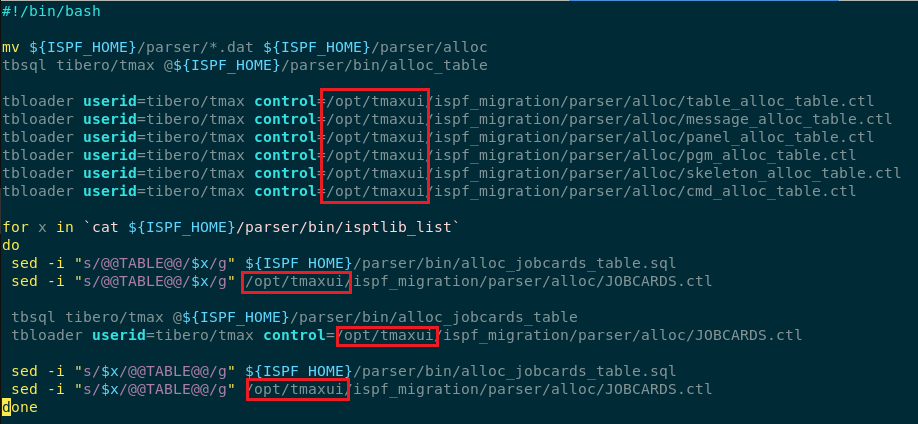

Here is a couple screenshots of *.ctl files* after modification:

   - cmd_alloc_table.ctl

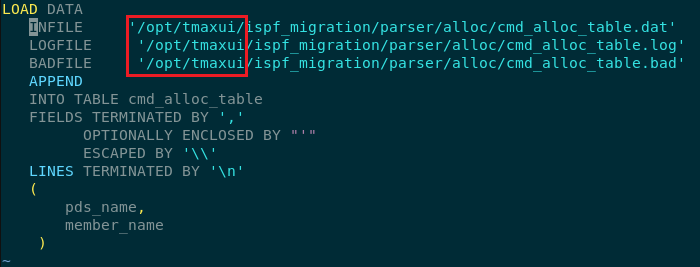

   - pgm_alloc_table.ctl

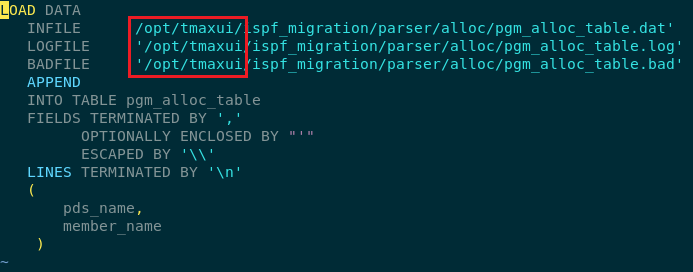

__c.__ Before this step, please make sure that Tibero is running. Execute the script *pstart*:
```bash
cd ${ISPF_HOME}/parser/bin
pstart
```
When you execute it, first original assets are parsed and generated to new source code that can be understood by ISPF and second it saves information of PDS and member to Tibero database. This feature is created because ISPF use information of PDS inside the system.

*Note: When pstart finish, you can check the logs under ${ISPF_HOME}/parser/log/*

#### 2.20.7 TOP IDE installation
Prior to this installation, you have to make sure that a JDK is installed on your machine, in your Windows environment. If not, please do this first.

This installation is very simple, you just need to unzip the TOP IDE zip file in your Windows environment. Make sure that the path where you unzip it contains only english word, for instance this is a correct path: *C:\Users\Public\Documents*
The following path is not correct: *C:\Users\RobertDupont\Documents*

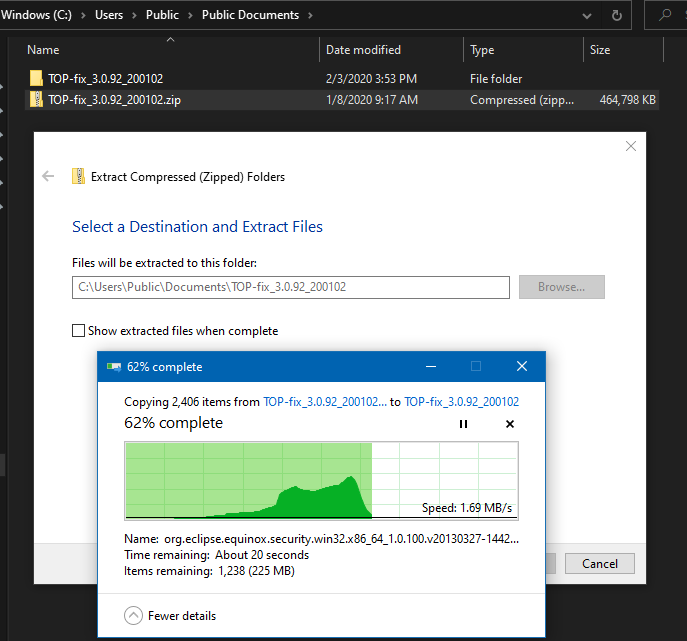


#### 2.20.8	Project for panel assets in TOP IDE
__a.__ To import panel assets in TOP IDE, the first step is to copy the result of `pstart` into you shared folder:
```bash
su -
# <enter root password>
cp -r /opt/tmaxui/ispf_migration/parser/gen /media/sf_Share_VMs/ispf-assets
```

__b.__ Open TOP IDE. You can keep the default workspace:

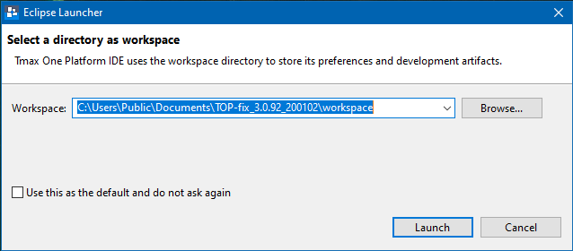

__c.__ Click right button of mouse in the TOP Project Navigator and select __Import...__.

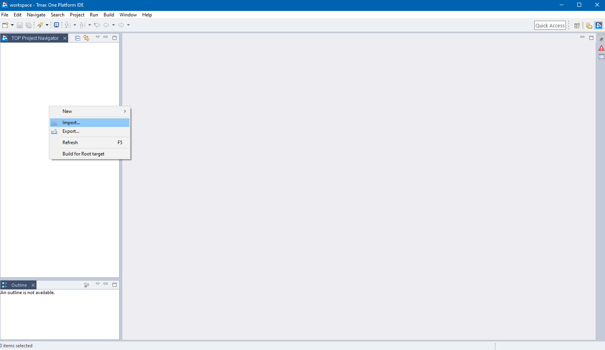

__d.__ Select __Existing Projects into Workspace__ and then __Next__.

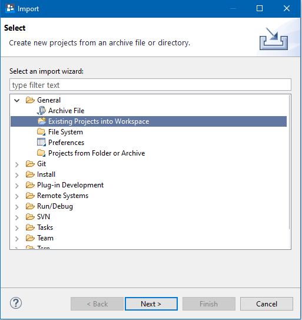

__e.__ Click __Browse__ and select *gen* folder created after executing code generator. It is still located in the folder shared with your VM.

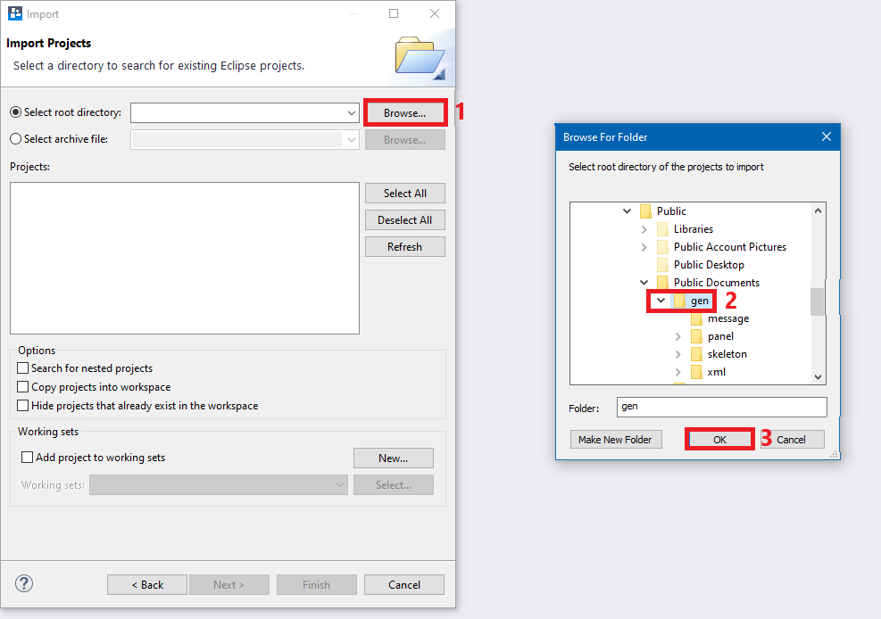

__f.__ After selecting *gen* folder, TOP IDE automatically find project called __top__. Click __Finish__ button.

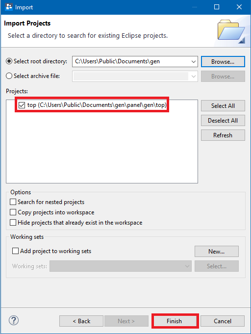

__g.__ After importing __top__ project, you can see the directory structure:

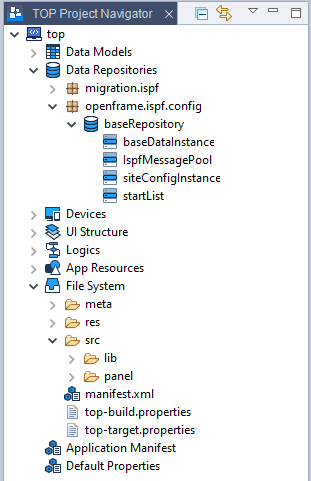

 - Data Models: this resource is used to define a schema of variables used at panel.
 - Data Repositories: this resource is used to define actual value of variables.

__h.__ Please modify the following parameters according to your environment:
   - under /siteConfigInstance: replace the value for serverAddress with the one for your environment (ip-address:ispf_http_port), plase look at the screenshot below

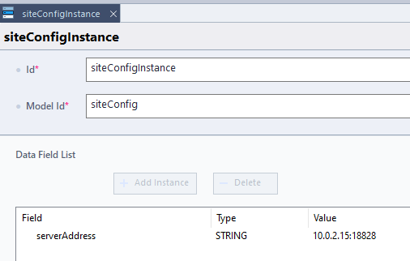

TODO Maybe need context path, maybe need to use http port of proobject7...

__i.__ After setting all project configurations in TOP IDE, build this web application. Click __Application Manifest__ menu in TOP Project Navigator. Select __web(HTML5)__ in the build target and click __+Add__ button. Look at the checkbox in the the screenshot below to see what is required (add __Package targets__). Finally, click on __Build All__.

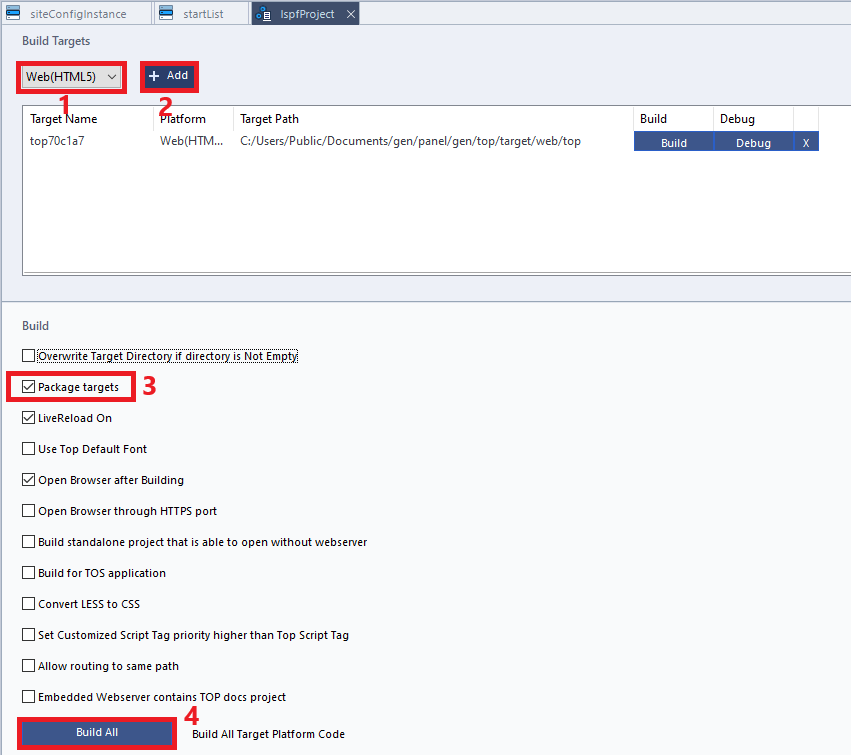

__j.__ If build process is successfully done, TOP IDE automatically open the web application using your default web browser:

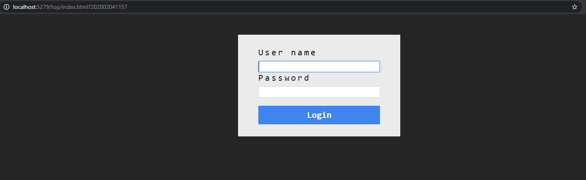 

#### 2.20.9 Deploy the ISPF application in JEUS 8
__a.__ As you selected __Package targets__ option when you build the project, a WAR file has been created in the target directory. Go to *target/web/top/target* folder in TOP IDE, and copy __top.war__ to the folder shared with your VM.

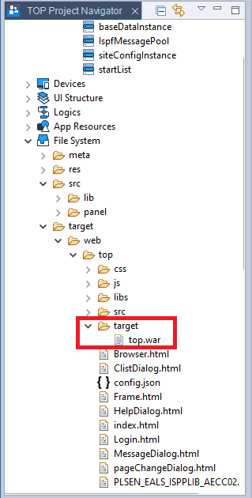

__b.__ Go back to your VM, and copy the WAR file under *${ISPF_HOME}*:
```bash
su -
# <enter root password>
cp /media/sf_Share_VMs/ispf-assets/top.war /opt/tmaxui/ispf_migration/
chown ofjeus8:mqm /opt/tmaxui/ispf_migration/top.war
```

Before the following steps, make sure that all the elements in the list below are running:
   - Tibero
   - obmtscmd, ISPFTACF, ispf_svr (in `tmadmin`, double check with `si`)
   - JEUS 8 servers (AdminServer, po7_svr, ispf_svr) 

__c.__ Go to the JEUS 8 webadmin, under the __Applications__ section. Click on __Install__:

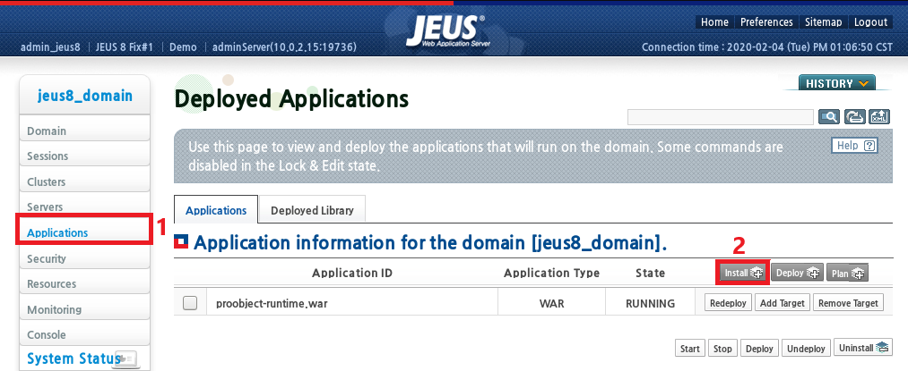

__d.__ Set the id to __ispf__ and browse the location of the WAR file. Press __OK__ button.

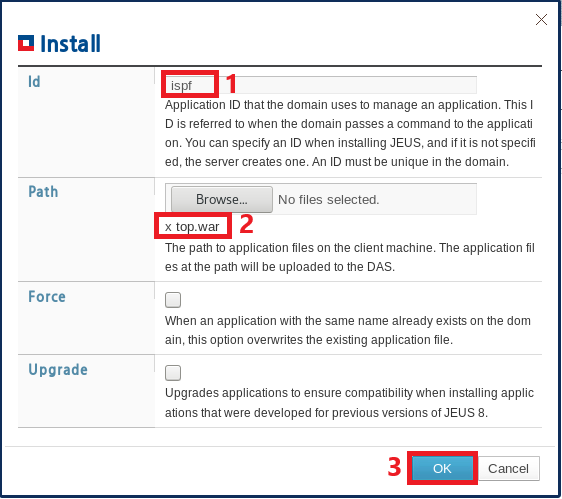

__e.__ The state changed to __INSTALLED__. Now, deploy the application:

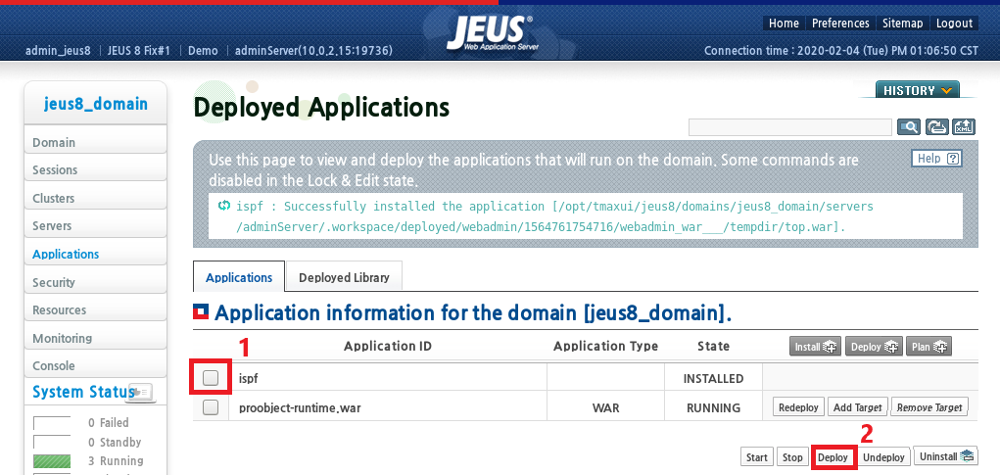

__f.__ In this window, choose a target managed server (ispf_svr) where you want to deploy and set context path to */ispf*. The managed server where you want to deploy should be in running status to deploy web application successfully.

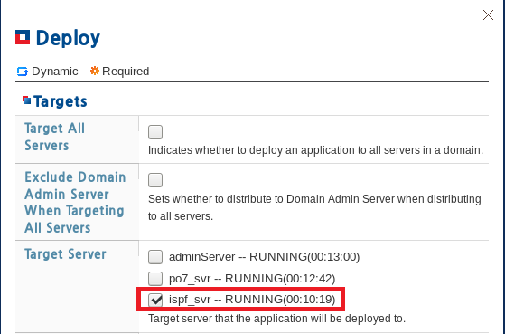


__g.__ If deployment is done successfully, you can meet below message and running status:

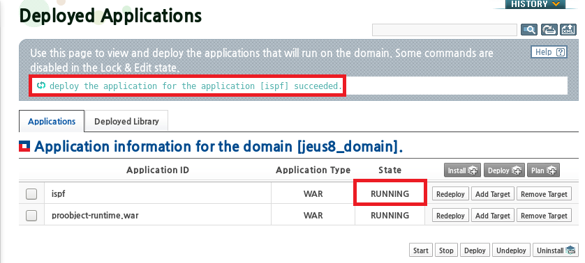

__h.__ Verify if the URL for __ISPF__ is working. Open your browser and type the URL in the address bar in the following format (replace 10.0.2.15 by your IP address): <http://10.0.2.15:18828/ispf/>

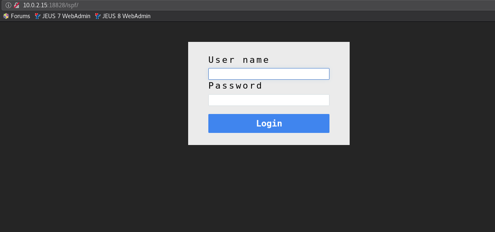

__i.__ Try to connect with the following credentials:
```text
id: ROOT
password: SYS1
```

If you cannot login, that means that the tool need more patch that what is currently described in this installation guide.

## 2.21 Running additional scripts (Optionnal, read carefully the role of each script)

Run the following scripts as __oframe user__ to enhance your use of OpenFrame products:
- __oframe_script_folders.sh__ (under *${HOME_DIRECTORY}/tmaxsw/scripts/openframe*): generate script folders uselful for OpenFrame and JEUS 7 to write custom scripts and not mix it with default scripts available with OpenFrame installation. This script is mandatory if you want to run the other ones for oframe.

- __j7_add_commands.sh__ (under *${JEUS_HOME}/scripts*): add simple commands to boot and shutdown JEUS 7 servers indivually such as dsboot, dsdown, msboot_ofmgr_svr, msdown_ofmgr_svr...

- __versions+licenses_check.sh__ (under *${OPENFRAME_HOME}/scripts/custom*): Check the version and license of all OpenFrame products. Save the result in two text files, version_check.txt and license_check.txt.

- __licenses_optimization.sh__ (under *${OPENFRAME_HOME}/scripts/custom*): Replace all the licenses for all OpenFrame products (unless Tibero and JEUS8) and create symbolic link instead of hard copies. For a later renewal of licences, you will only have to replace the folder /opt/tmaxsw/licenses/ and not other copies required (unless Tibero and JEUS8 as before).


Run the following scripts as __oftibr user__ to enhance your use of Tibero:
- __oftibr_script_folders.sh__ (under *${HOME_DIRECTORY}/tmaxsw/scripts/tibero*): generate script folders uselful for Tibero to write custom scripts and not mix it with default scripts available with Tibero installation. This script is mandatory if you want to run the other ones for oframe.

- __tibero-status.sh__ (under *${TB_HOME}/scripts/custom*): 


Run the following scripts as __ofjeus8 user__ to enhance your use of OpenFrame products (if not already done):
- __j8_script_folders.sh__ (under *${HOME_DIRECTORY}/tmaxsw/scripts/jeus/jeus8*): generate script folders uselful for JEUS 8 to write custom scripts and not mix it with default scripts available with JEUS 8 installation. This script is mandatory if you want to run the other ones for oframe.
  
- __j8_add_commands.sh__ (under *${JEUS_HOME}/scripts*): add simple commands to boot and shutdown JEUS 8 servers indivually such as dsboot, dsdown, msboot_po7_svr, msdown_po7_svr...


# 3. Boot/shutdown process

## 3.1 Boot everything
__a.__ Launch Tibero first:
```bash
su -  oftibr
# <enter password>
tbboot
```
__b.__ Then you can log in as oframe user in another terminal to boot all other components:
```bash
su – oframe
# <enter password>
tmboot

# Only if you installed OSC, replacement of tmboot
osctdlinit OSCOIVP1
oscboot

# Only if you installed OSI, replacement of tmboot
osiboot
tjesmgr boot
tjesmgr r IMSACTL
imscmd /NRE
#imscmd IMSA /NRE
#imscmd IMSA /START DC
#imscmd IMSA /START REGION IMSAMSG

# JEUS 7 (required)
startDomainAdminServer -domain jeus_domain -u administrator -p tmax1234
nohup startNodeManager > ${JEUS_HOME}/nodemanager/logs/JeusNodeManager.log &
startManagedServer -server ofgw_svr -u administrator -p tmax1234
startManagedServer -server ofmgr_svr -u administrator -p tmax1234
startManagedServer -server ofminer_svr -u administrator -p tmax1234

# JEUS 8 (if installed)
nohup $GATEWAY_HOME/bin/start.sh > $GATEWAY_HOME/bin/boot.log &
startDomainAdminServer -domain jeus8_domain -u admin_jeus8 -p tmax1234
nohup startNodeManager > ${JEUS_HOME}/nodemanager/logs/JeusNodeManager.log &
startManagedServer -server po7_svr -u admin_jeus8_ -p tmax1234
startManagedServer -server ispf_svr -u admin_jeus8 -p tmax1234
```
__j7boot.sh__ (under *${JEUS_HOME}/scripts*): replacement of JEUS 7 booting steps with control of the status of the servers.

__j8_ispf_boot.sh__ (under *${JEUS_HOME}/scripts*): replacement of JEUS 8 booting steps with control of the status of the servers.

__ofboot.sh__ (under *${OPENFRAME_HOME}/scripts/custom*): complete OpenFrame booting script.

## 3.2 Shutdown everything
__a.__ Down everything as oframe user first:
```bash
su – oframe
# <enter password>

# JEUS 8 (if installed)
jeusadmin -host 10.0.2.15:19756 -domain jeus8_domain -u admin_jeus8 -p tmax1234 "local-shutdown -to 120"
jeusadmin -host 10.0.2.15:19746 -domain jeus8_domain -u admin_jeus8 -p tmax1234 "local-shutdown -to 120"
stopNodeManager -properties ${JEUS_HOME}/nodemanager/jeusnm.xml
jeusadmin -host 10.0.2.15:19736 -domain jeus8_domain -u admin_jeus8 -p tmax1234 "local-shutdown -to 120"
algwdown

# JEUS 7 (required)
stopServer -host 10.0.2.15:8838 -u administrator -p tmax1234
stopServer -host 10.0.2.15:8828 -u administrator -p tmax1234
stopServer -host 10.0.2.15:8818 -u administrator -p tmax1234
stopNodeManager -host localhost -port 7730
jeusadmin -u administrator -p tmax1234 local-shutdown

# Only if you installed OSI, replacement of tmdown
imscmd IMSA /CHE FREEZE
tjesmgr shutdown
osidown

# Only if you installed OSC, replacement of tmdown
oscdown

tmdown
```

__b.__ Then down Tibero in another terminal:
```bash
su – oftibr
# <enter password>
tbdown
```
__j7down.sh__ (under *${JEUS_HOME}/scripts*): replacement of JEUS 7 shutdown steps with control of the status of the servers

__j8_ispf_down.sh__ (under *${JEUS_HOME}/scripts*): replacement of JEUS 8 shutdown steps with control of the status of the servers

__ofdown.sh__ (under *${OPENFRAME_HOME}/scripts/custom*): complete OpenFrame shutdown script.
