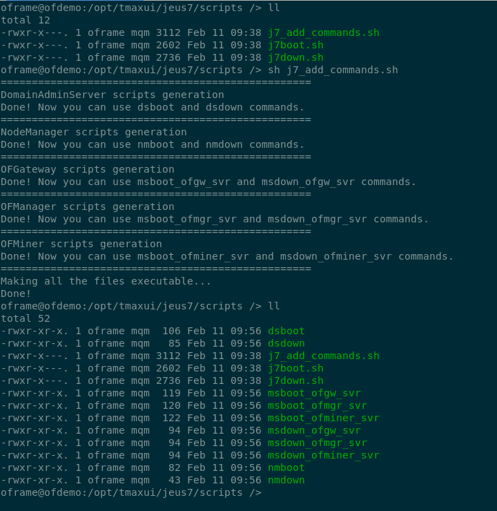

# How to use j7_add_commands

## Description

__j7_add_commands__ is a simple script which create simple commands to boot and shutdown JEUS servers indivudually. It creates all the following commands:

- dsboot
- dsdown
- nmboot
- nmdown
- msboot_ofgw_svr
- msdown_ofgw_svr
- msboot_ofmgr_svr
- msdown_ofmgr_svr
- msboot_ofminer_svr
- msdown_ofminer_svr


Once you execute the script, all those commands become available to oframe user. The shell prompt some information about the generation of the commands. You can find an example of this output here:



## Setup

To set the script up properly, you may need to change lines 18-20 to match the JEUS server names, and lines 23-26 to match port number for JEUS servers, this has to match what you configure during the installation.

This scripts create all these commands under *$JEUS_HOME/scripts* that does not exist by default. You may run __oframe_script_folders_gen.sh__ first or create *\$JEUS_HOME/scripts* by yourself and add it to the PATH environment variable. You may also ensure that the file __.j7_user_pass__ is in the same folder as all those commands.

To make sure that the script is working in your Linux environment, you may need to run the command: `dos2unix j7_add_commands.sh`

## Usage

```bash
sh j7_add_commands.sh
```

## Link to Source

You can find the source code here: [source](../source/j7_add_commands.sh)