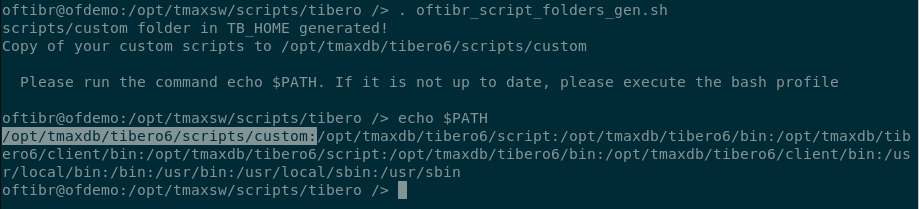

# How to use oftibr_script_folders_gen

## Description

__oftibr_script_folders_gen__ is a simple script which create a folder for custom scripts and add this folder to oftibr bash profile ( environment variable PATH) for easy execution. Most of the time when you create scripts you place them in the __bin folder__ or the __pre-existing scripts folder__. Then, what you create is mixed with the default scripts that come with the installation. This script solves this problem with folders dedicated to this purpose. Right now, it creates only one folder:

- *$TB_HOME/scripts/custom*

After folder creation, if you already have some custom scripts you want to use, this can be copied over this new folder for you. You just need to put them under:

- *$HOME_DIRECTORY/tmaxsw/scripts/tibero*

Once you execute the script, the shell will prompt some information for successful folder generation. You can find an example of this output here:



## Setup

To make sure that the script is working in your Linux environment, you may need to run the command: `dos2unix oftibr_script_folders_gen.sh`

## Usage

Please run with the . instead of sh:
```bash
. oftibr_script_folders_gen.sh
```

## Link to Source

You can find the source code here: [source](../source/oftibr_script_folders_gen.sh)