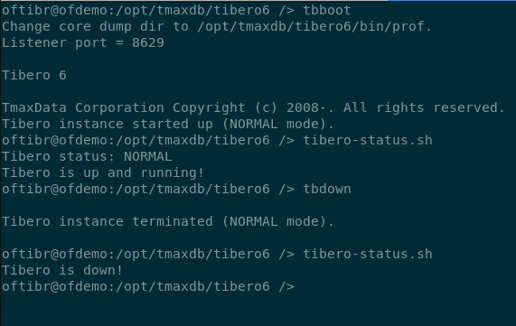

# How to use tibero-status

## Description

__tibero-status__ is a simple script that check the status of the Tibero database. The different possible status are: NORMAL or RUNNING, MOUNT (which means that Tibero did not boot properly), and DOWN.

Once you execute the script, the shell will prompt some information with Tibero status. You can find an example of this output here:



## Setup

To make sure that the script is working in your Linux environment, you may need to run the command: `dos2unix tibero-status.sh`

## Usage

```bash
sh tibero-status.sh
```

## Link to Source

You can find the source code here: [source](../source/tibero-status.sh)